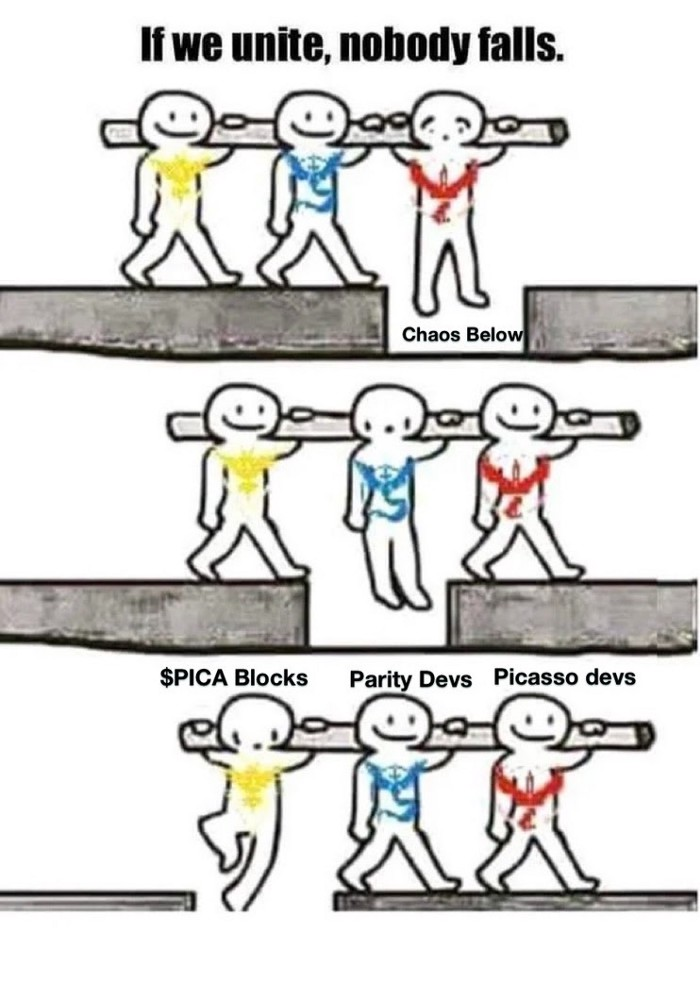

# Code Fixes

*For transparency purposes, Composable will publish significant code fixes below:*

---

## Picasso Block Production Halt

Picasso, our Kusama parachain, which serves as the foundational layer for substrate pallets, stopped producing blocks on December 17th and did not resume production until Tuesday, December 28, 2021, 6:02:48.533 PM. Here is a post-mortem of what actually happened and how our team managed to fix the problem. This content was originally published [here on our Medium page](https://medium.com/composable-finance/picasso-block-production-halt-a-post-mortem-analysis-9aeedbda7660).

### Initial Issue

On Friday, December 17, precisely at 2:55:54 PM, the Picasso parachain on the Kusama relay chain stopped producing blocks. The last block produced was backed by [relay block #10,561,126](https://polkadot.js.org/apps/?rpc=wss%3A%2F%2Fkusama-rpc.polkadot.io#/explorer/query/0x46d9d6036ad79e55f31d10b841cabb5fec3303618e91dfb99b860f289d6b697c). After carefully analysing the issue, we found out the problem: **there was a faulty runtime upgrade applied at parachain block [#75,775.](https://polkadot.js.org/apps/?rpc=wss%3A%2F%2Fpicasso-rpc.composable.finance#/explorer/query/0xcaf7f7aa3801aace93afb2828918c3719d688bd299be196b26daa1b1967adfe1)**

Specifically, this was due to a runtime upgrade that changed its block-times for the aura consensus worker. This piece of documentation here doesn’t specify that this value shouldn’t be changed once the chain is live and so was updated from 3000 (milli-seconds) to 6000 (milli-seconds). This was more in line with the relay chain’s expected block times for parachains which is 12 seconds.

The reason it was 6 seconds in the first place was that our runtime was first a standalone substrate blockchain and had a 6 seconds expected block time. Unfortunately, when it was converted to a parachain, this value wasn’t updated to Parachains standard block time. Therefore, this caused spotty block production on Picasso, with block times averaging 30 seconds. When viewed even more critically, this makes sense since the collators are authoring blocks every 6 seconds but what is happening behind the scenes is that they are really only allowed to produce blocks every 12 seconds by the relay chain, so collators often miss their slots.

After the runtime upgrade, all our collators stopped producing blocks. This was primarily because, from the perspective of the parachain, the new slot numbers produced by the new runtime code are for earlier slots.

From the logs of one of the collators: 2021–12–18 05:54:00.506 DEBUG tokio-runtime-worker aura: [Parachain] Starting authorship at slot 136650570; timestamp = 1639806840450

Note the slot number. Now compare it with slot number of the last block on the chain.

It would take roughly 53 years for our chain to start producing blocks.

With the chain unable to produce blocks, it became clear we had only two options:

---

#### 1. Reset our Parachain runtime WASM on the relay chain with a WASM file that reverts the changes to the MinimumPeriod. Then, create a new chain-spec with that same WASM blob specified as a WASM override, then update our collators so they can resume producing blocks.

**Pros**
- None whatsoever

**Cons**
- We still haven’t fixed the spotty block production issue, which causes collators to miss their slots and would need to do a more complicated runtime upgrade in the future to address this issue.

---

#### 2. We can call paras.force_set_current_head and paras.force_set_current_wasm in order to reset the chain with a new wasm/header with the correct MinimumPeriod

**Pros**
- We don’t have to plan a more complicated runtime upgrade in the future in order to fix block production times on Picasso as the new chain would be properly configured from the get-go.

**Cons**
- We lose our chain state, but technically it is still a PoA chain and nothing critical yet has been stored on it.

---

After careful consideration, we decided to go with the second approach, primarily because it’s the faster route to solving all our problems (un-bricking the chain and 30s block production). Otherwise, we would have to first modify the aura pallet to support slot offsets allowing us to upgrade our chain and successfully change the MinimumPeriod value, then test this new functionality efficiently. But luckily, because Picasso is also still a PoA (proof of authority) chain, therefore, it can afford to be restarted. Starting from scratch with the right configuration will prevent us from having any more troubles with potentially bricking Picasso, even after it becomes community-run.

### Faulty Fix

We proceeded with option 2, contacted the technical council, and created a governance proposal.

At this point, all our team had to do was wait for the proposal to be enacted, the automatic execution of our proposal by the Democracy pallet, which takes a couple of days. However, our fix was actually incorrect.

![Error: Success. [OK]](./error-success.png)

### The para_id

Each parachain is identified by a unique identifier, which for us is 2087. The identifier is present in three different locations: the genesis header, the collator node, and on-chain at the relay chain (Kusama). Disciplined developers will immediately shake their heads. “Single Source of Truth” is a principle that every developer should always abide by.

In our case, we considered a third option to un-brick our parachain without needing a governance proposal using [registrar.swap](https://github.com/paritytech/polkadot/blob/d5818b20332209c47e3da38b797fa79e952104b3/runtime/common/src/paras_registrar.rs?_pjax=%23js-repo-pjax-container%2C%20div%5Bitemtype%3D%22http%3A%2F%2Fschema.org%2FSoftwareSourceCode%22%5D%20main%2C%20%5Bdata-pjax-container%5D#L270), but this call has been filtered out on Kusama, requiring a governance proposal either way. Unfortunately, we had updated the para_id in Picasso’s chainspec to a new one 2104 before realising this but neglected to revert it to 2087 after going with option 2. This meant that the proposal to reset our header had the wrong para_id. We had our collators using id 2104, while Kusama expected us to use 2087. Fixing this would require another governance proposal.

![Error Error, An error occurred while displaying the previous error. [OK]](./error-error.jpeg)

### Calm in the midst of chaos

With the efforts of our engineers and Parity developers, we brainstormed further on the best solution. Our initial thought was that a governance proposal was inevitable, as the header was now incorrect on Kusama and would conflict between our collators and Kusama’s validators. On the contrary, thanks to Basti, we figured this was not necessary. The system does not use the para_id in the genesis header. As we controlled the collators, we had to revert the para_id change to start producing blocks again. Definitely, a new discovery for our team, as it implies that the para_id in the genesis header is not used by the system everywhere. We have planned out for Q1 2022 to change this, and as far as we know, this does not pose any security challenge.

### Prevention

In our case, no funds were lost, and no harm was done. However, we have diverted resources to setting up more infrastructure for our own integration tests (running ephemeral testnet for every single commit), which should prevent these types of bugs from occurring again.

Once again, we would like to reiterate that we have resolved the issue, and this has not caused any delay in the launch of Picasso. We thank the Parity team and our engineers, two of whom were on holiday when all this occurred, but were quick to cut their holidays short to get Picasso up and running again.
