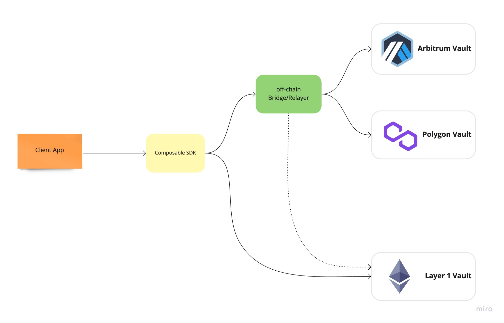

# Composable SDK
*The next level cross-chain toolset*

---

The Mosaic SDK is a cutting-edge toolset that enables developers to build the next generation dApps utilising the bespoke infrastructure across all levels of development. From basic helpers providing cross-layer transferral capability to advanced composability functionality utilizing DeFi protocols, interacting with vault strategies, and the ability to unlock countless other capabilities, the Mosaic SDK is a swiss-army knife solution for dApps.

Built for utility, the Mosaic SDK consists of multiple components that make it a complete solution and despite the sophisticated infrastructure, its ease and simplicity make it an imperative foundation for builders of cross-layer DeFi applications.

The Mosaic SDK is bolstered with AMMs integrations, Oracles integrations, ABIs, addresses & interfaces of popular DeFi protocols. Our team has supplemented the infrastructure with a Solidity library, in addition to a Typescript library for frontend integrations.

Most pertinently, the Mosaic SDK has been built to sync seamlessly your project to Composable Finance, so you can further fuel your project through our wider ecosystem.

The diagram below illustrates how our SDK sits between the client application and Mosaic, managing the flow of communication between the off-chain relayer, bridges, and vaults.

By using the Mosaic SDK, you are able to perform various operations like:

- Move supported assets between layers
- Swap tokens
- Perform add or remove liquidity operations (ex: swap `token A`, an ERC20 token available on the source layer with `USDC`, move it to another chain and provide liquidity to one of the AMMs available there)
- Query tokens prices

Head to Composable SDK documentation at [https://sdk-docs.composable.finance/](https://sdk-docs.composable.finance/)