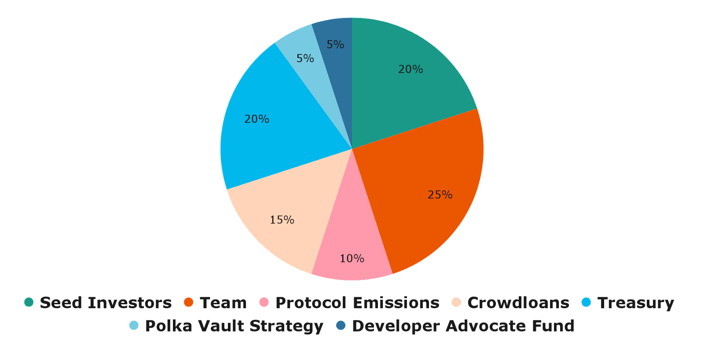

# LAYR Tokens

*LAYR is Composable's Polkadot and ETH Token.* 

---

## LAYR Use Cases

- Staking LAYR to get free/reduced-fee transactions or earn part of protocol fees 
- LAYR staked by the oracle pallet on our Polkadot parachain 
- Composable Labs — staking LAYR gives tokens from the LAYR ecosystem 
- For governance decisions on the pallets upgraded to LAYR and voting for additional network/bridge support 
- For staking by Mosaic validators 
- Staking LAYR by relayers and collators 
- Payments for SDK services 
- Staking by Routing nodes 
- Staking by Insurer nodes

---

## LAYR Distribution

Composable’s LAYR token will govern the Composable parachain. The total supply of 100,000,000 LAYR tokens will be 
distributed according to the following figure, with more information about each distribution channel below:

### Seed investors

20% (or 20,000,000 LAYR) of the total token supply will be distributed to seed investors as a reward for their essential
early support and strategic backing of the ecosystem. 20% of these tokens 
(4% of the total token supply, or 4,000,000 LAYR) will be unlocked at the token generation event (TGE), with linear 
vesting of the remaining tokens over the subsequent two years.

### Advisors

5% (or 5,000,000 LAYR) of the total token supply will be distributed to advisors for their guidance and contributions to
Composable Finance as early supporters, connectors, and/or consultants to the Composable Finance protocol. The 
distribution of these tokens will have a three month cliff with linear vesting of the remaining tokens over the 
subsequent three years.

### Team

20% (or 20,000,000 LAYR) of the total token supply will be distributed to founders and the core Composable team as a 
reward as well as incentives for their continued actions in the best interest in the Composable ecosystem. The 
distribution of these tokens will have a six month cliff with linear vesting of the remaining tokens over the subsequent
two and a half years.

### Protocol Emissions

10% (or 10,000,000 LAYR) of the total token supply will be released from the protocol as rewards and incentives for a 
number of actions involved in the protocol. These are programmatic incentives to bootstrap network growth 
(block validators, decentralized application builders and token holders from other networks) on Composable as well as 
token liquidity (liquidity mining programs). These tokens will be distributed evenly each month for 36 months 
(approximately 277,777.778 LAYR per month for three years).

### Crowdloans

15% (or 15,000,000 LAYR) of the total token supply will be allocated for the purposes of securing a parachain slot every
two years. 15% is being utilized for the current batches of Polkadot auctions, with a 25% vesting on TGE, and the 
remainder vesting over two years.

### Treasury

20% (or 20,000,000 LAYR) of the total token supply will be allocated to the Composable Treasury. These tokens are 
reserved for unexpected events in addition to instituting a buyback program to purchase tokens on the open market. 
Treasury tokens will be vested linearly over two years.

### Polkadot Vault Strategy

5% (or 5,000,000 LAYR) of the total token supply will be rewarded to participants in our Polkadot vault strategy. 
50% of this (2,500,000 LAYR) will be released at TGE, with the remaining distributed over six months.

### Developer Advocate Fund

5% (or 5,000,000 LAYR) of the total token supply will be allocated to the Developer Advocate Fund. Governance on our 
platform will allow users to delegate these tokens as they see fit to support the further development of the Composable 
ecosystem. 50% of this (2,500,000 LAYR) will be released at TGE, with the remaining distributed over three months.