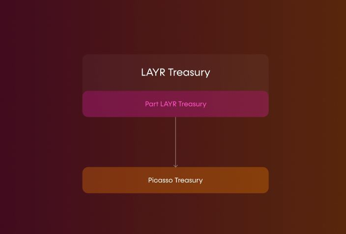
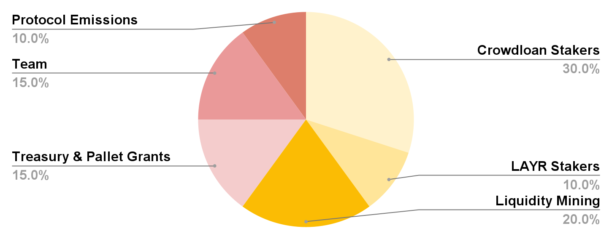
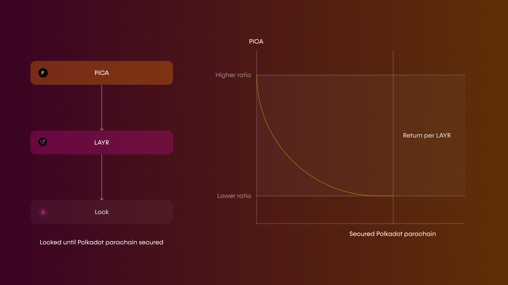

# The Picasso (PICA) Network Token

---

Composable is releasing the Picasso Network token (PICA) - the native token of the Picasso parachain, which lives solely on the Kusama parachain. 
**PICA will have critical functionalities including allowing voting on which pallets are implemented first on Picasso, beyond our core pallets such as Apollo (oracle pallet) and Cubic (vaults pallet) that will already be available.**

The LAYR token will also be created as the native token for all of Composable Finance’s activities on both Ethereum and on Polkadot. 

---

## Roles of LAYR versus PICA

- Similar to how DOT will be transferred to the KSM treasury at a later date (pending Substrate-Substrate bridges ), we are committed to allocating a portion of LAYR tokens to the Picasso treasury, Picasso governance will vote on how to spend these LAYR tokens.

- LAYR token holders will be eligible to redeem Picasso Network tokens by locking up their ERC-20 LAYR tokens on Ethereum until the Polkadot parachain is secured. Thus, investors and current stakers in the vault strategy, who will obtain LAYR upon the token generation event (TGE), will be eligible to lock their LAYR tokens for Picasso tokens. This amounts for 10% of the token supply. The priority is for the traction on the Picasso parachain to benefit the LAYR token holders, empower Picasso holders, and benefit the Polkadot parachain in the future. 

---

## PICA Distribution

The total Picasso token supply will be 10,000,000,000. The token will be distributed in accordance with the following figure, with further details below:

**Presently, 30% of Picasso token supply will be allocated to crowdloan stakers, with [an additional 10% of the total supply having been recently reallocated for this purpose](https://composablefi.medium.com/our-picasso-crowdloan-plans-for-future-kusama-auctions-8cda80d71208) and rerouted from liquidity mining rewards.** Rewards will also be slightly higher for users allocating to our crowdloan in the first 24 hours of its deployment, further incentivizing early participation.

The crowdloan was originally established to help Composable obtain the KSM tokens necessary for procuring a parachain from Kusama at auction. Users were able to deposit KSM or stablecoins into our crowdloan, with a number of incentives in place for participation, including:

- 5% of PICA tokens was allocated to contributors who previously staked in our first (unsuccessful) crowdloan, and restaked the same amount in our second (successful) crowdloan. 
- 5% of PICA was allocated to stakers who contribute to the second crowdloan after it has reached 100,000 KSM. We reached around 115,000 KSM, meaning that there will be PICA rewards of this category distributed on the final 15,000 KSM deposited. The 5% boost is based on the new amount that the user stakes in the winning auction that must be at least equal to the amount previously contributed. 
- We have also implemented a referral program where users can generate referral codes, and will obtain a 20% bonus on their Picasso Network tokens if they bring in other users contributing a total of 100 KSM or more. This was implemented for both crowdloans. 
- 5% bonus to those who staked in the first 12 hours of the second crowdloan. The early participation bonus of 5% applies to users who have already participated as well as those who participate in the 12h period starting at 10pm CET. 10% bonus to stakers in the first three days of the second crowdloan.

With the Kusama parachain successfully procured for Picasso, the crowdloan has ended and users will receive their bonuses of PICA, as indicated above. Half of this PICA will be distributed upon the token generation event (TGE) of PICA, and the remaining half will be distributed linearly within 48 weeks.

**We previously announced that the Picasso Crowdloan was the only opportunity we foresee for users to obtain the Picasso Network token. Now, we are excited to announce additional distribution channels:**

***20% of Picasso tokens (2,000,000,000) will be designated to liquidity mining that will be used to reward liquidity providers of the Picasso token - KSM on multiple different AMMs in the Kusama ecosystem.***

***Additional protocol emissions include 10% (1,000,000,000) of PICA to various channels, potentially including:***

- An airdrop of PICA to all wallets holding KSM 
- The aforementioned referral program for users bringing other contributors to our crowdloan 
- Reserves for distribution in future parachain auctions

Collators that create blocks on the parachain, as well as Picasso holders who stake Picasso with collators, will earn in protocol rewards. More specifically, Collators will earn transaction fees - a portion of which will be burnt, and also flow into the treasury.

Additionally, similar to inflation in Polkadot, there will be an inflation curve that has exponential rewards. Oracle providers in our system will earn rewards from inflation.

***The team will receive 15% of supply (1,500,000,000 tokens) as well.***

***The treasury, which will be used to incentivize the initial 5-6 projects that deploy on the Picasso network, along with pallet creation grants, will be allocated 15% (1,500,000,000 tokens)***. Furthermore, as mentioned previously, a certain percentage of transaction fees will go towards the treasury.

### Vesting Distribution

The crowdloan stakers will earn 50% of their PICA upon TGE, with the remainder being released linearly within 48 weeks. The full balance can be used to participate in governance and other activities besides transferring.

The vesting of protocol emissions, LAYR staking tokens, and liquidity mining rewards is linearly over 48 weeks. Vesting of team tokens will be over 2 years, linearly. 50% of treasury tokens will be immediately available, with the remaining 50% also vested linearly over 48 weeks.

---

## Staking LAYR for PICA

With the Kusama parachain successfully procured for Picasso, the crowdloan has ended and users will receive their bonuses of PICA, as indicated above. Half of this PICA will be distributed upon the token generation event (TGE) of PICA, and the remaining half will be distributed linearly within 48 weeks.

- Users stake and lock their LAYR tokens in Ethereum vaults until Composable secures a Polkadot parachain slot. In the theoretical scenario in which Composable does not obtain a Polkadot parachain, the maximum locking period will be 1 year. 
- Stakers will be earning Picasso tokens at a rate determined after monitoring the PICA network token, which will likely be released before LAYR. A maximum of 10% of PICA supply will be allocated to users who lock up LAYR upon LAYR TGE, on a diminishing returns curve; there will initially be a higher ratio of Picasso to LAYR tokens locked, reducing to a lower ratio of Picasso to LAYR tokens over time. In the event of the full 10% not being allocated to LAYR lockers, the remainder of this token supply will flow into the treasury, which will be run by governance, and primarily focus on grants to new projects on Picasso.

*An illustration of the process of locking LAYR for PICA and the diminishing return curve.*

---

## PICA Use Cases

Our vision for Picasso is that it will attract developers who would like to build on top of our DeFi primitives, and Picasso will be a testing ground for experimental DeFi applications. As such, the Picasso token will have a few key use cases:

### Governance:

The Picasso token will serve as the voting mechanism to govern:

- Which pallets can be incorporated onto the Picasso Network 
- How to direct the treasury towards different initiatives in the ecosystem such as grants and incentivizing usage of the initial dApps on the network 
- Which products on the Picasso network will be able to “graduate” to our Polkadot parachain 
- Public goods infrastructure: powering infrastructure providers, block explorers, wallets, and other key ecosystem partners

### Collators:

The Picasso token will be staked in order to produce blocks on our Kusama parachain. In doing so, the collators will earn Picasso tokens through transaction fees.

### Data Provider Staking:

As mentioned previously, for our oracle to query crypto-economically secured data feeds, providers will need to stake the Picasso Network token. This will serve as an additional use case for the Picasso token, which will underpin all the DeFi applications that exist in the network. The slashing mechanism will burn Picasso Network token, and providing data feeds correctly will result in the awarding of Picasso tokens from inflation. This will be balanced by a slashing of a portion of each transaction fee to account for this reward inflation.

### Network Usage:

Transaction fees are payable in Picasso Network tokens.

### Picasso Network Treasury:

To account for the long-term sustainability of the Picasso Network, the Picasso Network treasury is governed by the Picasso General Council, which will later be governed by PICA token holders. Decisions on grants, incentives, will be actioned through the treasury, and will be the location where transaction fees flow into.