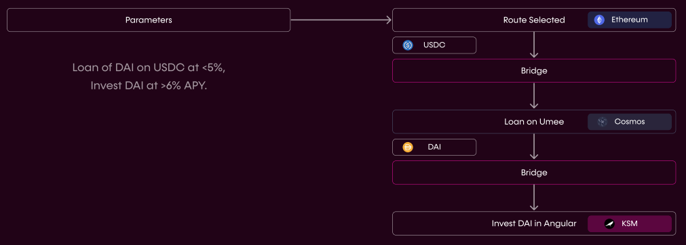

# **👋** Introduction
*Composable Finance: The Face of DeFi's Future*

---

*Composable Finance: The Face of DeFi's Future*

---

## The Vision
**The future we are crafting is fully interoperable by its design and seamless in utility.**

A natural evolution in a **cross-chain world** entails developers and users interacting seamlessly regardless of where their assets lie. That’s why our team at Composable Finance is on a mission to build a **fully interoperable future** capable of offering developers and end-users alike **seamless user experience and utility.**

---

## The Problem
DeFi is still flourishing. Many top DeFi protocols are still seeing an influx of users and high total value locked (TVL), while stablecoins in circulation are at an all-time high. However, the industry is siloed and fragmented, and scaling the industry is further perpetuating the fragmentations as projects explore L2s and other L1 networks to launch. Current interoperability solutions for cross-layer and cross-chain communication and value transfer are lacking in number and efficiency. Yet, all DeFi participants need infrastructure to build and use the most cost-effective and performant applications.

Moving assets is becoming more intuitive, but with several applications segregated within a specific ecosystem, managing assets is not. It is clear though, that we are approaching a world in which the future of DeFi will be fully blockchain-agnostic.

Resultantly, in the race for market share and users, two key functionalities are becoming the most important components for remaining competitive in the quickly evolving landscape: **capital efficiency** and **interoperability**. Both developers and users will seek methods to interface with different ecosystems in a scalable, provable, and decentralized manner.

---

## Limitations in Current Approaches
Current approaches to solving these problems are limited by at least one of the below:
- Only focused on transfers, and not the broader developer experience
- Are focused on creating an entirely new security model, based on a segregated chain
- Are creating new messaging protocols, instead of leveraging existing messaging protocols
- Depend on oracles for finality
- Do not provide a framework for users to navigate these different ecosystems
- Do not focus on user experience, cross-ecosystem

---

## The Composable Solution
Composable Finance’s full technical stack enables the evolution of digital assets and DeFi protocols - enabling the unification of functionality, across all blockchain ecosystems.

Composable Finance is building infrastructure that allows developers to deploy applications capable of , while allowing users to access previously disparate ecosystems simultaneously, autonomously interoperating across layers and chains all through the same fabric.

The result is DeFi users will be able to have their actions reduced to parameters:

*An example of a user's desired parameters and the optimal route being selected and completed by Composable's technology.*

Our vision of **hyper liquidity** and **composability** abstract the underlying technology into a single interface, unlocking the potential for new primitives to be developed at an unprecedented pace. With Composable Finance, creativity, communication, and community will be reimagined and reconciled for a more inclusive and composable future. We believe technological advancements in this growing domain will create new opportunities to build new innovative protocols and applications which previously were not possible.

We are accomplishing these goals through a multifaceted [technical stack](./products/technical-stack-overview.html) where we begin by bridging gaps between today’s isolated blockchains and layer 2 scaling solutions, to create a single and unified access point that we are calling the Innovation Availability Layer (IAL), based on our Parachain offering. The IAL communicates with our powerful new virtual machine — Composable Cross-Chain VM (XCVM) — that serves to orchestrate and compute smart contract functions across the array of layer 1 and layer 2 networks autonomously, with the sole purpose of optimizing for best execution and mitigating all user experience constraints for developers and end-users.

On our quest to supplant new interoperability and development standards across Web3 and DeFi, we have recently launched an incubation arm, Composable Labs. Through this initiative, one of our key objectives is to develop and deploy a novel set of financial applications in a bid to prototype the suite of new tools and technologies we are building. Serving to highlight the technical and UX benefits Composable offers to applications built atop, we believe our in-house incubation efforts will inspire new and existing crypto developers and ignite a Cambrian explosion of Composable Finance-powered technologies and applications.

We’ve been working on perfecting our ecosystem, our vision and ensuring that we are leading the way in terms of innovation and accessibility for DeFi. Through our collective vision, our suite of bespoke offerings and products, we aim to embed collaboration where competition has been. Retreating back to the values of decentralism we are passionate to invite, collaborate and work with other projects and investors who reconcile in our vision. 

The future we are building needs everyone to play a part, reach out to our team for informal or formal enquiries — and see how we can help you and more importantly how you can help us as we build tomorrow, today.

**Join the Composable community:**

[Twitter](https://twitter.com/ComposableFin) | [Telegram](https://t.me/composablefinance) | [Discord](https://discord.com/invite/pFZn2GCn65) | [Website](https://www.composable.finance/) | [Medium](https://composablefi.medium.com/about) | [GitHub](https://github.com/ComposableFi) | [LinkedIn](https://www.linkedin.com/company/composable-finance/)