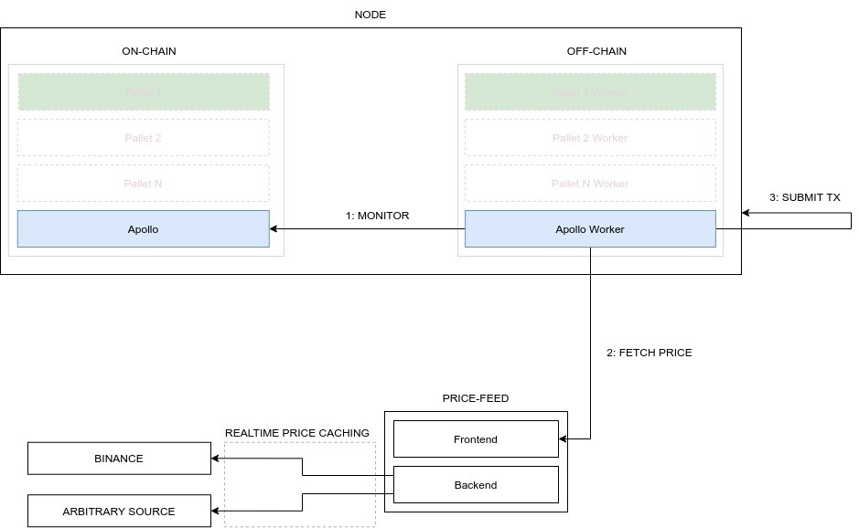

# Oracle

*This pallet provides the functionality to submit prices on-chain*

---

{{#include ../developer-guides/oracle-set-up-guide/oracle-set-up-guide.md:10:18}}

{{#include ../developer-guides/oracle-set-up-guide/oracle-set-up-guide.md:22:24}}

For more information refer to the [extrinsics](./oracle/extrinsics.md) or take a look at how to run an oracle yourself in our [Oracle Set-Up Guide](../developer-guides/oracle-set-up-guide/oracle-set-up-guide.md).
