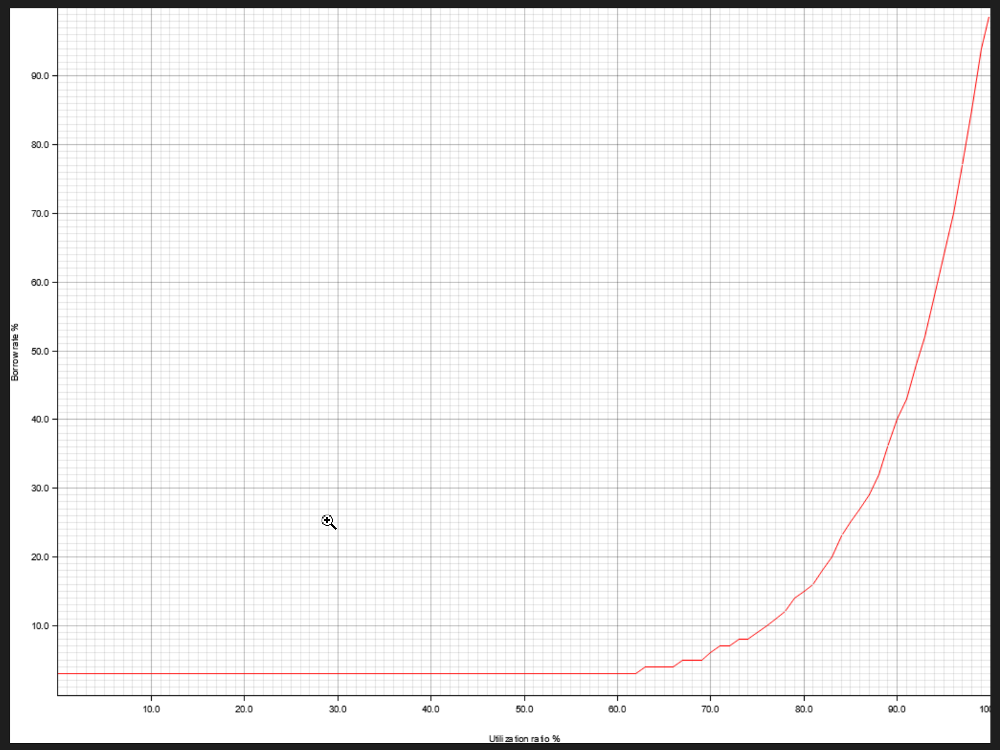
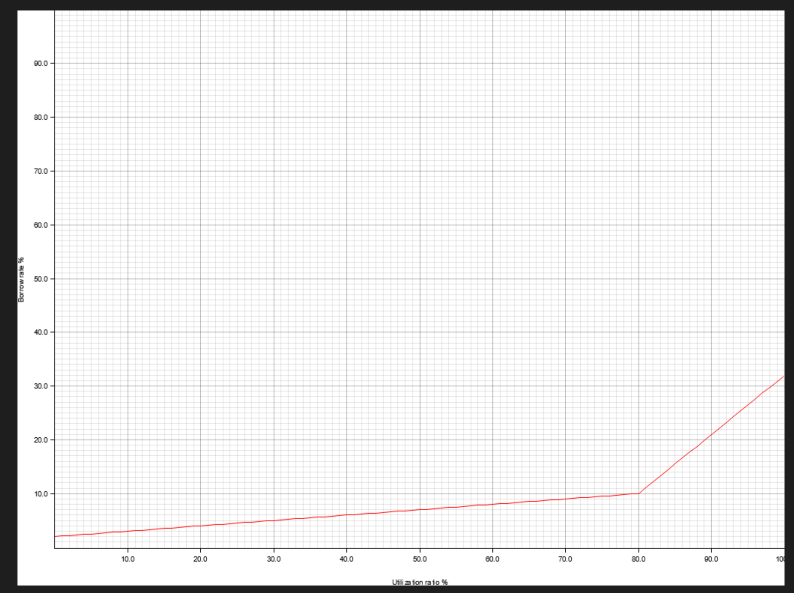

# Models

* * *

###
Interest rates are configurable per lending pool and depend on ratio amount of borrowed asset from total amount possible.

The utilization ratio is defined as the number of lent out assets over the total borrow assets owned by the pool. As utilization increases, so does the interest rate, to reflect the higher demand of the pair. So if interest rate increases with utilization, more lenders will add liquidity, making utilization lower, and decreasing interest rate to some optimal amount. As utilization decreases, interest rate decreases too, incentivizing borrowing.

Intersect rates are floating. Interests to paid are added continuously and are continuously compounded. User can borrow and payback loan any time, no lock period applied.

Interest rate scales from 0% to 100%.

Multiple configurable utilization curves are provided to have borrow rate obtained from current utilization rate from some target rate. In general, larger utilization, larger is borrow rate. Look of curves greatly depends on choses parameters.

Curved model:

Jump(Kinked) Model:

Double Exponents Model:

