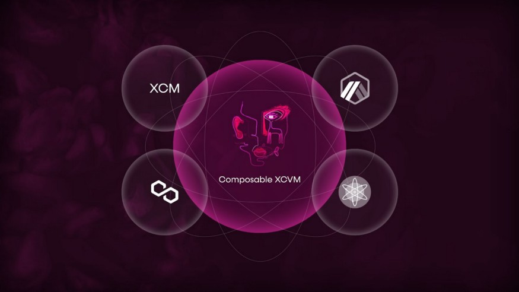
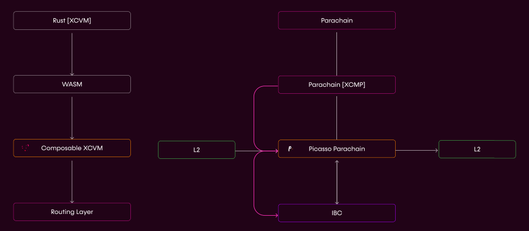
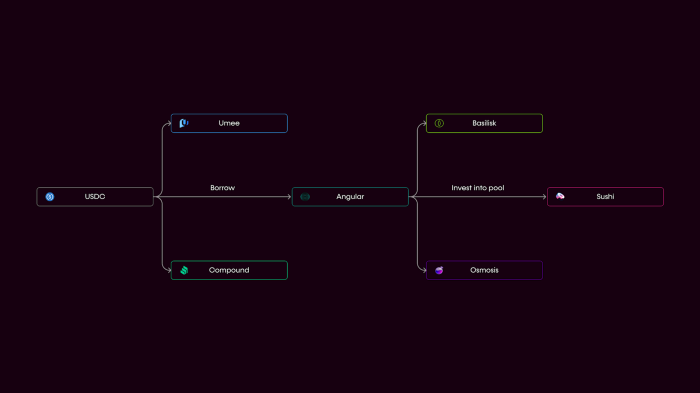

# Cross-Chain Virtual Machine
*The Composable XCVM allows for cross-ecosystem communication.*

--- 

The Composable Cross Chain Virtual Machine (XCVM) is a single, developer friendly interface to interact orchestrate smart contract functions across the multitude of L1 and L2 networks available. In short, the XCVM serves to abstract complexity from the process of having to send instructions to the routing layer directly, initiate call-backs into smart contracts, and more.

Utilizing the [Innovation Availability Layer](./cross-chain-virtual-machine/innovation-availability-layer.html) (IAL) infrastructure, we are creating a set of tools for the Composable Cross-Chain Virtual Machine that developers can use to tap into various functions of communication and liquidity availability. The result is multifaceted; users can perform cross-chain actions, and the overarching blockchain ecosystem is repositioned as a network of agnostic liquidity and available yield.

*The XCVM unites a number of ecosystems across DeFi.*

In order to facilitate this communication, we need two specific components that we are currently building: the Communication and Finality layers of our XCVM.

- **Innovation Availability Layer (IAL)**: This includes the following features:
    - Polkadot-IBC cross-chain communication and asset transfers
    - L2-L2 communication and transfer through our parachain
- **Finality Layer**: This will be our parachain offering — called [Picasso](./the-picasso-parachain.html) on Kusama, and [Composable](./the-composable-parachain.html) on Polkadot.

*Our XCVM includes the IAL and our parachains, allowing communication across various chains and layers.*

The idea of our solution, however, is not to create a new standard for cross-chain communication, which is already the object of a number of projects. Instead, the intention is to serve as a data availability layer for existing cross-chain communication protocols like IBC and Polkadot’s cross-chain message passing (XCMP).

Throughout this experience, Composable allows users to tailor their experience to maximize for a desired parameter while minimizing ecosystem-specific decision making.

*An example use for the Composable XCVM, allowing a user to borrow with USDC on Angular Finance and invest into a liquidity pool on SushiSwap, a process that can occur cross-chain and cross-layer thanks to Composable's technology.*

We will also provide **developer interfacing** for the XCVM: tooling with which users can interface with the Composable XCVM, such as testing suites, deployment scripts, etc.