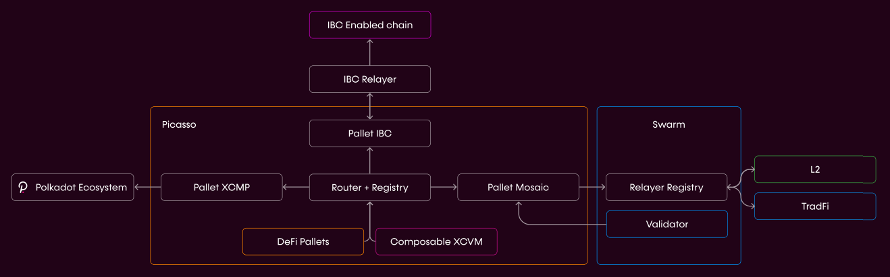
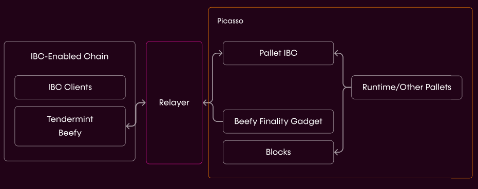

# Innovation Availability Layer

---

## Components

The Innovation Availability Layer is comprised of: 

- Substrate - IBC Bridge
- L2 transfer and communication interface
- Finality and shared security model of parachain

*The IAL*

### Substrate - IBC Bridge

This allows for asset transfer and communication between the DotSama and Cosmos ecosystems.

Integration with Cosmos chains is done through IBC, a protocol which defines both the network protocol (ports, serialization formats), and the on-chain interactions. IBC connections require both chains to embed a light client for proof validation.

Components include:

- IBC-Substrate pallets
- Beefy-IBC client merged into IBC-Go
- Beefy-Go light clients
- Mint and burn approach for transfers

*The IBC-Substrate Bridge. Note that the relayer is just a process to pass messages, and does not perform signing, etc.*