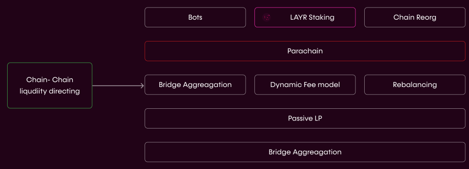

# Mosaic

*The Composable liquidity layer ensures the facilitation of transfers, such that there is enough liquidity on destination layers. Mosaic is fit with multiple tools to ensure transfers occur.*

---

## Overview

Mosaic (the liquidity layer that communicates with the [Composable XCVM](./cross-chain-virtual-machine.html) and the [Routing Layer](./routing-layer.html)), serves to ensure liquidity is moving to the locations where it is needed, allowing the propagation of whatever instructions are required to satisfy the user’s desired outcome, as specified above. We are currently testing this capacity within the EVM ecosystem by running our Proof of Concept (PoC) of Mosaic. From there, we can generalize this liquidity problem and solution to other ecosystems.

Mosaic serves as the asset transferal layer for all cross-chain and cross-layer interactions. It ensures liquidity is moving to the locations where it is needed, allowing the propagation of whatever instructions are required to satisfy the user’s desired outcome, as specified above.

Today, Mosaic is successfully integrated with the Ethereum mainnet, a number of scaling and layer 2 solutions ([Arbitrium](https://composablefi.medium.com/composable-finance-is-collaborating-with-arbitrum-for-seamless-cross-layer-transfers-be42d7da4ccc), [Avalanche C-Chain](https://composablefi.medium.com/integrating-avalanches-c-chain-into-the-mosaic-poc-631a75e8be23), [Polygon](https://composablefi.medium.com/composable-finance-collaborates-with-polygon-for-integration-into-its-layer-2-bridge-40aaf4a47954), and [Fantom](https://composablefi.medium.com/composable-integrates-fantom-into-its-mosaic-poc-bridge-25a4a5569875)), as well as [Moonriver](https://composablefi.medium.com/composable-integrates-moonriver-into-the-mosaic-poc-bridge-73442af528cc), a Kusama project which allows us a connection to the Polkadot ecosystem. Tomorrow, we will connect all major DeFi ecosystems (including pioneering ecosystems such as Cosmos and Dotsama), allowing for total flexibility and unity in the industry.

Mosaic serves to ensure liquidity is moving to the locations where it is needed. We are currently testing this capacity within the EVM ecosystem by running our Proof of Concept (PoC) of Mosaic. From there, we can generalize this liquidity problem and solution to other ecosystems.

*The flow of Mosaic, particularly addressing liquidity concerns.*

---

## Liquidity Considerations

We have designed Mosaic by viewing liquidity as complete, and not loyal. Liquidity flows based on fees, speed, and other tangibles. As a result, we’ve architected a synergistic relationship between passive and active liquidity providers, resulting in Mosaic being an optimized liquidity directing system for the purposes of facilitating cross-chain/layer transactions. Simply, we want users to move their assets freely and not see fickle obstacles such as liquidity maximization problems which are presented by other competitor protocols.

Liquidity concerns are not new in DeFi. However, they have largely been resolved by automated market makers (AMMs) built into the popular DeFi exchanges like Uniswap and SushiSwap. The introduction of cross-layer and cross-chain applications is, however, making liquidity a more pressing issue than ever before; with so many different layer 2 applications and blockchains to balance liquidity across, and so little infrastructure to do so, liquidity is very siloed for interoperable applications.

Composable Labs has built a Liquidity Simulation Environment (LSE) to better explore the opportunity and best means of cross-layer liquidity provisioning (LPing). The first phase of this experimentation was to determine the viability of cross-layer liquidity provisioning by running test trade data through our model. This resulted in the prediction that LPs could be positioned to earn an impressive 16% return per week for providing liquidity for cross-L2 transfers. The second phase of this experiment is underway, wherein we have deployed our PoC of our cross-layer asset transferral system Mosaic, with the PoC being our [Polygon-Arbitrum Cross-Layer Transferral System](https://composablefi.medium.com/the-launch-of-our-polygon-arbitrum-cross-layer-transferral-system-a-novel-proof-of-concept-b4cfc8cf0023), to test out the associated dynamic fee model. Once we have scraped this data, we will be able to prove out the dynamic fee model and, as a broader goal, our passive liquidity provider role in this system. This data will also assist us with the rebalancing work our Head of Product 0xBrainJar has [released](https://0xbrainjar.medium.com/liquidity-forecasting-in-mosaic-e93beb6cc511) as well.

Lastly, our full solution will have an active management model as [0xBrainJar has previously indicated](https://0xbrainjar.medium.com/mosaic-phase-2-deploying-an-mvp-for-transfers-across-a-number-of-l2s-with-bot-facilitated-f9991271c7cd) as well. These bots will be working to reorganize transactions in a manner that maximizes fees, ensuring that trades are able to go through.

With this full model, we hope to generalize the model for meeting liquidity demands for cross-chain transfers. Initially, we are focused on the EVM universe, but will expand this vision for Mosaic to deliver the infrastructure needed for developers to create any of an infinite number of cross-layer dApps and have appropriate liquidity be available to their users.

Following this progress with the EVM, we want to expand from ensuring cross-layer liquidity on Ethereum to ensuring cross-layer liquidity on other chains as well; there are still cross-layer liquidity problems within the [Inter Blockchain Communication (IBC) Protocol](https://ibcprotocol.org/), [Cosmos SDK chains](https://cosmos.network/), and [Polkadot](https://polkadot.network/).

**We aspire to create a continual flow of liquidity between all of these ecosystems.**