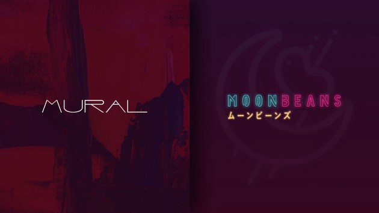

# Moonbeans Integration

---

[Moonbeans](https://moonbeanstoken.com/#/collections) has integrated our Mural NFT Transfer tool into their platform.

---

## About Moonbeans & The Integration

[Moonbeans](https://moonbeanstoken.com/#/collections) is one of the fastest-growing NFT marketplaces on [Moonriver](https://moonbeam.network/networks/moonriver/), offering a central platform for digital creators and NFT enthusiasts to create, buy, sell, and trade their NFTs. With this integration, Moonbeans aims to broaden the reach of its market platform, allowing users to move and sell their NFTs on layers other than the Moonriver network, such as Polygon(Matic) and Arbitrum. Furthermore, minting NFTs on Moonriver is significantly cheaper than on ETH for example, meaning that the integration of Mural within Moonbeans will create a much more accessible platform for artists, whilst still giving them the option of selling their NFTs on other chains and layers.

Moonbeans’ incorporation of the Mural bridge allows metaverse and gaming projects built on Moonriver to incorporate other ecosystem NFT collections, thereby expanding collaboration and community interactions beyond Dotsama native projects. Going forward, Moonbeans will also look to integrate with [Mosaic](https://mosaic.composable.finance/mural) — Composable’s asset transferral solution, which will serve as a bridge between Moonriver and other chains, including Arbitrum, Polygon, Fantom, and Avalanche C-chain, providing users another option to bridge their tokens to the Moonriver network.

---

## Future Integrations

The incorporation of Mural by Moonbeam is only the beginning of a long line of NFT projects infused with creative expression and ingenuity that has yet to be seen in the Web3 economy. As more NFT projects integrate the Mural bridge, the protocol will become a powerful tool in the hands of game developers working on in-game asset transferals and propel the accessibility and availability of NFTs on major marketplaces regardless of the NFT’s native chain.

Composable intends to continue improving the Mural protocol to create a vibrant and extensive network of cross-chain and cross-layer NFT transferals.