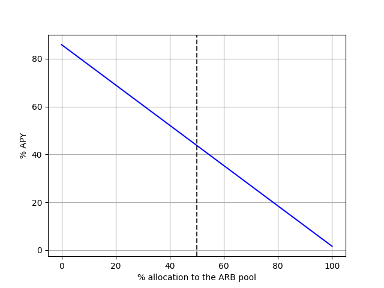
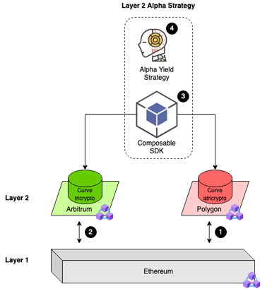

# TriCrypto, aToken, and SLP PoC Expansions

---

## Summary

We have added compatibility to Mosaic to allow for the cross-layer transferal of receipt tokens from the Curve, Aave, and SushiSwap platforms. These liquidity provider (LP) tokens are termed TriCrypto/aTriCrypto, aTokens, and SushiSwap LP (SLP) tokens, respectively.

By allowing users to swap these tokens across our Mosaic offering, they can be moved between any linked layers (currently, that includes Polygon, Arbitrum, the Avalanche C-Chain, and mainnet).

The benefit of adding LP tokens in particular to Mosaic is that LP tokens have many use cases in DeFi; in addition to being cashed out for their underlying LP stakings plus any accumulated rewards, LP tokens are often used as a means of collateralizing loans or participating in other dApps. Thus, we have allowed some of the most popular LP tokens to be integrated into Mosaic to allow for maximum user opportunities and functionality.

For each of these three token types that we added, we re-opened LPing for our cross-layer asset transferal system for an additional 3 days, this time leveraging Curve pools to provide ample liquidity with improved fees. After this 3 day LPing period into our L1 vaults, the LP vault deposits closed, and transfers of these LP tokens are now enabled across Mosaic.

---

## Improving our PoC LPing Structure

Composable is continually striving to discover the best way to optimize cross-layer liquidity provisioning (LPing) while also optimizing fees. These metrics are a key focus of our research related to [Mosaic](https://mosaic.composable.finance/) and its Proof of Concept (PoC), the [Polygon-Arbitrum Cross-Layer Transferal System](https://composablefi.medium.com/the-launch-of-our-polygon-arbitrum-cross-layer-transferral-system-a-novel-proof-of-concept-b4cfc8cf0023).

Through the research endeavors here at Composable Labs, we have developed a mechanism for liquidity provisioning across L2s that our simulations have shown to deliver high liquidity with increased rewards distributed to liquidity providers (LPs). This mechanism involves two [Curve Finance](https://curve.fi/) pools (one on Polygon and one on Arbitrum), which are monitored for exchange volume activity. The Composable software development kit (SDK) automates and simplifies token movements between these pools to abstract away the constant manual tracking and shifting of liquidity. This allows users to have a vastly simplified cross-layer transaction experience, where liquidity is not a concern, and LPs are amply rewarded - precisely the win-win situation Composable seeks to deliver. 

**Through our simulations, we project that this new active strategy will have additional returns: around a 4% APY or much higher (towards the theoretical max of >1,100%), as compared to a passive LPing strategy that would show lower returns.**

---

## Current Limitations in our Cross-Layer LP Model

Our first model for cross-layer LPing is incredibly promising; currently the performance in our vaults for wETH is a 37% APY, and 17% for USDC. This model involves a farming vault on L1 supporting cross-layer transactions, as explained in more detail [here](https://0xbrainjar.medium.com/introducing-mosaic-tackling-cross-layer-2-liquidity-provisioning-through-delivering-a-new-means-of-1c1edb8691df).

Yet despite this potentially lucrative new opportunity for cross-layer LPing, we know we can further improve this model and have been exploring options through Composable Labs. In particular, in the initial model, LPs would have to be constantly manually reshuffling liquidity across Polygon and Arbitrum. 

For example, take an LP that is 100% allocated to the Arbitrum pool when they discover that the revenue in another pool is increasing and will likely soon exceed their current income. Revenues vary over time and nothing is certain, but they decide to reallocate their contributions to 50/50 between the pools initially. To do this, they need to un-LP on Polygon and move the funds to L1 Ethereum waiting for the exit time pass. Then, they must move the funds to Arbitrum. Finally, they need to deposit into the Curve pool on Arbitrum, receiving the corresponding LP tokens. But, then it is likely that the revenue ratios between the two pools will change again shortly thereafter and a new reallocation will be necessary, requiring the lengthy, manual, error-prone process to be repeated.  

Enter the Composable SDK, automating and simplifying the token movement. This abstraction enables us to build even more powerful financial stacks and strategies, as presented here. Our alpha strategy seamlessly moves LP tokens between layers and chains with no need for concern or involvement from the user.

The LP simply inputs their exact strategy parameters (the rules governing when LP tokens are moved) and Composable’s technology takes care of the rest.

---

## Composable’s Layer 2 Alpha Strategy Overview

Before presenting our Layer 2 strategy, consider a passive investment strategy shown in Fig. (1) on data collected on-chain in the time period August 26th 2021 to September 26th 2021. Funds are allocated upfront in some ratio between the pools (the vertical black line shows a 50/50 allocation). We find the following returns are obtained on one particular snapshot of data (keep in mind that this curve below is time-dependent, we just show it at one point in time):

*Figure 1:  The passive investor strategy: allocate 50/50 (see vertical dashed blackline) to the pools upfront, do not re-invest, and just wait and collect returns. However, we see an opportunity cost here in that, if the allocation had been much more in favor of POL (lower values on the x-axis), the overall return would have been much higher. Conversely, making the wrong bet on a pool (e.g., allocating 100% to the ARB pool) could have significantly lowered the overall performance down to <2%.*

So, at a 50% allocation upfront between the pools, the investor makes around a 2.8% annual percentage yield (APY). But, they could have made around an 4% APY via a 100% allocation to the Polygon pool instead. The key here is that this is not known upfront and that this graph changes over time (and can swap in favor of Arbitrum).

To resolve this issue, we then proceeded to simulate the “perfect strategy” which is hypothetical, but can allocate to the best pool (most activity) in a given instant. This is not practically possible to construct, but can help us understand the theoretical APY ceiling. We find a return of 1,306% in this case. Thus, passive allocation leaves a lot of return on the table which we seek to recoup for our users. 

We can view the alpha strategy that we present as an intermediate solution where we seek to obtain returns from the larger end of the passive pool upwards to the theoretical limit. The limitations will be the time it takes to move tokens between the networks and how good of a predictive mechanism is in play.

We now visualize our proposed strategy setup in Fig. (2) below with each key section labeled with a black circle with white text.

Underlying our system is the Ethereum blockchain. On top of this Layer 1 (L1) infrastructure are two Layer 2 systems: Polygon (POL) and Arbitrum (ARB). Ether (ETH) can transfer back and forth between L1 and L2 on Polygon (see the black circle 1) and these transfers can also hap- pen between L1 and L2 on Arbitrum (black circle 2). The Curve (CRV) pools are shown as cylinders on top of each L2 platform. These pools are similar in that they support the same three tokens (they are Curve TriCrypto pools on Arbitrum and mainnet, and Curve aTriCrypto pools on Polygon). Users can LP into each pool and earn revenue when traders swap any pair (for example, wrapped Bitcoin to wrapped Ethereum) of the three tokens. 

The primary question is how the funds for a given investor should be split among the ARB Curve pool and the POL Curve pool. What drives yield from the investor’s perspective is trading activity within the pools. This activity varies over time and can be forecast and predicted which in turn can help automate asset allocation between the pools. Moving funds between the pools is a very manual process, but by leveraging Composable Finance’s SDK, the movement of ETH between the two layer two pools becomes trivial. By using Composable’s technology, we abstract away the inter-chain, inter-layer, liquidity problem and speeds up the strategy to produce profit. This greatly simplifies the logic of the alpha yield strategy (fourth black circle). Based on real-time data, the strategy can make decisions on how to allocate the capital and re-balance as needed, also factoring in the cost of doing so (there is a small fee associated with the extreme convenience of cross-layer transfers).

*Figure 2:  Visualizing the strategy setup showing the various layers of abstraction on top of the main Ethereum network. Yield is obtained by a manager - a fund manager/bot (black circle 4) - running investment decisions on top of data. Actions are taken using the Composable SDK (black circle 3) which in turn handles any transfer from the ARB Curve pool (black circle 2) to the POL Curve pool (black circle 1) and vice versa.*

---

## Benefits of Leveraging Curve Finance in the Alpha Strategy

As an automated market maker (AMM)-based decentralized exchange (DEX), Curve is built to be highly-efficient at trading stablecoins and tokens which remain in a similar price range (such as tokenized versions of ETH). Through its concentration on stablecoins, Curve is able to reduce volatility within its exchange.

Unlike other DEXes which use an intermediary asset to swap tokens — with the process going from token A to B to C — Curve is able to swap tokens directly from A to C, the final destination. This direct exchange helps to reduce transaction fees and minimize slippage.

In its efforts to provide these benefits, Curve makes use of liquidity pools for direct swaps. Each pool holds a few assets at a similar price, with usually two or three tokens total. As an example, at the time of writing, one of Curve’s pools holds cDAI and cUSDC. If a user was looking to exchange cDAI for cUSDC, they could deposit their selected token type into the pool in return for an equal amount of the other tokens.

The protocol is controlled by an AMM which rebalances the pools after each exchange. In order to rebalance, the price of the recently deposited token drops to create an arbitrage opportunity until enough tokens are bought and the pool is rebalanced. As is common, Curve’s liquidity pools also provide yield for staked assets. 

Critically, Curve also has instances on Polygon and Arbitrum, making it usable for our PoC.

---

## Alpha Strategy Simulation Methods & Data

As an initial step in building this new SDK-backed cross-layer LPing strategy, we collected data in a proof-of-concept (PoC) to support its business case and to make data-driven decisions surrounding the potential and backing up our intuition. Excitingly, we found a strong correlation between what we believed to be possible and what was happening on-chain.

Composable Labs first ran the blockchain data scanner on the Curve pool on POL and found all exchange events (one exchange event means a single token swap in the pool occurred). We repeated this for ARB - all in the time frame August 26th 2021 to September 26th 2021. Then, we leveraged API calls to Uniswap to obtain pricing information about the swaps, which in turn allowed us to compute the USD equivalent volume. We studied the deployed contract codes to get the fees for the pools charged to LPs. Thus, we knew the total revenue generated in USD for each pool at any point in time. We made the assumptions of using same-day pricing for all exchange events within a day (i.e. not intraday resolution) and we assumed the same ratio of reserves in the pools as it was near September 27, 2021. These are assumptions that can be removed later on, but our general results are unchanged.

We then created a global time grid and snapped the revenues onto this grid. We subtracted ARB from POL and this gave us the delta revenue stream versus time - we call it the delta distribution. If this stream is positive, it implies that more revenue can be obtained by staking in the ARB pool. But, this distribution changes over time and there is a (small) fee involved with moving the LP tokens so moving 100% back and forth might not be the best strategy either also when factoring in risks. Besides, the exchange volume can change and experience spikes in time intervals shorter than the time it takes to reallocate the portfolio. From this, we found that the optimal distribution of capital is not one in which 100% is allocated to one of the L2 pools.

Next, we look at how the direct/actual distribution changes over time. These data will be computed in real-time allowing the strategy to apply conditional rules governing the reallocation actions.

---

## Alpha Strategy Simulation Results & Implications

Combined, this leads us to one of the key findings in this work: namely the insight that an optimal alpha strategy should be dynamic in time (in other words, a static upfront allocation is not better) and should intelligently decide when to move the LP tokens and how many to move. 

**Perhaps most importantly, we discovered that this strategy offers increased rewards for LPs: by having the opportunity to partake in the active strategy versus a traditional passive strategy, we show that additional returns from around an 80% APY or much higher are projected.**

As shown, to effectively and safely accomplish this, we leverage Composable’s SDK. Thus, we solidified our proposed alpha strategy:

We turn the data collected into actionable insights guiding the investment manager/bot. We envision that this be a bot continuously reading in the data making decisions based on this in real-time.

The strategy can be thought of as a function with the following required inputs:

- How many funds to allocate overall to this strategy.
- What is the max allocation in one pool at any time; e.g., 80% (this of course implies the minimum as well to be 20%).
- What is the distribution of allocation versus the number and types (mean or skewness) of windows favoring a given pool. We will provide an example of this below.
- A limit on the total turnover ratio computed as number of turnover events over the total number of dates in a rolling window.

---

## Conclusions

Composable Labs has already uncovered cross-layer liquidity provisioning as a new opportunity with potentially significant yield. We have now furthered our investigation into optimizing this strategy for LPs themselves (in terms of the fees they earn) as well as optimizing the liquidity available for cross-layer transactions.

Our research endeavors have shown us that a cross-layer LPing strategy using Curve TriCrypto pools on Polygon and Arbitrum with automated redistribution of liquidity via the Composable SDK results in optimizing these aforementioned metrics.

As a result of the promising results we observed in this simulation, we will be reopening LPing for Mosaic’s PoC for an additional 3 days using this strategy, before returning to a period where cross-layer transactions themselves are active. This will further help us test our alpha strategy using real-world transactions, helping us refine the model that is best for our users.
