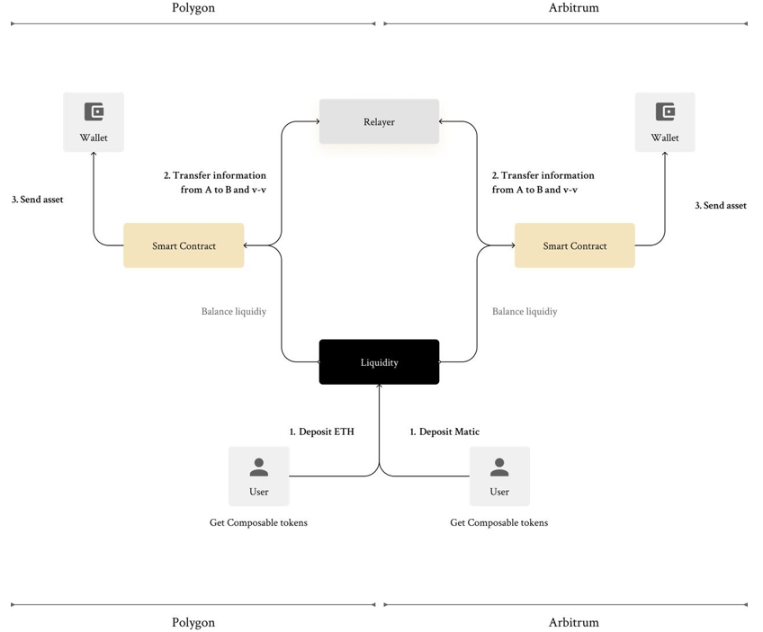

# PoC Components and User Flow

---

## Components

The system is represented by the following components:

### L1 Vault

This holds the liquidity necessary for the PoC to work. Each user adds liquidity into the vault and will be incentivized with Composable Tokens after our TGE. This represents an entirely new opportunity in the DeFi space: cross-layer liquidity provisioning.

### L2 Contracts

These are deployed on Polygon and Arbitrum and facilitate the transfer of assets to the user. The liquidity we obtained with the help of the L1 Vault will be balanced between these two L2 contracts.

### The Dispatcher

The responsibility of the dispatcher is to notify the respective L2 Contract to release funds to a specific address, ensuring that the original depositor of the funds on one L2 receives the same funds on the other L2. This feature will be implemented after the PoC is in place.

---

## User Flow

User flow for our Arbitrum-Polygon Cross-Layer Transferral System is depicted below:

This process can be described as follows, in the example case of a user who wants to transfer 1000 UNI (as an example, UNI is presently not an option in the PoC) from Arbitrum to Polygon:

1. The user shows up on our platform where they're prompted with the possibility to transfer WETH or USDC from Arbitrum to Polygon or from Polygon to Arbitrum.

2. The user inputs their request for transferring 1000 UNI from Arbitrum to Polygon.

3. We check if there’s enough UNI in the L2 Vault from Polygon.

4. 1000 UNI are locked in our smart contracts from Arbitrum.

5. Once step #3 is finished, the dispatcher off-chain service dispatches the movement operation to Polygon.

6. The L2 Vault from Polygon transfers the designated UNI to the user’s wallet

Before the system can work properly, a period of accumulation will be necessary (3 days in which we will be allowing LPing in our L1 vault), in which the liquidity is locked in the L1 vault. Of course, this won’t be necessary anymore in the phase 2 of the project (i.e. expanding upon the PoC), when connecting directly to various AMMs which already have the necessary liquidity.
