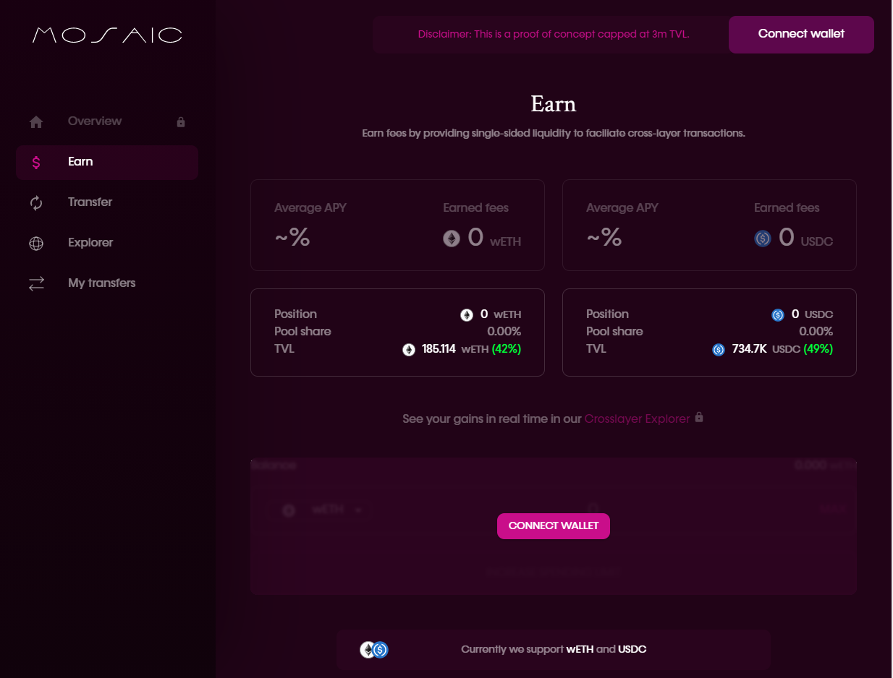
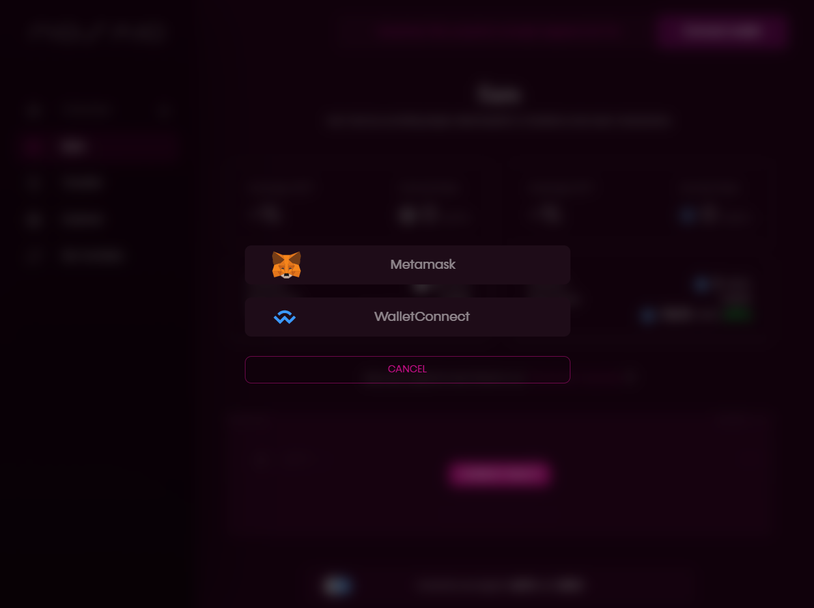
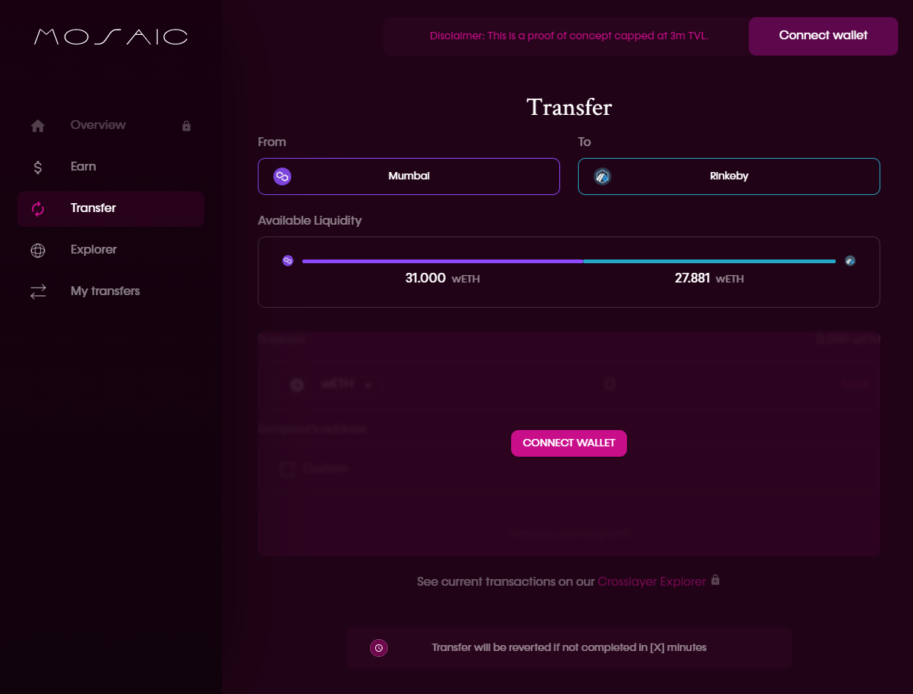
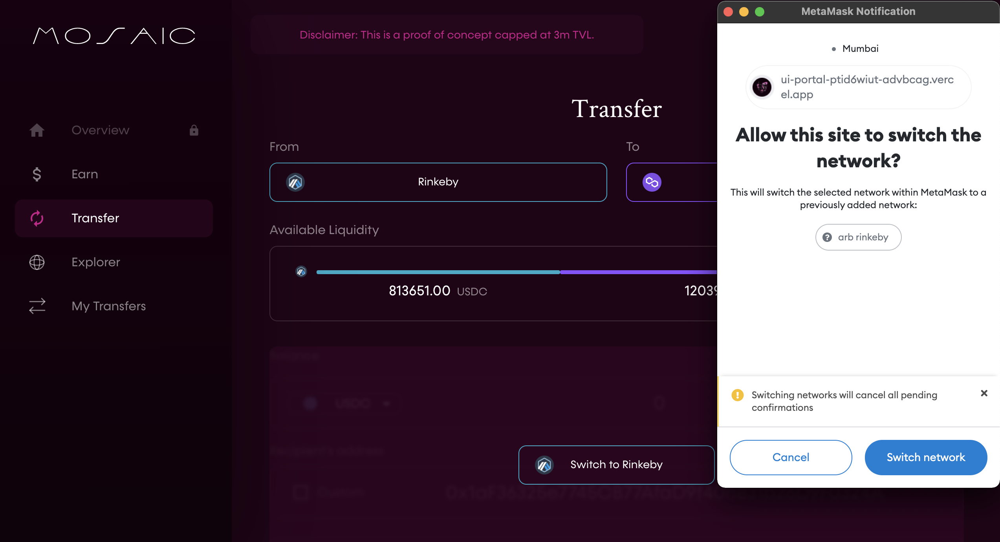
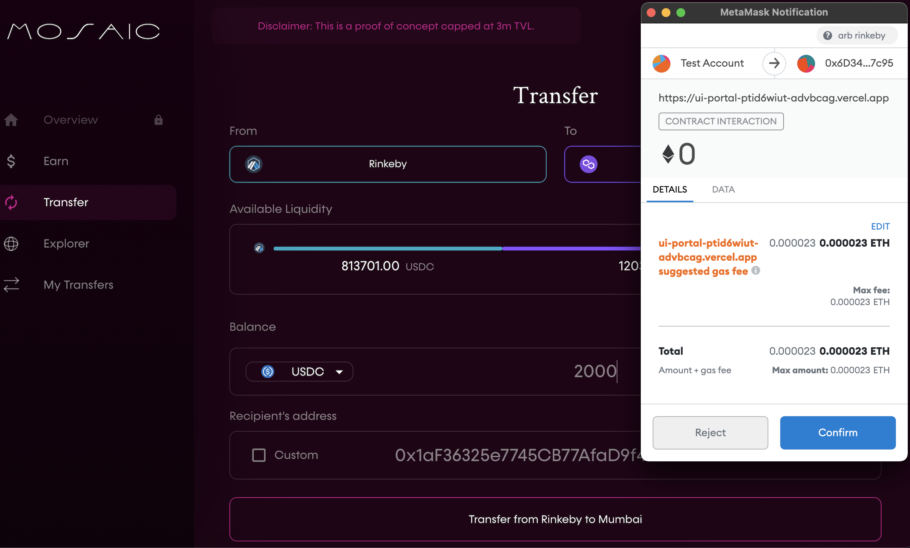
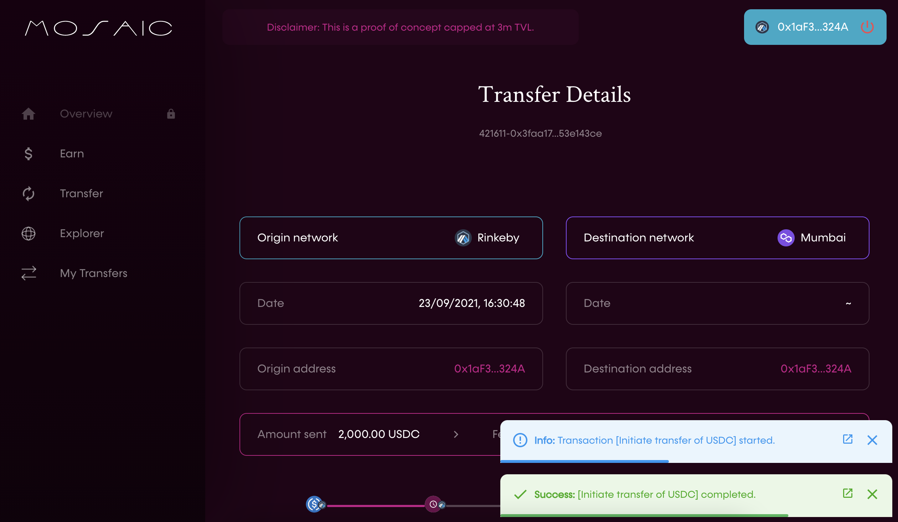
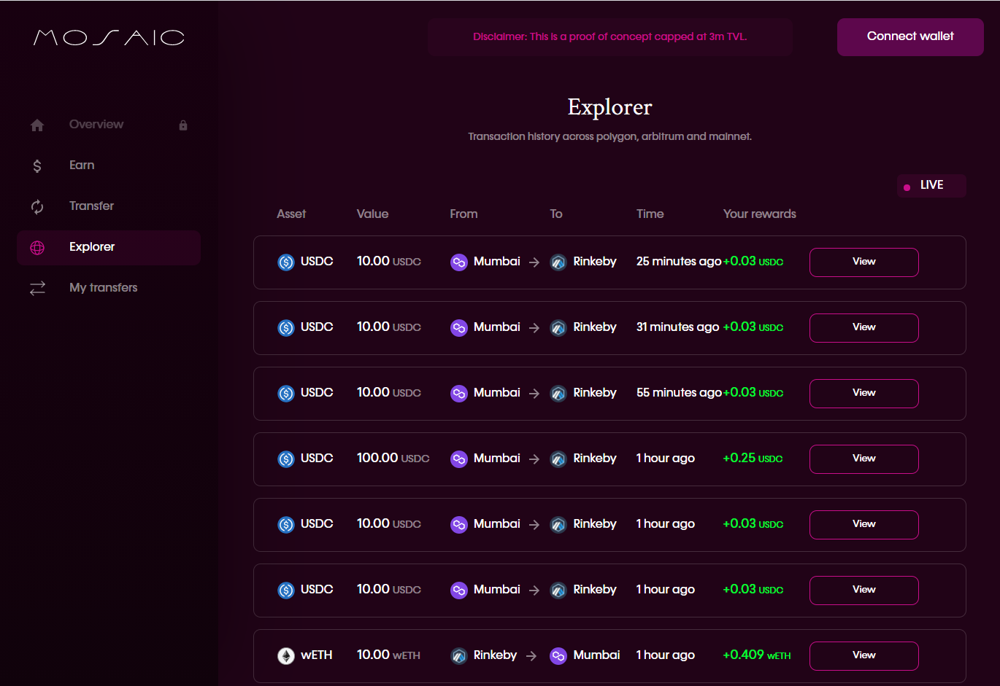
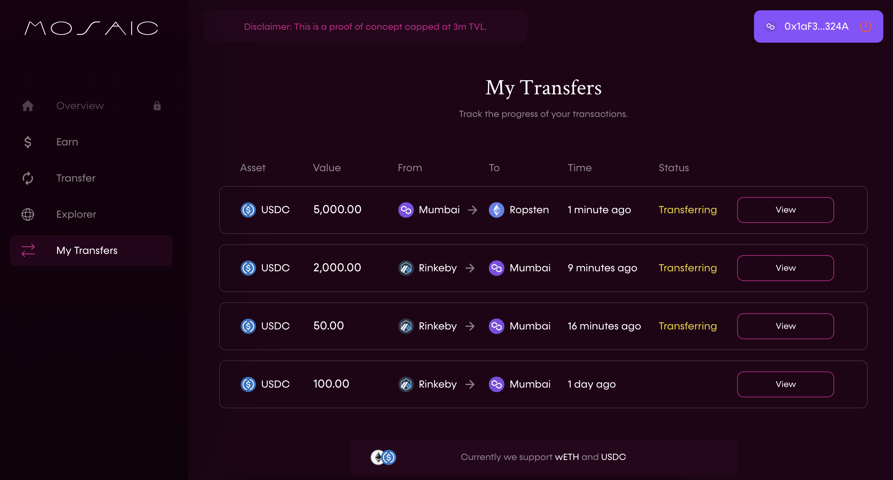

# PoC Walkthrough

---

## Navigating the Mosaic PoC
Mosaic, our layer 2-layer 2 transfer system, will be available at [https://mosaic.composable.finance/](https://mosaic.composable.finance/). We are currently in the PoC phase, where users are able to move assets between Polygon, Arbitrum, and the Ethereum mainnet, in addition to supplying liquidity to a layer 1 vault to allow users to move between these layers.

### Connect a Wallet
To get started, you should first connect your wallet to Mosaic. You can do so by clicking the “Connect wallet” button located at the top right of any page of Mosaic, such as the “Earn” page here:

This will open the following window, which will walk you through the process of connecting either a Metamask or WalletConnet wallet, depending on your selection:

### Earn

The Earn page provides you with the ability to supply single-sided liquidity to our layer 1 vault to facilitate the cross-layer transactions within Mosaic:

This will earn you an APY. As an experimental PoC, Mosaic currently supports deposits of wETH and USDC only. Thus, at the top of the page, you can see your average APY and earned fees for wETH and USDC deposits. Underneath each of these stats, you can also see your position for these two tokens. First, your total position (number of tokens deposited) is listed, followed by what share of Mosaic’s total pool of these tokens that your position makes up, and the TVL in this pool (with the percent of the $3 million cap).

Once you have connected your wallet, the Earn page is also where you will deposit wETH and/or USDC. Towards the bottom of the page, you will be able to select the amount of each token you would like to deposit. This will also provide you with a prediction for your earnings based on this deposit.

Our Crosslayer Explorer feature, will enable you to see your real time gains on your deposits. 

### Transfer

The transfer page allows you to leverage the Mosaic PoC to complete cross-layer transfers between Polygon, Arbitrum, and the Ethereum mainnet:

At the top of the page, select which layers you would like to move between. Here, a transfer from Polygon to Arbitrum is depicted. The available liquidity for this transfer will be visible below.

Switching from networks will require you to switch network on your connected wallet. In this case, switching from Polygon to Arbitrum, will require you to press 'Switch to Arbitrum' on the UI and which will launch your wallet connection. The custom network will be added if you do not already have this. 

Once you have connected a wallet on the desired network, you will be able to select the parameters for your transaction, including the amount and type of token you would like to transfer. The fee on this transaction will also be visible. When the user is satisfied with these parameters, they can opt to submit and confirm the transaction.

Once confirmed, the transfer will be initiated and you will be shown your transfer summary as above.  

The PoC will be commenced with the following parameters:

- USDC min and max transfer size: 100USDC and 20k USDC
- wETH min and max transfer size: 0.04 wETH and 7 wETH
- Delay of a user making the same transfer on the same network: 5 min

As this is a PoC, we are still optimizing functionality and it is possible that some desired transactions may be too large to have the appropriate liquidity to go through. Once a user’s transaction is specified, the bottom of the page will display how long the transfer has to go through before it would be reverted. This ensures user funds are not unavailable to them for any significant period.

### Explorer

The “Explorer” tab allows you to explore transactions on our platform, in real time, and how these transactions are rewarding you for providing liquidity:

For each transaction, the asset type, value, source and end layer, transaction time, and the rewards you have accrued via supporting the liquidity in this transaction. You can also select the “View” button next to each transaction to view more details, or scroll down to see older transactions.

In the explorer, "Your Rewards" refers to the amount of earnings that liquidity providers in the L1 vault are earning. These will be distributed in LAYR. 

## My Transfers

The “My Transfers” page allows you to see the progress of your transactions through Mosaic:

For each transaction, you can see the asset type, value, source and end layers, transaction time, and transaction status.
