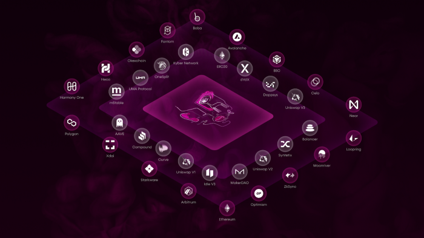

# The Composable SDK
*Our SDK embodies our vision of propelling composability in DeFi; this kit lets solidity and frontend developers utilize our malleable infrastructure and build cross-chain solutions directly into their*

---

*The Composable SDK allows developers to leverage cross-chain capabilities to create a vast range of new and improved functionalities for users.*

Our Composable software development kit (SDK) consolidates our cross-layer capable technology to DeFi developers across the industry. Included within the SDK are the connections to our layer 2-layer 2 transferal system [Mosaic](https://mosaic.composable.finance/), this interoperable kit will unlock cross-layer opportunities. This will allow dApps to optimize scaling solutions for the benefit of all parties involved, from developers and dApp operators to end-users.

---

## About Composable’s SDK

The Mosaic SDK is a ground-breaking toolset that grants developers the power to build the next generation of DApps powered by our Mosaic infrastructure across all levels of development — from basic helpers providing cross-layer transferal capability to advanced composability functionality utilizing DeFi protocols, interacting with Vaults strategies, and the ability to unlock countless other capabilities etc.

With additional protocol features, our SDK interfaces directly with dApps like [Curve Finance](https://curve.fi/) and [Uniswap](https://uniswap.org/), creating a dynamic expansion to the tools developers can utilize. This allows developers to leverage well-established protocols to build cutting-edge sophisticated financial tools. In the near future, we plan to connect our SDK with more existing dApps to expand opportunities for developers, allowing for greater creativity and flexibility when designing protocols. In addition, we are adding more bridges to our SDK so that it will serve as a bridge aggregator.

The key to our SDK’s cross-layer interoperability is its connection with Mosaic, which allows for seamless interoperability between scaling solutions. In addition to its already incorporated ecosystems, Mosaic will grow significantly to incorporate more layer 2 (L2) platforms.

With the addition of more and more L2s to Mosaic, developers will have an increasing number of options to leverage the advantages of scaling solutions. Moreover, developers leveraging our SDK will give their end-users the opportunity to utilize the L2 of their choice while only having to engage with one user-friendly and seamless interface. New cross-chain applications can also be created, such as cross-layer yield aggregators, providing the means for novel dApp creation.

---

## Using and Contributing to the SDK

We welcome all developers to benefit and use the power of our SDK to build their own protocols. With a focus on developer-friendliness, we have optimized our kit to be easily accessible and simple to use.

Our Composable Finance Docs portal, provides developers with easy to follow instructions to enable them to build and integrate our SDK, which can be found [here](https://sdk-docs.composable.finance/).

Additionally, to open up the Composable ecosystem for development, we have launched the [Composable Grant Program](https://grants.composable.finance/) in which teams and individuals can apply to build dApps leveraging Mosaic and our SDK. The most promising projects to apply will receive funding in addition to developmental support from the Composable team.

Interested parties can apply for the Composable Grant program [here](https://airtable.com/shryLItVAiXjWzqdn).

Beyond our grant program, we invite developers to access our SDK and utilize Mosaic to build interoperable dApps. Further, we welcome all to contribute to our SDK by submitting pull requests for additional interfaces to be added.

We are confident that the Composable SDK will become widely utilized throughout DeFi, letting developers seamlessly integrate cross-chain interoperability into their projects. In the meantime, we will continue to further develop integrations, add more layers and additional tools to our SDK and Mosaic in the coming weeks.

**To keep up to date, join in the conversation or seek technical support on integrating our SDK, developers can also join our [#sdk-dev-support](https://discord.gg/AjyXHQUB) Discord channel.**

---

## Composable SDK Use Cases

The Composable SDK is an integrated solution with multi-dimensional capabilities. Its functionalities range from simple cross-layer transferal mechanisms to much more sophisticated capabilities that cut across multiple blockchains, established DeFi protocols, and layer 2/scalability solutions.

Take a deep dive into a few key use cases of the Composable SDK toolset.

### Cross-Layer Transferals

The Composable SDK serves as a cross-layer interoperability solution upon which developers can leverage the creation of protocols that can benefit from easy cross-layer transferals. This is especially useful for projects that aim to scale across multiple layer 2 solutions; the SDK will be useful for projects that want to maintain multiple instances across different L2 solutions or separate blockchains. This practice is currently popular, with major protocols such as [Uniswap](https://uniswap.org/), [SushiSwap](https://sushi.com/), and [Curve Finance](https://curve.fi/) already having instances on multiple L2s in addition to the Ethereum mainnet — in fact, we have already integrated these prominent platforms into Mosaic. By building on Mosaic through the Composable SDK, many other projects (including those focused on arbitraging, yield farming, loans, and liquidity provisioning) can trailblaze alongside major players in the space to easily maintain cross-layer coordination.

### Token Swaps through AMMs

Our SDK also enables developers to create a cross-chain token swap system through various Automated Market Makers (AMMs). This is made possible by the many platforms that have already been integrated into Mosaic, including [Avalanche](https://www.avax.network), [Moonriver](https://moonbeam.network/networks/moonriver/), [Arbitrum](https://bridge.arbitrum.io), [Polygon](https://polygon.technology), [Fantom](https://fantom.foundation/?__cf_chl_jschl_tk__=pmd_WquJY5nzn8vjMmWIX87bjEE3ZaMgNxtAFlPBo4FO8uE-1635326381-0-gqNtZGzNAfujcnBszQiR), and [the Ethereum mainnet](https://ethereum.org/en/enterprise/). Additionally, dApps like [Sushiswap](https://sushi.com), [Uniswap](https://uniswap.org), and [Curve](https://curve.fi) have also been integrated.

To easily swap assets cross-chain, developers can use one of the aforementioned AMM protocol’s packages in the SDK to get the address and ABIs of the AMM making it possible to swap between two specified tokens. Then, the user can use libraries provided by either v1-SDK-contracts (for Solidity developers) or v1-SDK-typescript (for frontend app users) (available in version 2 of Mosaic). The user then utilizes the transfer library provided by the SDK to connect to Mosaic. Mosaic’s address can be retrieved from the protocols’ package to move assets cross-chain. When funds arrive here, **Swap Helpers** are used to complete token swaps, while **Liquidity Helpers** are deployed to add liquidity into the destination pool.

### Query Chainlink Price Data

The SDK contains a mechanism that enables end-users to query [Chainlink](https://chain.link) price data for collateralized assets on lending protocols at risk of becoming liquidatable. A viable solution would be for users to set up notifications to this effect.

The standard procedure involves creating a bot that sends Telegram notifications whenever the position is at risk. Users can create a **daemon service** that uses existing contracts which import the Chainlink library to query token prices. You can set this bot such that whenever the price is lower than a predefined liquidatable threshold, notifications would be sent via Telegram to your account there. You could also enhance your experience by adding top-up features to automatically provide more collateral.

### Add and remove Liquidity through AMMs

With the Composable SDK, Users can remove liquidity from a roll-up layer without having to wait weeks as usual. Using the transfer library provided, the entire withdrawal process can be completed within minutes. Liquidity can also be added to support cross-layer asset transfers as well, ensuring that these transactions can go through uninterrupted.

### Create a Dashboard for the Composable Community

Developers can easily create a user-friendly dashboard (to serve as a guide) with the SDK. You can use the transfer library to customize parameters such as showing available liquidity for the token transfer, minimum/maximum transfer size, etc. Developers can also create models such as fee simulators for frontend users to further improve transparency and the user experience.