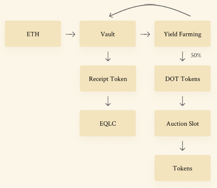

# Parachain Vault Strategy

---

Composable developed its parachain vault strategy initially for procuring its Kusama parachain, Picasso. This strategy was then revamped for procuring our eponymous Polkadot Parachain, Composable. More details on this repurposing can be [found here](./parachain-vault-strategy/vault-strategy-expansion.html).  

## For transparency, we are continuing to publicize the parachain vault approach we took when bidding for a Kusama parachain. This strategy is no longer being implemented to support Kusama parachian procurement, as this milestone has already been achieved. Please note that the information in italicized text below is outdated for this reason:

*To receive and maintain a Polkadot parachain, it must be purchased in an auction with the chain’s native DOT token, and maintained with continued DOT stakings. Similarly, to receive a Kusama parachain, it must be purchased with its native KSM token and maintained with KSM stakings. We implement strategies to ensure that we obtain enough KSM/DOT to secure the parachain.*

*To maximize our chances of winning a parachain slot, we are working on rewarding users who help us stake KSM/DOT with a novel ETH vault strategy.*

### *Limitations of Present Parachain Strategies:*

*Typically, projects seeking a parachain rely on Polkadot’s crowdloaning functionality instead of funding the project entirely themselves or relying on limited grants. This crowdloaning mechanism asks users to migrate their assets over to Polkadot and stake them in the ecosystem. The same goes for Kusama. Ultimately, KSM and DOT are largely used as assets that are locked up in some manner or another. This is a far cry from the complex DeFi world where receipt tokens and yield farming allow for a trader’s assets to work for them. Overall, this means that the actual contributors of KSM/DOT are not very well rewarded for performing this essential functionality.*

### *The Composable Strategy:*
In contrast, Composable is always looking for unconventional ways to increase capital efficiency and benefit our users. That is why we are allowing our supporters to help us in parachain procurement—and earn yield at the same time.

***Our new solution allows for participation in our parachain with ETH or any ERC-20 token asset, rather than purchasing KSM/DOT and locking them up.** With our novel approach, we expand our ability to stake KSM/DOT and allow users to continue gaining profits on their staked assets.*

*In our system, users will deposit their ETH in an unlocked multisig vault. While the asset is in the vault, the ERC-20 tokens will be routed through our yield farming strategies to increase gains. Composable will then use the earned gains to purchase DOT and KSM in a centralized manner. KSM (for the Kusama parachain) and DOT (for the Polkadot parachain) presently do not have an existing method for purchase. However, Composable expects leading players like THORChain and others to be able to unlock this capability. This KSM/DOT tokens will be used to secure our parachain auction spot and allow for the continuation of the protocol.*

*50% of the yield from the strategy (regardless of the particular vault) will be collected by the Composable Treasury and automatically routed to buying more KSM/DOT and increasing the user’s stake in our parachain. When the Treasury purchases KSM, the details of these purchases (such as assets sold/bought) will be logged and reported transparently.*

*The rest of the yield will be returned to the user as a reward for staking. Rewards are assuming a price of 1.05 for LAYR Tokens, and out of the tokens earned, 50% are available on TGE, and the rest are vested over six months.*

*Users will also receive a receipt token (parachain Auction Tokens, or pAT) memorializing their stake in the vault, which can be further used to mint Equal Cash (EQLC), our multi-layer stablecoin. The current lock time is presently 0.*

*There will be a configurable 1% withdrawal fee for users of this strategy, which can be configured upon agreement by the forum. This uniquely beneficial strategy is depicted below, using DOT as the example, but also applying to our KSM strategy:*

**Strategy Benefits:**

*In return for staking in our ETH vault, users receive the following value adds:*

- *Exposure to Composable Tokens*
- *Exposure to Kusama/Polkadot parachain auctions*
- *Exposure to KSM/DOT*
- *Yield on staking*
- *Yield on Composable Farming*
- *Minting Equal Cash off a receipt token (parachain Auction Tokens, or pAT) from the vault*
- *Further vaults for use of EQLC*

*This incentive model simplifies user experience significantly, as well as improves incentives and capital efficiency. All the user has to do is show up with digital assets—we will do all the work to yield farm and create KSM/DOT on the back-end while the user is rewarded.*

*Staking KSM/DOT for parachains has a built-in opportunity cost—meaning rewards for KSM/DOT stakers are limited in current models. Our goal is to remove this cost with the issuance of receipt tokens (parachain Auction Tokens, or pAT) and the implementation of strategies for maximizing yield.*

*With our ETH vault, users can get cross-chain exposure while supporting our parachain. This is an entirely new mechanism that allows for parachain auctions to be more participatory, as anyone with an Ethereum asset can show up and join. Thus, we believe our novel methodology for procuring and running a parachain has the potential to change the Polkadot landscape completely.*