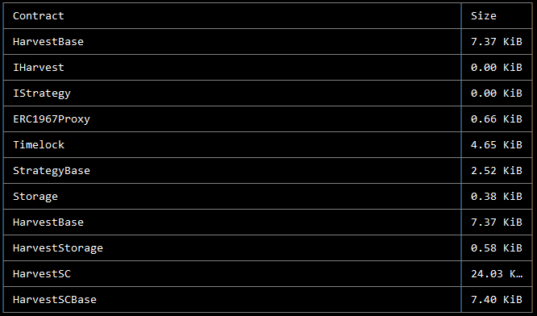

# Contracts - Technical Details

**For transparency, we are continuing to publicize the parachain vault approach 
we took when bidding for a Kusama parachain. This strategy is no longer being 
implemented to support Kusama parachian procurement, as this milestone has 
already been achieved. Please note that the information in italicized text below 
is outdated for this reason:**

*Our present options for vault strategies are as follows:*

1. *Harvest dai with ETH // Harvest dai with DAI*

2. *Harvest usdc with ETH // Harvest usdc with USDC*

3. *Harvest usdt with ETH // Harvest usdt with USDT*

*The contracts being used to power the vaults are as follows, with definitions 
below:*

* ***HarvestBase*** *- base contract for all strategies using Harvest as the 
  underlying strategy*

* ***IHarvest*** *- interface for Harvest strategies*

* ***IStrategy*** *- interface for all strategies*

* ***ERC1967Proxy*** *- the proxy contract that points to a specific 
  implementation*

* ***Timelock*** *- contract to which ownership of all strategies will be 
  transferred*

* ***StrategyBase*** *- base contract for all strategies*

* ***Storage*** *- base storage contract*

* ***HarvestStorage*** *- Harvest strategies contract*

* ***HarvestSC*** *- contract used for Harvest strategies where users enter with 
  a stablecoin*

* ***HarvestSCBase*** *- base contract for all Harvest strategies where users 
  enter with a stablecoin*

*The following are the contract addresses for the deployed strategies:*

***HarvestDaiStableCoin:*** *0x4A03ea61E543eC7141a3f90128B0c0c9514F8737 (proxy)*

***HarvestUsdcStableCoin:*** *0xF12dA8470E2643cCb39a157e8577D9AA586a488f (proxy)*

***HarvestUsdtStableCoin:*** *0x1941441d31809e9E1828Da0cE6d44175F657E215 (proxy)*

