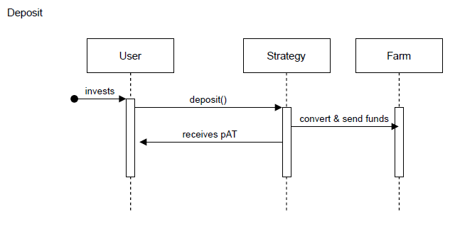
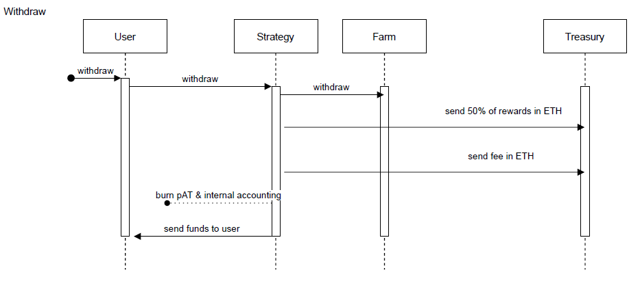
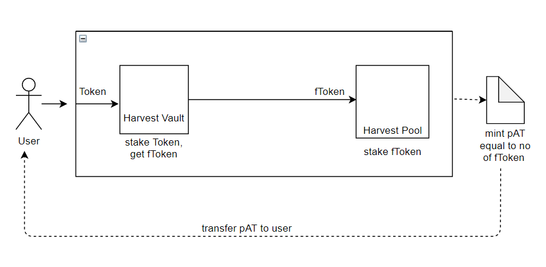

# Vault Process in Detail

**For transparency, we are continuing to publicize the parachain vault approach 
we took when bidding for a Kusama parachain. This strategy is no longer being 
implemented to support Kusama parachian procurement, as this milestone has 
already been achieved. Please note that the information in italicized text below 
is outdated for this reason:**

## *General Vault Flow*

### *Deposit*

*The diagram above illustrates the generic flow of all the vault strategies. The 
user first invests ETH or a specific stablecoin and gets back pAT (more info 
about this receipt token in the pAT - Parachain Auction Tokens sections). The 
investment is routed to specific yield farming strategies that have shown to be 
stable and secure.*

*For each one of the strategies, the detailed flow can be seen later on this 
page.*

### *Withdrawal*

*The above flow illustrates the generic withdrawal flow of all the strategies. 
The user returns either a portion of his or her pAT (or even the entire amount) 
and gets back the same token they entered with (either ETH or a specific stable 
coin) and 50% of the rewards obtained (in the same token they invested - ETH or 
a specific stable coin). The rest of the rewards (the other half) is sent to a 
treasury account, and funds from that treasury are later used to participate in 
the KSM/DOT auction.*

*At the beginning of this process, a fee is taken from each withdrawal, 
encouraging users to stake for a more extended period.*

## *Harvest Vault Flow*

### *Harvest Stablecoin Strategies*

#### *Deposit*

*The above diagram illustrates the summarized flow for “deposit” action of what happens internally in the case of a Harvest strategy (ex: Harvest DAI or Harvest USDC). The average gas used by a deposit transaction for a stablecoin Harvest strategy is 409684. Strategies that we will release initially are Harvest Dai, Harvest Usdc, and Harvest Usdt.*

#### *Withdrawal*

*The “withdraw” action is a bit more complex, as you can see in the diagram below:*

*In the case of Harvest, when you withdraw from the Harvest Pool, you get back 
your fToken as well as Farm tokens. Also, for the same amount of fToken that you 
withdraw from the Harvest Vault, you might get back more Token than what you 
initially deposited. As an example, if you stake 100 DAI, you get back 95 fDai 
and after 1 year you come back with these 95 fDAI, you will probably get more 
than 100 DAI, as well as Farm tokens).*

*The difference between the amount of Token you got now and the amount you had 
initially, plus the Farm tokens, are considered rewards. All the rewards are 
then converted to ETH. 50% of that ETH amount will be routed to the treasury, 
and 50% is swapped with Token (Dai, in the previous example) sent to you.*

*The average gas used by a withdrawal transaction for a stablecoin Harvest 
strategy is 819300.*

*Let’s take the Harvest DAI strategy as an example where you enter with DAI and 
get the rewards later. A full deposit and withdraw flow is explained below:*

1. *The user invests 4000 DAI.*

2. *4000 DAI are deposited to Harvest Dai Vault and you get back an amount of 
  fDai; let’s consider you receive 3500 fDai.*

3. *3500 fDai are invested into the Harvest Dai Reward Pool.*

4. *3500 pAT are minted and they are transferred to the user, alongside all the 
  internal accounting done in the contract.*

5. *Two months go by.*

6. *The user wants to withdraw and sends 3500 pAT to the withdraw method.*

7. *3500 pAT is burned.*

8. *3500 fDai is retrieved from Harvest Dai Reward Pool.*

9. *At this step we now also have Farm tokens obtained from Harvest. Let’s 
  consider that 1 Farm was obtained.*

10. *3500 fDai is sent to Harvest Dai Vault and an amount of Dai is received by 
  the contract. At step #2 we added 4000 DAI, but in this case, Harvest might 
  give back more than 4000. We will consider that 4350 DAI was received.*

11. *At the current step, we have 4350 DAI and 1 Farm tokens into the contract. 
  Given the fact that the user's initial investment was 4000 DAI, we consider 
  350 DAI and 1 Farm as rewards.*

12. *175 DAI is left aside for the user.*

13. *175 DAI and 1 Farm tokens are swapped with ETH at the current ETH/DAI and 
  ETH/Farm prices. Let’s assume total rewards are 0.125 ETH*

14. *50% of the rewards are marked and sent to the treasury: 0.0625 ETH.*

15. *The other 50% of the rewards are converted to DAI, so the user will be 
  entitled to around 90 more DAI.*

16. *The user gets back 4000 DAI (initial investment) + 175 DAI (extra tokens) + 
  90 DAI (rewards) = 4265 DAI total.*

17. *0.0625 ETH (that was sent to the treasury) is designated to purchase 
  KSM/DOT tokens. Besides the base APY the user had (4265 DAI compared to 4000 
  DAI minus their initial investment), they are also entitled to Composable 
  Tokens resulting in a much greater APY.*

*Please note that Composable Token does not exist yet, but it will be 
distributed after TGE to everyone who participated in the vault strategies. The 
APY entitled to each user depends on the total value locked (TVL) of all the 
strategies.*

## *Adding Strategies*

*We plan to expand our strategies in the future. Our community will also have 
the chance to vote on what other strategies we should implement. We also plan to 
launch gas friendly strategies by reducing the necessary amount of gas for a 
withdrawal transaction by at least 30%.*
