# Walkthroughs

**For transparency, we are continuing to publicize the parachain vault approach 
we took when bidding for a Kusama parachain. This strategy is no longer being 
implemented to support Kusama parachian procurement, as this milestone has 
already been achieved. Please note that the information in italicized text below 
is outdated for this reason:**

## *General Platform/Site Access*

*To access the Composable Finance platform and its features, visit its webpage 
at [composable.finance](https://composable.finance/):*

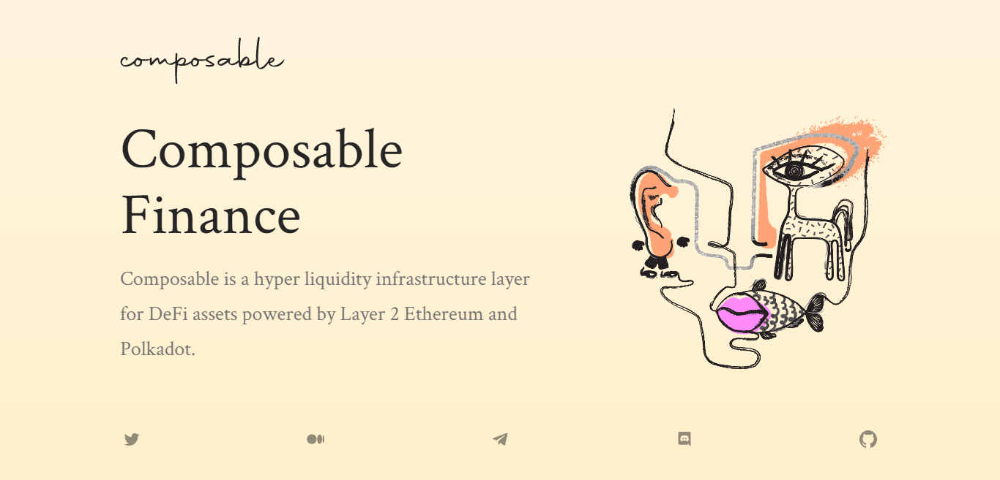

## *Wallet Connection*

*Once user functionality of the site goes live, users will be able to create an 
account, then connect a wallet.*

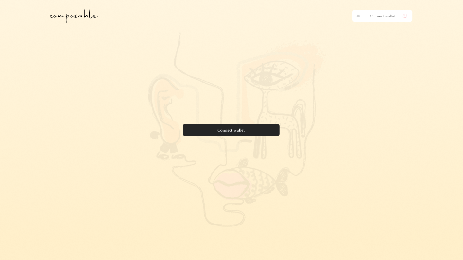

*After clicking "Connect wallet", the following prompt will appear, showing the 
user which wallet type they are able to add:*

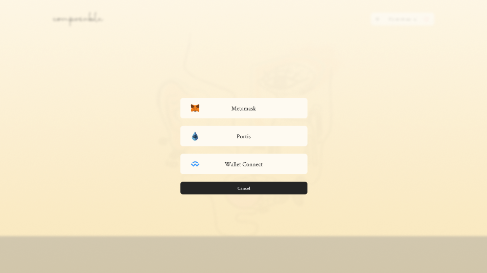

*Simply click on the wallet type you would like to add, and you will be prompted 
to sign into and connect that wallet.*

## *Protocol & Vault Strategies Overview*

*Once the user has signed in and connected their wallet, they will be able to 
view an overview of the Composable protocol and platform:*

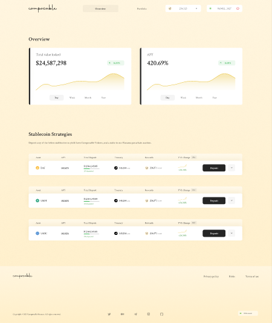

*The figure at the top left shows the total value locked (TVL) in the Composable 
protocol, in USD. This can be viewed by day, week, month, or year by clicking 
through the options at the bottom of the figure. The percentage change is 
depicted above the figure to the right.*

*Similarly, the figure at the top right shows the annual percentage yield (APY). 
Again, this can be viewed by day, week, month, or year by clicking through the 
options at the bottom of the figure, and the percentage change is depicted above 
the figure to the right.*

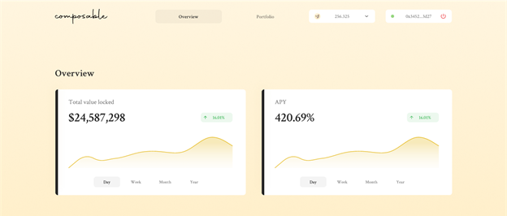

*The various stablecoin strategies of the platform are visible below that:*

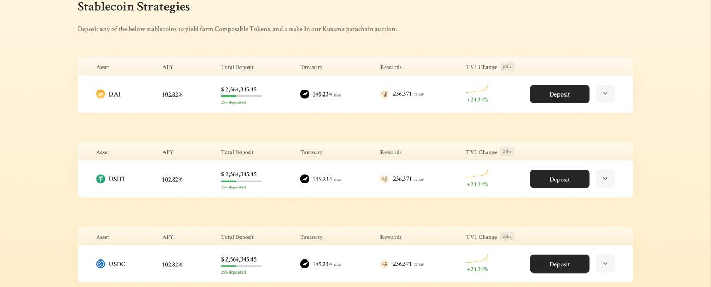

*As stated on the site, the user can opt to deposit any of the listed 
stablecoins in order to be able to yield farm Composable tokens, enabling the 
user to participate in Composable's bid to obtain a Kusama parachain. An example 
option is highlighted below:*

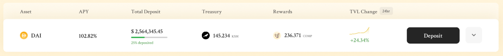

*The "Asset" indicates the particular stablecoin that can be deposited and yield 
farmed for Composable tokens, in this case DAI. "APY" is the annual percentage 
yield estimated for the yield farming of that token. "Total Deposit" refers to 
the total USD equivalent of the particular "Asset" that has already been 
deposited across all Composable users, with the percentage below indicating what 
percentage of the deposit goal has been met. "Treasury" refers to the amount of 
KSM held by the Composable Treasury. "Rewards" indicates the number of tokens 
allocated towards the particular strategy, in terms of Composable Tokens. "TVL 
Change" refers to the 24 hour percentage change in total value locked within 
Composable in that particular "Asset".*

*Finally, the user can click the "Deposit" button for any given strategy they 
would like to participate in. The "˅" button opens up strategy details and the 
user's participation history in that strategy.  From there, the user is prompted 
to set the desired amount of that strategy's deposit asset from their connected 
wallet.*

## *User Portfolio*

*Clicking "Portfolio" at the top of the Composable site will open the following 
page:*

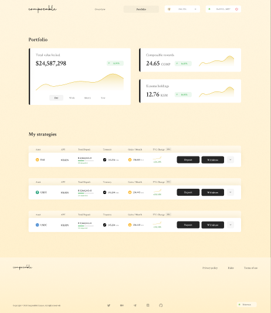

*At the top left of the page, the total value locked (TVL) the user has in the 
Composable protocol will be visible, in USD. This can be viewed by day, week, 
month, or year by clicking through the options at the bottom of the figure. The 
percentage change is depicted above the figure to the right. The user's total 
held Composable rewards (in terms of Composable Tokens, or LAYR, with the 
percent change in 24 hours indicated) are indicated in the figure at the top 
right of the page. The user's total Kusama (KSM) holdings are indicated below 
that, with the percent change in 24 hours displayed:*

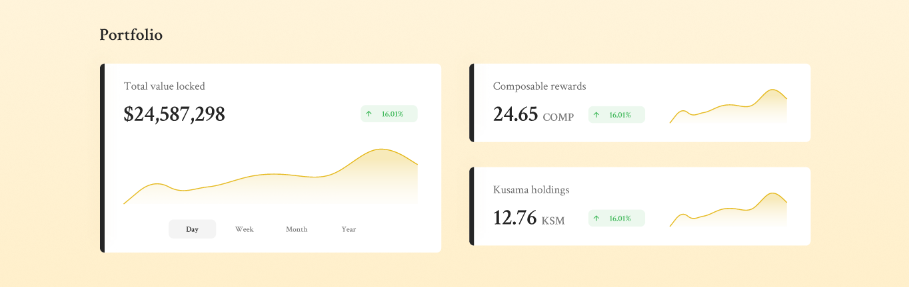

*Below, the strategies the user is presently deposited into are visible:*

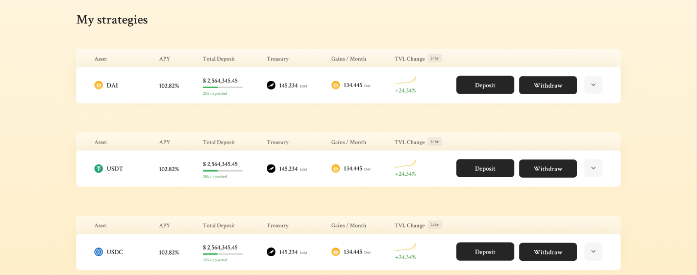

*An example is highlighted below:*

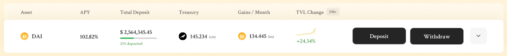

*The "Asset" indicates the particular stablecoin that can be deposited and yield 
farmed for Composable tokens, in this case DAI. "APY" is the annual percentage 
yield estimated the user is earning for participating in the strategy. "Total 
Deposit" refers to the total USD equivalent of the particular "Asset" that has 
already been deposited by this user, with the percentage below indicating what 
percentage of the total deposit into that strategy has been contributed by that 
user. "Treasury" refers to the amount of KSM that the user has contributed to 
the Composable Treasury (50% of rewards). "Gains/Month" indicates the monthly 
gains in the deposited asset that the user has generated, in terms of that 
asset. "TVL Change" refers to the 24 hour percentage change in total value 
locked within Composable in that particular "Asset"/strategy by the user.*

*The user can click the "Deposit" button for any given strategy they would like 
to increase their participation in. From there, the user is prompted to set the 
desired amount of that strategy's deposit asset from their connected wallet. 
Similarly, the user can click the "Withdraw" button to withdraw their rewards 
from the strategy, and will be prompted to input how much they want to withdraw 
and which wallet they would like to withdraw to, with a notification of any 
withdrawal fees that may be charged. The "˅" button opens up strategy details 
and the user's participation history in that strategy.* 

## *Strategy Details & User History*

*The "˅" button next to a particular strategy (either on the "Overview" or 
"Portfolio" page) opens up strategy details and the user's participation history 
in that strategy.*

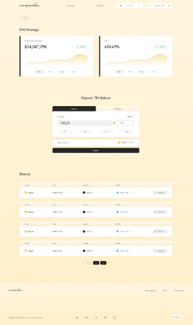

*At the top left of the page, the "<" button can be clicked to return back to 
the strategy list. The figure at the top left of the page indicates the total 
value locked (TVL) in this entire strategy, in USD. This can be viewed by day, 
week, month, or year by clicking through the options at the bottom of the 
figure. The percentage change is depicted above the figure to the right.*

*Similarly, the figure at the top right shows the annual percentage yield (APY) 
of this strategy. Again, this can be viewed by day, week, month, or year by 
clicking through the options at the bottom of the figure, and the percentage 
change is depicted above the figure to the right.*

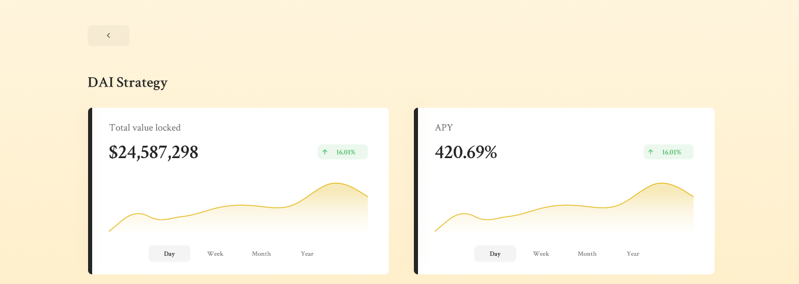

*Below, options for deposit/withdrawal into this strategy are available. The 
user can click "Deposit" and set the desired amount of that strategy's deposit 
asset from their connected wallet. The percentage indicates how much of the 
user's wallet balance they would like to deposit. Expected gains (in terms of 
the strategy's deposit asset and USD) are depicted. Similarly, the user can 
click the "Withdraw" button to withdraw their rewards from the strategy, and 
will be prompted to input how much they want to withdraw and which wallet they 
would like to withdraw to, with a notification of any withdrawal fees that may 
be charged. To withdraw, you must have the pAT tokens associated with your 
strategy in your wallet you deposited with.*

*The "˅" button opens up strategy details and the user's participation history 
in that strategy.*

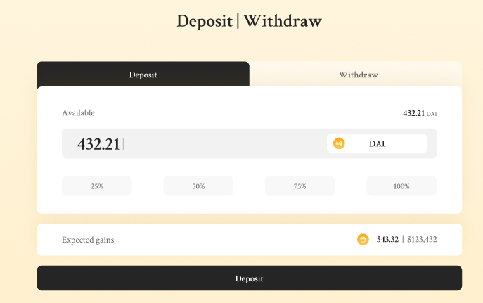

*Below this, the user's history of deposits and withdrawals into this strategy 
are visible. For each transaction within the strategy, there is a separate list 
item including the "Action" (either deposit or withdrawal), the timestamp, the 
amount of KSM generated, the utilized wallet address, and a link to the 
Etherscan of the transaction. Below the history may appear page numbers, 
indicating a more extensive history that the user is able to click through to 
view older transactions.*

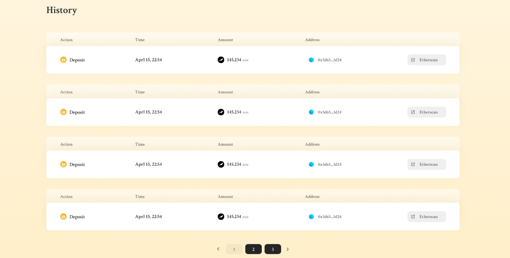

