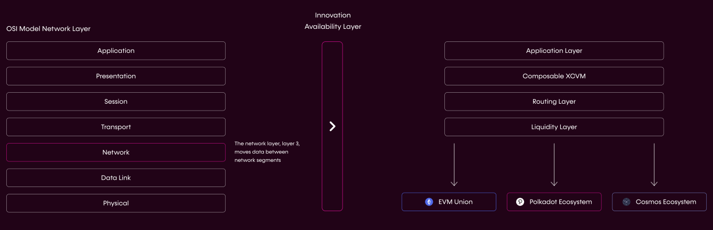

# Technical Stack Overview

---

## Simplicity at Our Core: Our Guiding Principle

**Composable Finance is dedicated to eliminating the complexity that current DeFi users experience, abstracting away difficulties and unnecessary costs and delays. Our technical infrastructure takes on the complications of DeFi so that users can navigate the space easily and efficiently, in whatever manner suits their needs.**

Unnecessary complexity in many cases causes end-user friction and barricades developers from either expanding innovation or accessing it. To this end, we believe that sophisticated infrastructures must be rooted in simple and easy to use interfaces to propel efficiency and enable builders to ship confidently and faster. That is why at Composable Finance ‘simplicity’ is engrained in the DNA of our technologies and development ethos. Our purpose is to ensure pioneers get the most out of our whole host of products in the Composable ecosystem, and thus create exceptional experiences for the end user.

Upon the launch of our technology, our team and community of developers are committed to furthering the Composable tech stack through continual upgrades to user experience, exploring and attacking new opportunities to strive to push DeFi towards ultimate ubiquity.

*The Composable Technical Stack unites the presently siloed blockchain and DeFi industries, creating a united ecosystem that makes the user experience both powerful and streamlined.*

To accomplish our mission, we are creating an inter-ecosystem communication protocol and virtual machine bolstered by the **Innovation Availability Layer** (IAL). The IAL will ultimately serve as a new and powerful fabric that can orchestrate and compute smart contract functions across a multitude of L1 and L2 technologies seamlessly and without compromising security. With this capability, an action such as borrowing X against Y can be routed through an ecosystem-agnostic path, maximizing for users’ preferred outcomes and parameters. The applications of such a stack are limitless.

Our current technical stack consists of:

1. [Composable Cross-Chain Virtual Machine (XCVM)](./cross-chain-virtual-machine.html): The Cross-Chain Virtual Machine (XCVM) is a single developer-friendly interface to orchestrate smart contract functions across the multitude of L1 and L2 networks available.
2. [The Routing Layer](./routing-layer.html): This incentivized pathway selection allows users to perform actions, in an ecosystem-agnostic manner.
3. [Mosaic](./mosaic.html): To ensure the facilitation of transfers, such that there is enough liquidity on destination layers, Mosaic is fit with multiple tools to ensure transfers occur, such as dispute and security protocol.
4. [The Picasso Parachain](./the-picasso-parachain.html)
5. [The Composable Parachain](./the-composable-parachain.html)

This tech stack and how it flows together is depicted below:

*Similar to how Port Control Protocol became an essential networking fabric for the Internet, Composable’s vision is to become the entry way and fabric for interactions, transfers, and communication cross-ecosystem. The result is a Port Control Protocol-like system for blockchains.*