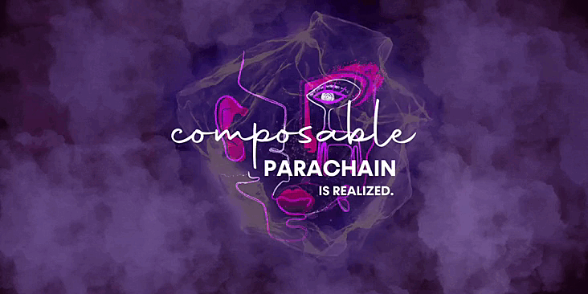
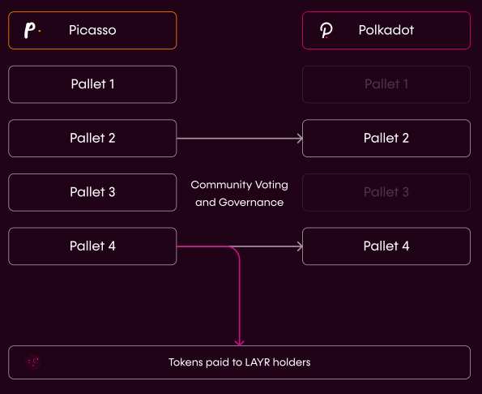

# The Composable Parachain

A Polkadot parachain for the composable ecosystem.

## The Composable Parachain has been Procured!

Composable is proud to join the elite class of Polkadot parachain custodians, 
having won the 8th parachain slot in the 7th Polkadot auctions. To make this 
remarkable achievement happen, over nine thousand crowdloan participants 
contributed 6,075,485 DOT valued at over $163 million.

This massive outpouring of support demonstrates the goodwill shared with our 
community. In appreciation, we are rewarding 16% of Composable’s total $LAYR 
supply to crowdloan participants. Thank you to everyone who has supported us in 
our efforts and continues to edge us towards the full realization of our [vision 
for an interoperable ecosystem](https://composablefi.medium.com/the-composable-parachain-our-vision-for-an-interoperable-ecosystem-12888aa1f654).

## About our Ecosystem and the Composable Parachain

Composable’s full technical stack is driving the evolution of digital assets and 
DeFi protocols. It enables the unification of functionality across all 
blockchain ecosystems to guide the industry towards a cross-chain future. 
Through our infrastructure and associated projects such as [Instrumental Finance](https://www.instrumental.finance/), 
[Angular Finance](https://www.angular.finance/), and [Bribe](https://www.bribe.xyz/), 
we drive thought leadership and provide robust protocols and tools to help DeFi 
achieve the ideals it was built upon.

Thanks to Polkadot’s high-security environment, the Composable Parachain will be 
home to both the Composable Cross-Chain Virtual Machine (XCVM) and our Routing 
Layer. These key innovations will drive our ecosystem towards true 
blockchain-agnostic functionality. In time, users and developers will be able to 
do more than just move assets between applications on different chains. Our 
infrastructure will orchestrate the most efficient pathway irrespective of 
chain or application.

## The Relationship Between Picasso and Composable

With pallets being relatively new infrastructure, it is important that projects 
have a secure environment to learn and develop - which Picasso will provide for 
various pallets that deploy on it.

In time, we plan to **establish a system where pallets can graduate from Picasso 
onto our eponymous Polkadot parachain, Composable*. As part of this graduation, 
we will include the community through a governance/voting process to allow those 
with Composable’s best intentions in mind to have a say in the direction of the 
platform.

*The Pallet Graduation Process*

Larger transactions through our Routing Layer will be on Polkadot, allowing for 
our Polkadot parachain to have enhanced utility and scalability beyond the safe 
testing grounds of Picasso.
