# Crowdloan How-To Guide for DOT

**For transparency, we are continuing to publicize the crowdloan approach we 
took when bidding for a Polkadot parachain. Please note that the information in 
italicized text below is outdated for this reason:**

*This page outlines the simple process for participating in the Composable 
Crowdloan using DOT by visiting crowdloan.composable.finance*

1. ***Choose Contribute with Dot***

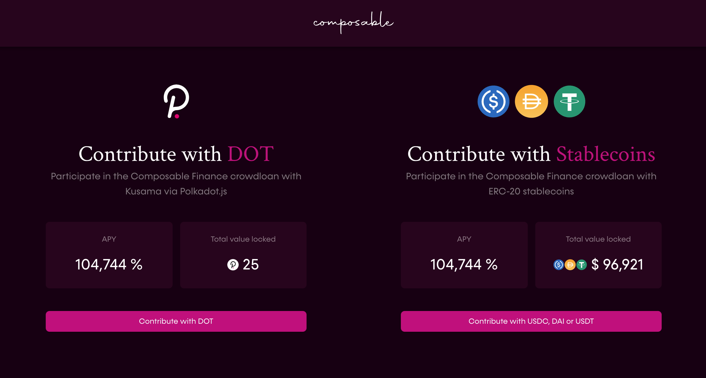

2. ***Connect your Polkadot.js wallet***

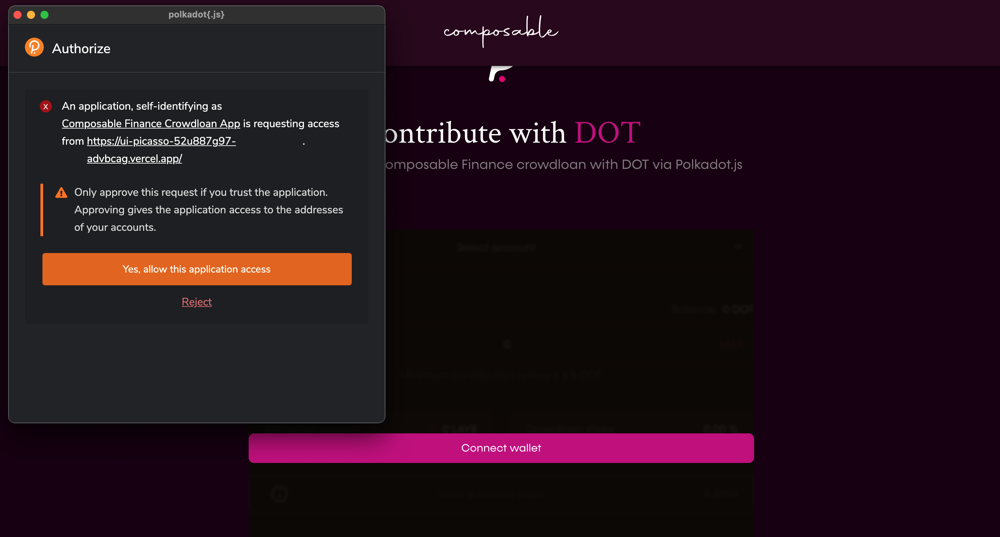

*For more information on how to create a polkadot.js, please visit [here](https://support.polkadot.network/support/solutions/articles/65000098878-how-to-create-a-dot-account).*

3. ***Select your  account***

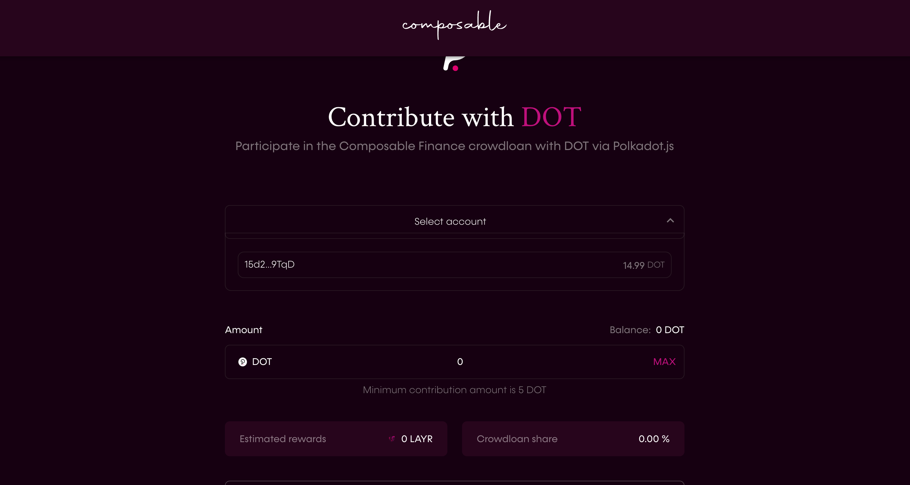

4. ***Use the DOT referral CODE***

***a) Generating your own referral code - 2% bonus for your contributors, 20% 
bonus on your contributions if your total referrals contribute the target amount 
of 1000 DOT.***

*i. Press Generate referral code*

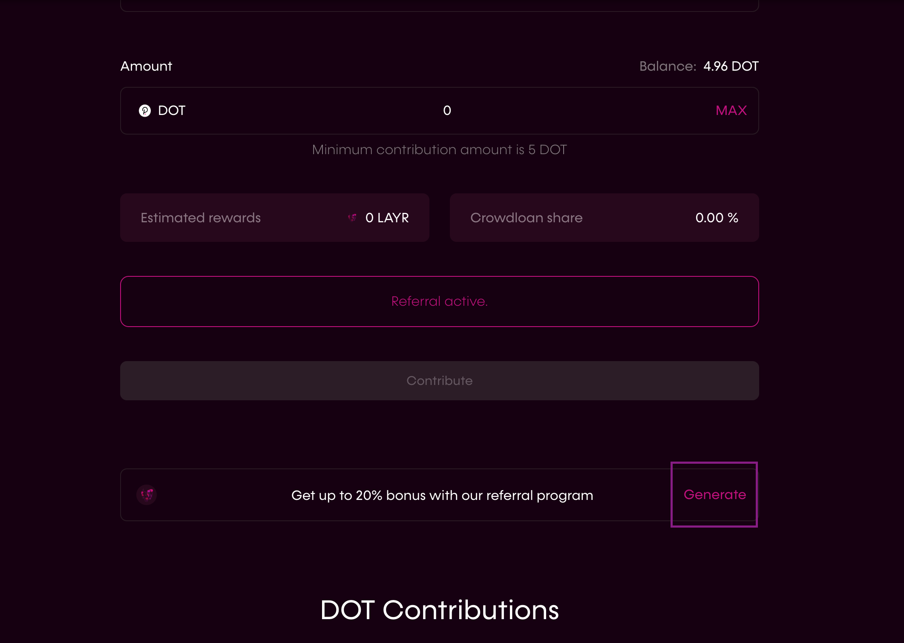

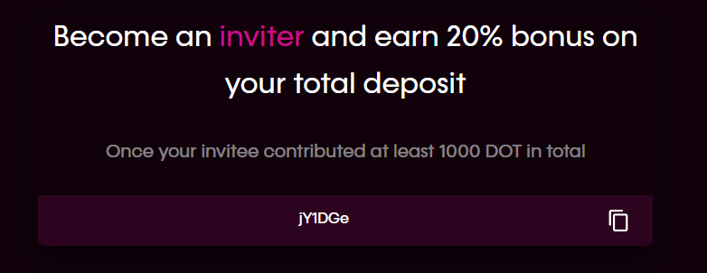

*ii. Share your referral code!*

*When others will use your referral code, they will earn a bonus of 2% on each 
deposit AND you will earn 20% on your contributions when it reaches the target 
amount from all your referrals (1000 DOT total).*

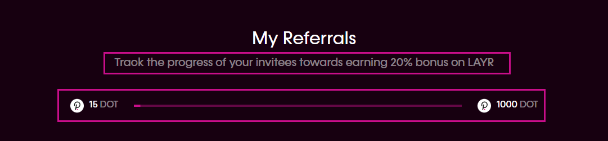
*The target amount is 1000 DOT*

***NOTE***

*The DOT referral code from DOT contribution cannot be shared for Stable 
contribution and vice versa. It only works for other DOT contributions. If a 
user will activate the 20% target bonus AND 2% bonus by using another ref code, 
they will be eligible only for the 20% bonus.*

***b) Use an existing referral code in order to earn an extra 2% on all your 
next deposits***

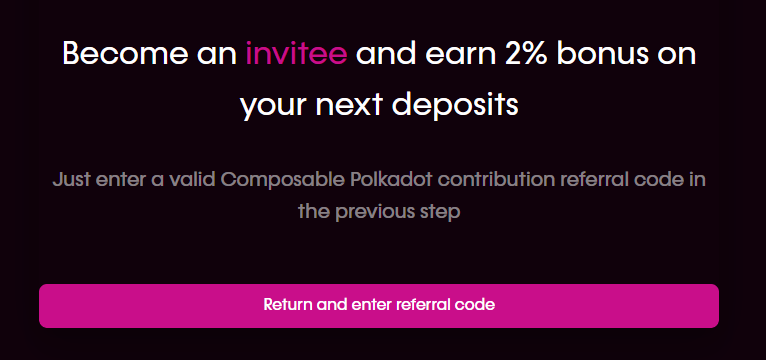

*Prior to starting contribution, activate the DOT referral code and you will 
automatically earn 2% more on all your next contributions.*

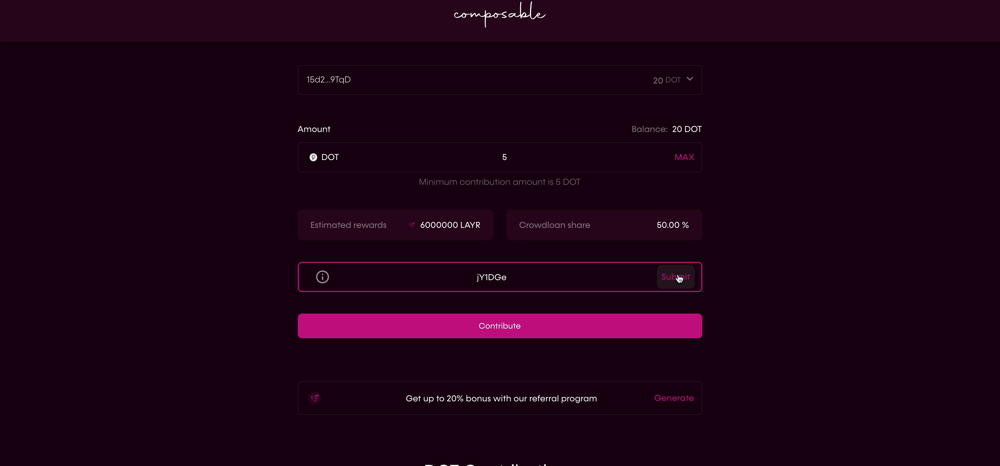

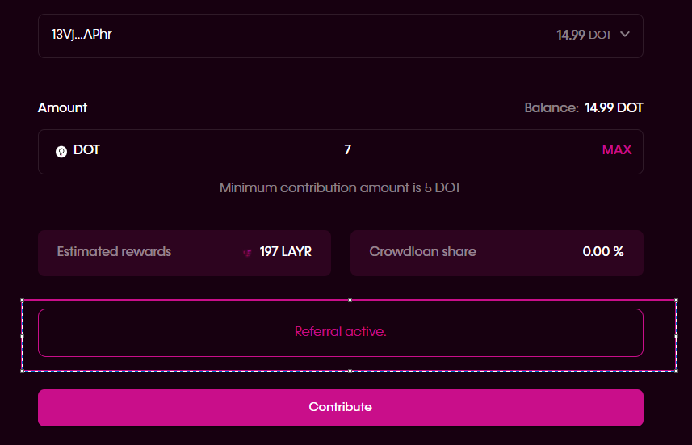

***NOTE***

*The referral code from DOT contribution cannot be shared for Stable 
contribution and vice versa. It only works for other DOT contributions. If a 
user will activate the 20% target bonus AND 2% bonus by using another ref code, 
he will be eligible only for the 20% bonus.*

5. ***Enter the amount of DOT you wish to contribute***

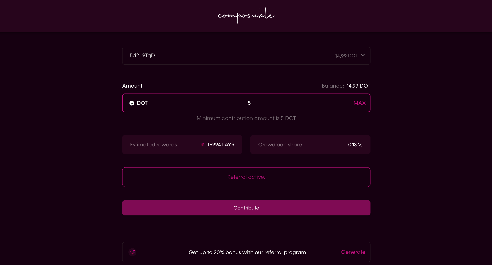

6. ***Press Contribute and sign your polkadot.js wallet transaction***

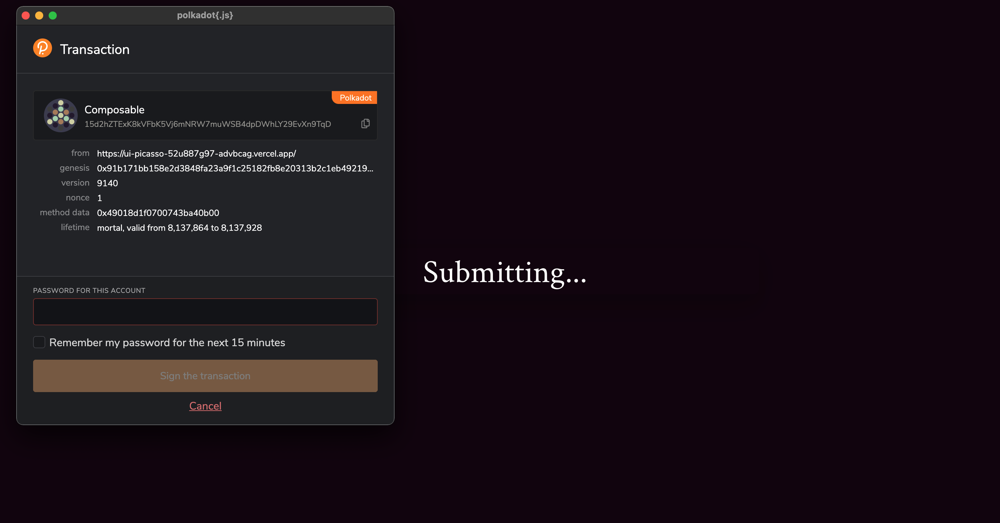

7. ***Thank you for your support and contribution!***

8. ***You can easily check out your position and contributions in your DOT Contributions section***

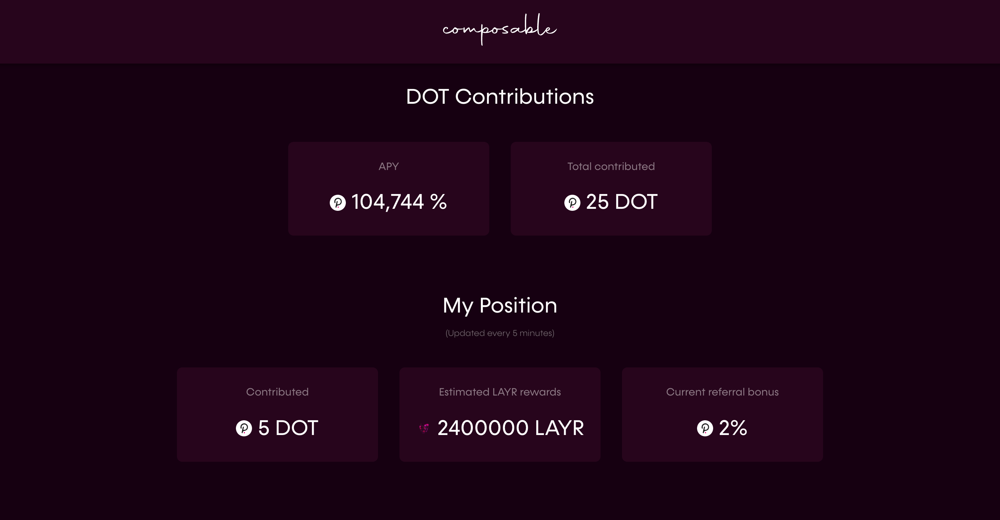

