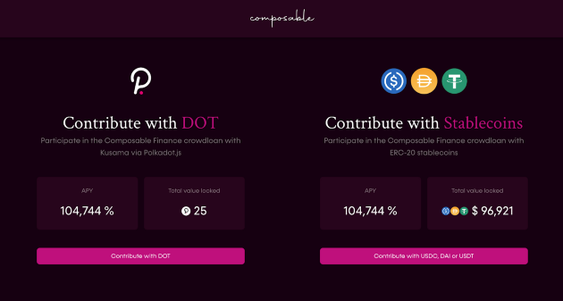
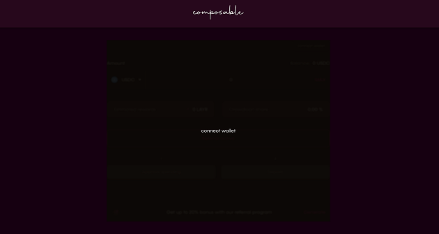
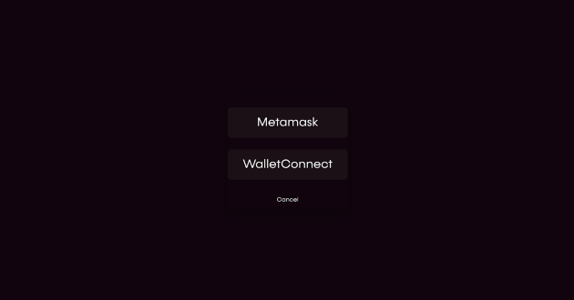
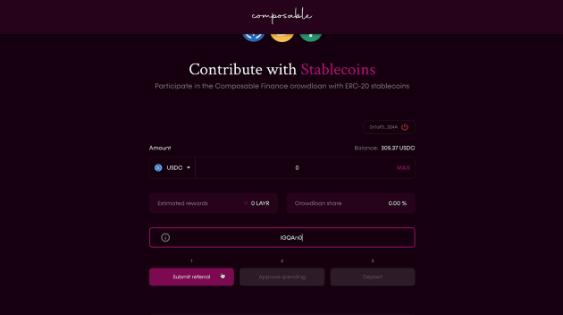
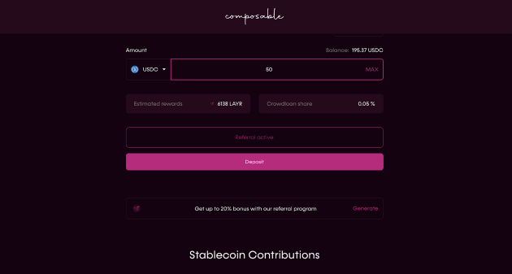
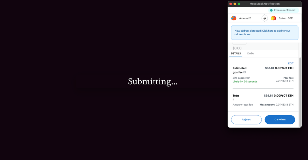
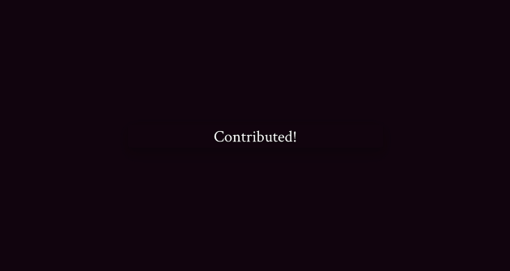
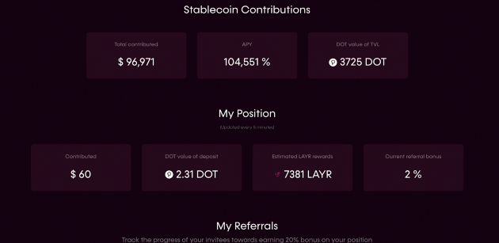

# Crowdloan How-To Guide for Stablecoins

**For transparency, we are continuing to publicize the crowdloan approach we 
took when bidding for a Polkadot parachain. Please note that the information in 
italicized text below is outdated for this reason:**

*Our crowdloan campaign to secure a Polkadot parachain mirrored the strategy of 
our previously successful procurement of our Kusama parachain, Picasso. As with 
Picasso, our Composable Parachain crowdloan was the first project to accept 
stablecoins as crowdloan contributions for the parachain auctions on Polkadot, 
thus opening up the Dotsama ecosystem to a broader audience.*

*Below is a walk-through on how to participate using the ERC-20 stablecoins: 
**USDT**, **DAI** and **USDC**.*

## *Enter into the Polkadot Ecosystem*

*The primary aim for enabling participation using Ethereum-based stablecoins is 
to foster exposure to the Polkadot ecosystem across the board, ensuring a 
broader and more robust community of token holders.*

*Users are able to deposit stablecoins into Composable’s vault at a standard fee 
of 1%, and we will use these tokens to purchase DOT, which will be contributed 
towards our parachain auction. At the end of the lease duration, users will be 
able to claim this DOT through Polkadot.js wallets, or choose to obtain their 
stablecoins back to their Ethereum addresses. LAYR rewards will be distributed 
to Polkadot.js wallets through a claim process.*

*Additionally, we have allocated 12% of our LAYR token supply to reward 
contributors to our DOT crowdloan with additional incentives listed as 
follows:*

* *Users who previously contributed KSM or Stablecoins to our Picasso crowdloan 
  will receive a 5% bonus.*

* *Users who contribute in the first three days will be issued a 10% bonus. 
  (until Friday 17th Dec 21:00 EST)*

* *And 20% referral bonus to users who refer a sum of 1000 DOT using our 
  referral codes*

*You can find more details about our Polkadot [parachain procurement plans and 
LAYR token distribution](https://composablefi.medium.com/announcing-the-composable-polkadot-parachain-procurement-plans-a4e8dd82c4fe) 
in case you missed it.*

## *Be a part of Composable’s Polkadot parachain journey*

*To join in and contribute towards the procurement of our Polkadot parachain 
visit crowdloan.composable.finance, and follow the simple steps below.*

*Our vault will be available at `0x4adA5227e164a37a0183eC6Ce93222232f6A00F1`, and 
upon clicking the above link, you will be directed to the page as seen below.*

*Now select your preferred contribution option. In this case, **“Contribute with 
Stablecoins”**.*

***Next, Connect your preferred wallet***

*Enter your stablecoin crowdloan referral code (if you have one or check the 
community). Click “Submit referral”. It is important to note that stablecoin 
referral codes can only be used when contributing stables.*

***Next***, *enter the amount you wish to contribute, approve and deposit.*

***Voila!*** *You have just successfully contributed your stablecoins to our 
cause, and we thank you for being a part of this journey with us.*

*As you can see, you can keep track of your stablecoins contribution and 
referral bonuses on the **“Contribute with Stablecoins”** section:*

