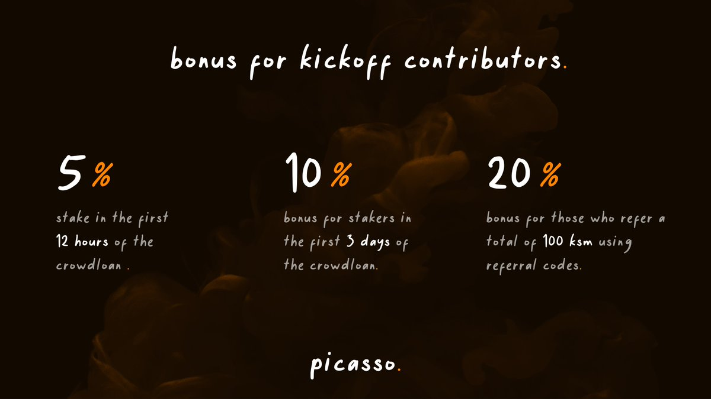

# The Picasso Crowdloan

---

Our strategy that lead to successful parachain procurement.

As a parachain for Picasso has been successfully procured at auction, we are repurposing the Picasso crowdloan as a 
liquidity provisioning mechanism for the Picasso parachain. This will provide users with the opportunity to continue to 
support the Picasso ecosystem and gain a yield from our strategy.

**For transparency, we are continuing to publicize the crowdloan approach we took when bidding for a Kusama parachain. 
This crowdloan has now been repurposed to allow users to provide liquidity to our Picasso parachain. Please note that 
the information in italicized text below is outdated for this reason:**

*On the 25th of October 2021, Kusama opened the next back of 24 auctions commencing lease 16 in which Picasso has 
entered. The Picasso Crowdloan details and format below remain much the same with additional bonuses for previous 
stakers for the same amount or more.*

## *Picasso Crowdloan Details*

*We are launching a crowdloan to obtain the KSM needed for receiving a Kusama parachain at auction, which will allow us 
to deploy our Picasso parachain ecosystem.*

*On the day of the sixth parachain auction (the 7th parachain slot), slated for September 1st, we will be releasing a 
parachain lease offering to obtain the KSM needed for securing a Kusama parachain, to deploy the Picasso Network.*

*Crowdloan participation will be capped at 200,000 KSM, an amount which we believe will amply position us for Kusama 
parachain procurement. The crowdloan period will total 48 weeks, broken down into 8 lease periods of 6 weeks each.*

***Crowdloan stakers will earn 20% of Picasso token supply: 2,0000,000,000 PICA.***

*In the near term,* ***the crowdloan is the only opportunity we foresee for users to obtain the Picasso Network 
token.***

## *Picasso Crowdloan Bonuses*

### *Referral Bonus*

*We have implemented a referral program where users can generate referral codes, and will obtain a 20% bonus on their 
Picasso Network tokens if they bring in other users contributing a total of 100 KSM or more.*

### *Early Participation Bonuses*

*Users who participate early on in the Picasso crowdloan will receive a boost on their earnings: participating in the 
first 12 hours will provide users with a 5% bonus, and participating in the first three days provides a 10% bonus.*
