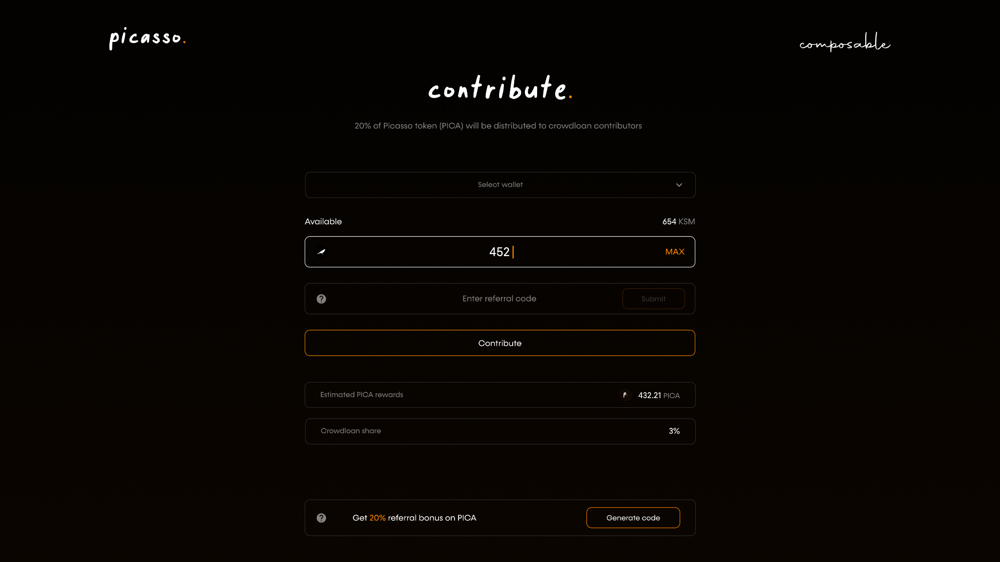
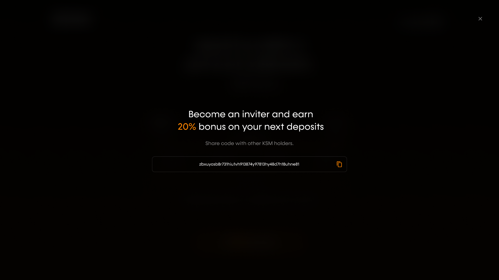
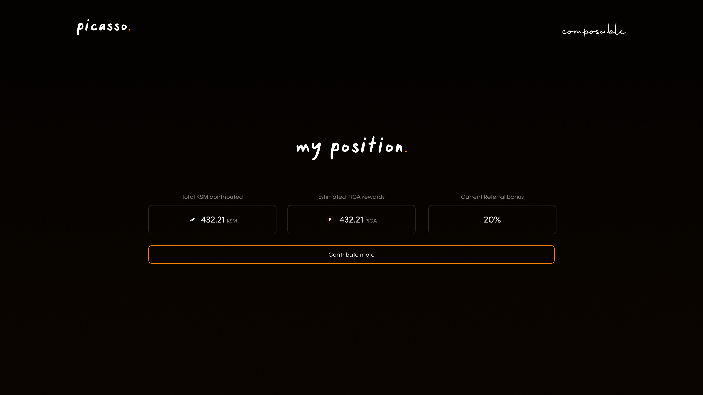
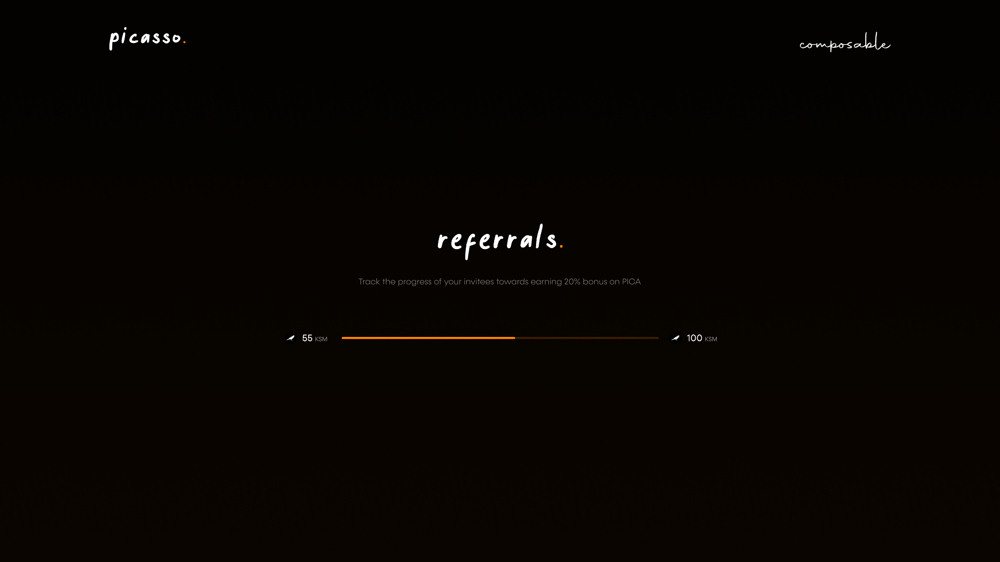
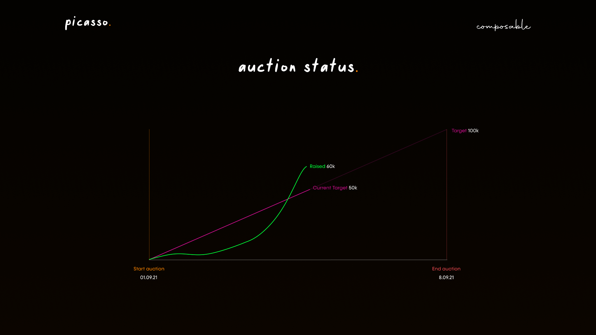

# Crowdloan How-To Guide for KSM

**For transparency, we are continuing to publicize the crowdloan approach we 
took when bidding for a Kusama parachain. This crowdloan has now been repurposed 
to allow users to provide liquidity to our Picasso parachain. Please note that 
the information in italicized text below is outdated for this reason:**

*This page outlines the simple process for participating in the [Picasso 
Crowdloan](../the-picasso-crowdloan.md) using KSM. The following link is a 
how-to-guide that guides users through the process of participating in our 
crowdloan:*

*https://www.youtube.com/watch?v=DG2GLYVdT4U*

*Our crowdloan is available at https://crowdloan.composable.finance/. Click on 
the option to contribute to the crowdloan and you will be directed to the 
following page:*

*In this interface, you will be able to select the wallet you would like to 
deposit from, input how many KSM you would like to stake (with the amount of KSM 
available in your wallet also visible to you), and input any referral codes that 
you have been given from others.*

*You must click submit before clicking contribute.*

*You will also be able to see your estimated PICA rewards from your stakings, 
and how much of the crowdloan share of PICA rewards this would be.*

*Once you are ready to stake your KSM, hit “Contribute”.*

*At the bottom of the page, you are also able to generate a referral code to 
pass along to others. You can click the “?” icon for more information about this 
referral code:*

*Once you have contributed, you will be able to see your position in the 
crowdloan under “My Position”:*

*Here, you will see a summary of your KSM contributions so far, the 
corresponding estimated PICA rewards, and whether or not you have obtained the 
referral bonus. You also have the option to “Contribute More” KSM to the 
crowdloan, which sends you back to the previous interface.*

*If you click on the “Current Referral Bonus” you will be able to view the 
progress you have made towards obtaining the 20% referral bonus:*

*From the main crowdloan page, you will also be able to view the overall auction 
status, and its comparison to our targeted KSM raise:*

*We appreciate your contributions thus far and look forward to seeing what 
Picasso is able to achieve.*

