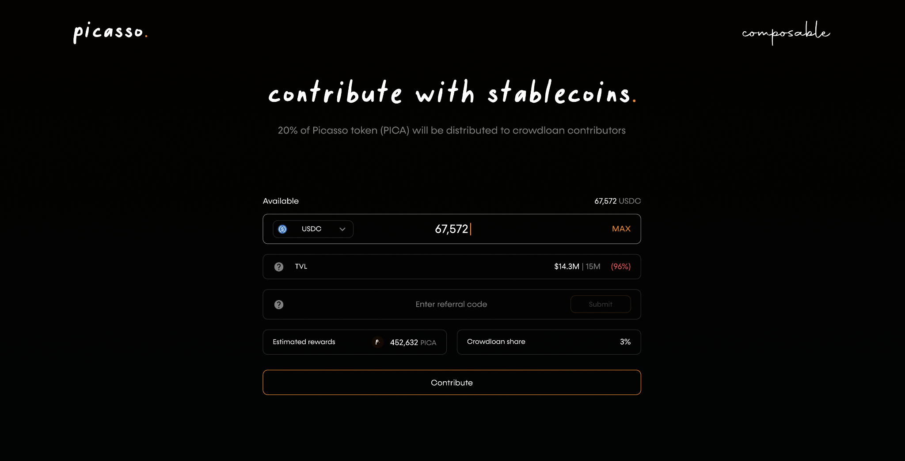
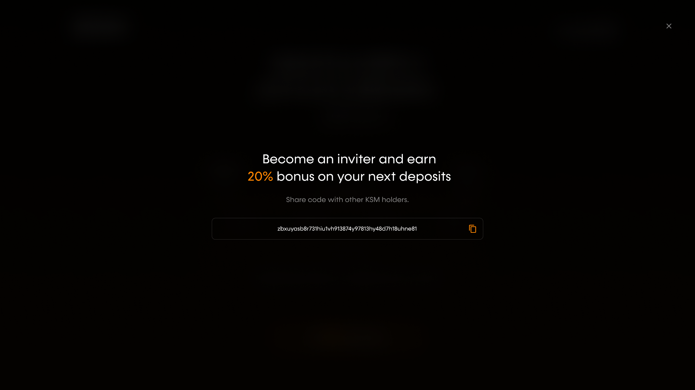
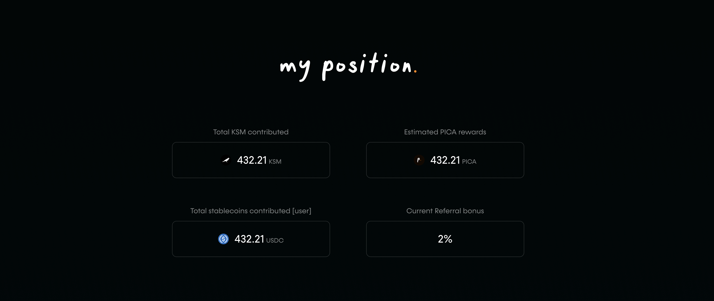
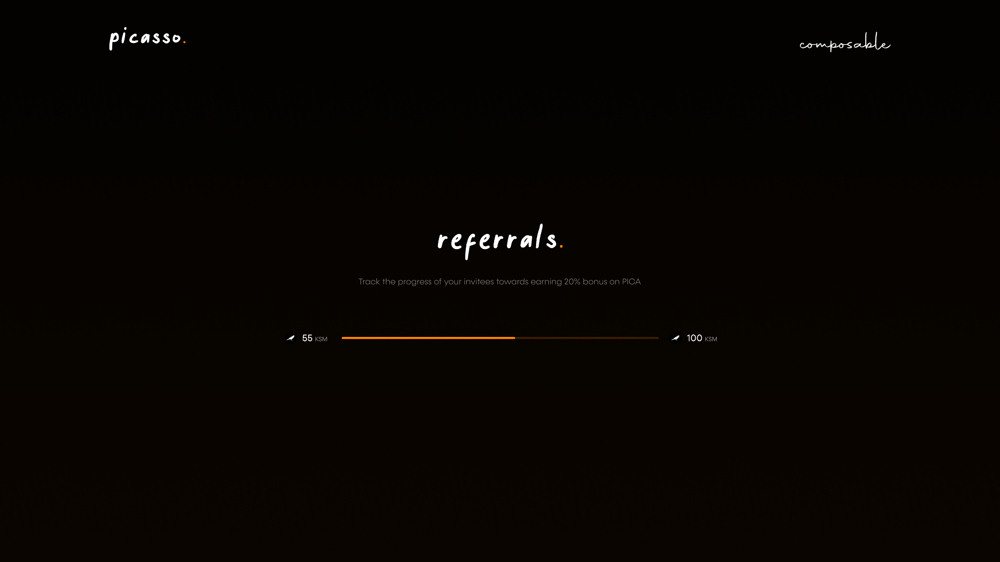
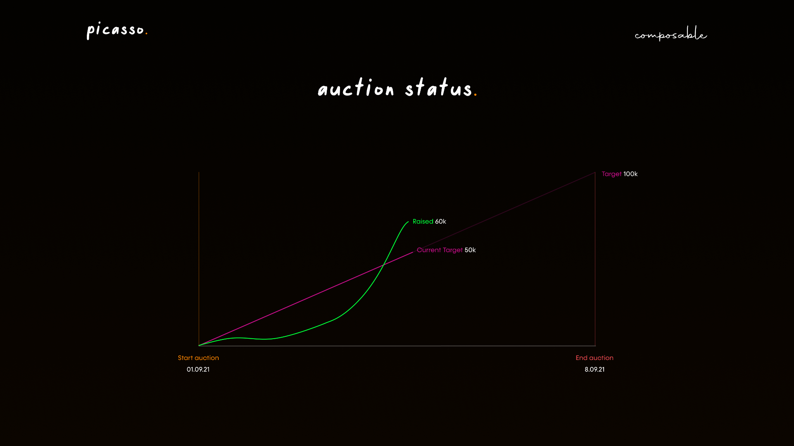

# Crowdloan How-To Guide for Stablecoins

**For transparency, we are continuing to publicize the crowdloan approach we 
took when bidding for a Kusama parachain. This crowdloan has now been repurposed 
to allow users to provide liquidity to our Picasso parachain. Please note that 
the information in italicized text below is outdated for this reason:**

*Composable Finance is opening its crowdloan to a broader audience via the 
acceptance of Ethereum-based stablecoins. This page provides a walkthrough 
explaining how you can participate using these tokens, including USDC, USDT, and 
DAI. We also explain fund conversion to KSM, as well as user repayment and 
rewards.*

*We are continually trying to improve the parachain procurement model. The most 
recent step we have taken in this mission is to allow users to [participate in 
our crowdloan with ERC-20 stablecoins](https://composablefi.medium.com/composable-enables-participation-in-the-picasso-crowdloan-using-erc-20-stablecoins-launching-aab49c965a1a) 
\- something that has not been done before for a Kusama parachain crowdloan. 
These incredibly popular tokens are far more numerous than KSM, the token 
traditionally accepted in Kusama crowdloans. Thus, we enable participation by a 
much larger group of token holders, and allow them to gain exposure to the 
Polkadot ecosystem.*

*Users simply deposit their stablecoins into Composable’s vault for a standard 
1% fee, and we convert these tokens to KSM ourselves to put towards our 
parachain auction. Users will receive their funds back, in addition to PICA 
rewards should we win the auction. These processes are fully detailed below.*

## How To Guide: Participating in the Picasso Crowdloan with ERC-20 Stablecoins

*Once our ERC-20 stablecoin vault goes live, users will be able to contribute 
USDC, USDT, and DAI. The cap will be $15 million for the first week. Afterwards, 
we will raise the cap to $50 million.*

*Our vault will be available at `0x4adA5227e164a37a0183eC6Ce93222232f6A00F1`. To 
participate in the vault, click on the option to contribute and you will be 
directed to the following page:*

*Here you can link the crypto wallet you would like to deposit from, type in how 
many/which stablecoins you would like to deposit, and input any referral codes 
that you have been given from others. This interface also displays your 
estimated PICA rewards (the native governance and utility token of our Picasso 
parachain) from your stakings, as well as how much of the crowdloan share of 
PICA rewards this would be, and the present total value locked (TVL) in the 
crowdloan compared to its cap.*

*Once you are satisfied with the parameters you have set for your staking, hit 
“Contribute”.*

*As previously available to KSM stakers, at the bottom of the page, you are also 
able to generate a referral code to pass along to others. You can click the “?” 
icon for more information about this referral code:*

*You are also able to see your position in the crowdloan (for each token type 
you have deposited) under “My Position”:*

*This will display your current contributions including how many/which tokens 
you have deposited (out of the options of KSM, USDC, USDT, and DAI), the 
corresponding estimated PICA rewards, and whether or not you have obtained the 
referral bonus. If you would like to increase your position, click on 
“Contribute More” to navigate back to the previous interface, where you are able 
to deposit more tokens.*

*Further, in this screen, you can click “Current Referral Bonus” to view the 
progress you have made towards obtaining the 20% referral bonus:*

*The “General Stats” page further demonstrates the statistics on your position:*

*Here, you can see your total value locked (TVL) of stablecoins, the projected 
APY on PICA rewards, and the KSM value equivalent of stablecoins you have 
deposited. The displayed APY for PICA assumes a $15 million diluted valuation of 
PICA.*

*From the main crowdloan page, you will also be able to view the overall auction 
status and statistics, and its comparison to our targeted KSM raise:*

## Fund Conversion, Repayment, and Rewards

*In addition to PICA rewards, a major advantage of depositing ERC-20 stablecoins 
into Composable’s vaults is that this provides contributors with exposure to the 
Polkadot ecosystem. More specifically, users’ stablecoins are used to purchase 
KSM, effectively giving contributors KSM exposure.*

*To uphold our community-first approach, we will transparently indicate whenever 
these purchases of KSM are executed, as well as the price ranges in which these 
purchases were made. This KSM will then be contributed directly to the parachain 
slot for Composable’s Picasso parachain.*

*[Three Arrows Capital](https://www.threearrowscap.com/) will be the capital 
provider for making these KSM purchases. This nearly decade-old hedge fund 
manager focuses on investments into the blockchain space, particularly in crypto 
and DeFi. The Composable and Three Arrows Capital teams will be on a multisig 
wallet on Ethereum at `0xAD44c5bb2c726Fcecf67D66Baa6cD8cC447A1637` and on Kusama at
`FxLmDZbMB7sZfR6MJbuUzRmrb535nKcT2CxyGwWF6LLieud`. The purchase log can be found 
[here](./ksm-purchase-log.md).*

*In the event we win a parachain slot at auction, the KSM that users have 
contributed will be locked up in the parachain slot for 48 weeks. In the event 
we do not win, the contributed funds will be returned to users. Contributors 
will then have an option to receive these funds in KSM or stablecoins. If users 
opt for stablecoins to be returned, there will be an additional 1% fee. In the 
case of winning a parachain, the same process of returning funds will occur when 
the staked KSM is unlocked after 48 weeks. If a user wants their funds back in 
KSM, they would receive the KSM that were purchased at the strike price that the 
conversion was executed at. If a user wants their funds back in stables, the 
conversion to stables would occur at a strike price at the end of the 
crowdloan/auction.*

*In regards to the PICA rewards for stablecoin contributions, we will distribute 
non-transferable ERC-20 tokens to participants. These tokens must be in the 
users’ wallets when they go through the claim process; they will sign a 
transaction with the wallet that contains the PICA to then claim the PICA token 
directly to a Polkadot.js wallet. This is similar to the DOT token distribution 
that occurred for early DOT investors.*

*By accepting these tokens, we believe we are even better positioned to obtain a 
Kusama parachain than we previously were, while also providing users with a new 
opportunity for exposure to Polkadot and Kusama.*

