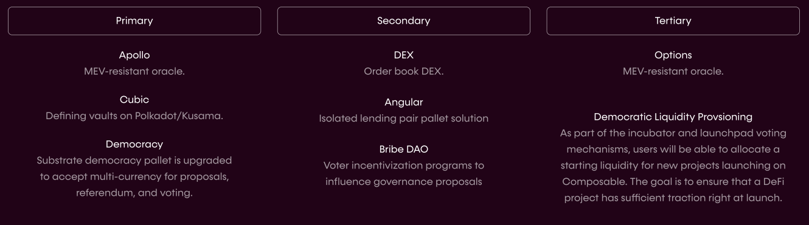

# The Picasso Tech Stack

---

## 1. Pallets to Power Defi Functionalities

Within Picasso, the ultimate vision is for [pallets](https://docs.substrate.io/v3/runtime/frame/#pallets) 
to cover all major components of DeFi, including primitives, core/secondary 
functions, and application/tertiary infrastructures. Primitives are the 
essential elements underpinning all of DeFi, and include oracles, smart 
contracts, tokens, transaction execution, keepers, and governance. Core 
functions build on these primitives to deliver valuable functions like DeFi 
lending. Finally, tertiary applications meld these core functions into even more 
complex and valuable opportunities such as yield aggregation. 

Using this framework, we are encouraging the community to build pallets to suit 
their needs and to share with other community builders. To assist in and 
stimulate the development process, we also will be building base-level 
infrastructure from which other pallets can be created. Initially, we will be 
deploying our [Apollo](./the-picasso-tech-stack/apollo.md) (oracle), [Cubic](./the-picasso-tech-stack/cubic.md) 
(vaults) and [Angular](./the-picasso-tech-stack/angular.md) (isolated lending 
pair) pallets, in order to provide a foundation and kick off development on 
Picasso.

*Current primary, secondary (core), and tertiary (application) pallets are 
displayed in the table above.*

This full pallet suite will decrease the barriers to entry for parachain 
participation, in addition to providing built-in DeFi primitives for developers. 
Overall, this will make it easier than ever to build new and innovative 
solutions on the parachain, unleashing novel functionalities into the DeFi 
space.

## 2. An Incubator Program to Foster New Projects Using Our Technology

Composable Labs is recruiting projects to build on Picasso. Individuals and 
teams can contribute to a cutting-edge ecosystem, with the potential to win 
grants and developmental/marketing assistance. We are presently inviting 
community members and developers to build these pallets on Picasso, with the 
most promising projects being incubated by Composable Labs. Thus, developers can 
work with all of the tools they need to build powerful applications, and receive 
the support to achieve success.

To even further support and incentivize pallet development on Picasso, we have 
launched the [Composable Grant Program](https://grants.composable.finance/) to 
assist some of the most promising upcoming pallet projects. Selected projects 
will receive full hands-on support from the entire Composable team in addition 
to funding. More details on how you can get involved building on the Composable 
ecosystem are available [here](../../ecosystem/build-on-composable-ecosystem-development.md)

## 3. A Governance Functionality Through Composable Tokens

Picasso has a built-in mechanism for users to vote on which pallets they want to 
add to a run time on Picasso. This will be accomplished through Picasso’s native 
tokens PICA, which also act to provide token holders with governance votes.

