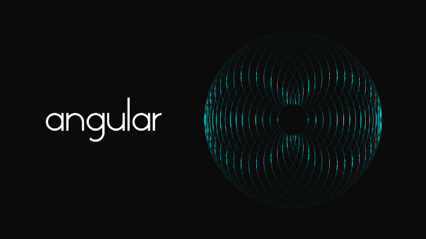
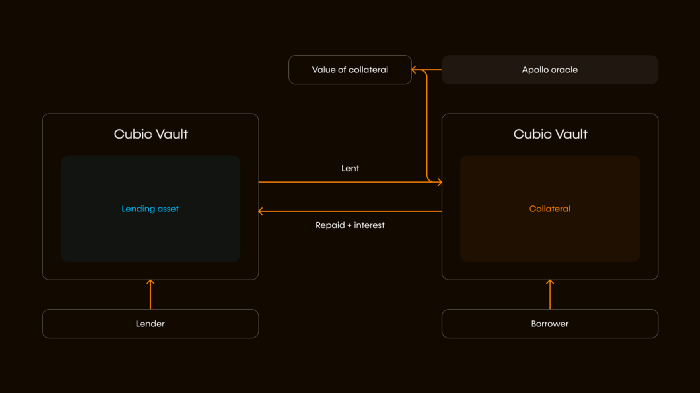

# Angular Finance: The Isolated Lending Pair Pallet

---

Another project building on Picasso that is being developed by a team that is 
working in collaboration with [Composable Labs](https://0xbrainjar.medium.com/introducing-composable-labs-an-incubator-and-testing-ground-for-projects-using-composables-tech-b467d438142c) 
is called [Angular Finance](https://www.angular.finance/) - an isolated lending 
pair pallet. Purposefully designed to isolate risk, this pallet is set to open 
new opportunities for use cases such as leverage on interest bearing assets, and 
serving as a lending protocol for leveraged trading, options, and derivatives.

## The Benifits of Isolated Lending Pools

The benefits of lending protocols like Compound and Aave are apparent, but how 
they are used for the broader DeFi ecosystem makes them core infrastructure. 
Building off of lending functionalities, developers can build more complex tools 
such as options and derivatives markets. The ability to leverage lending 
protocols to create these more sophisticated financial tools — which are readily 
available in centralized finance — is crucial to the broader adoption of DeFi 
and to better serve current users.

Recently, however, the concept of isolated lending protocols has become the 
latest innovation in the lending ecosystem. The benefit of isolated lending 
pools is their ability to isolate risk to a single pool, which is not always the 
priority of other lending protocols.

An isolated lending pair is effectively the pairing of one asset which is the 
collateral type, and another asset which is the lending asset. When users choose 
to lend in isolated lending pools, they are not taking on the risk of the entire 
protocol. Meaning, if a user contributes stablecoin to one pool, those 
stablecoins are lent out only to borrowers who are depositing the corresponding 
collateral associated with the lending pool. Thus, lenders can choose to take on 
only the level of risk in which they are comfortable. Risk-tolerant users can 
seek out higher risk-reward opportunities while risk-averse individuals can 
choose from more stable options.

An example of these risk-minimizing functionalities can be seen through [Euler](https://www.euler.finance/#/), 
a non-custodial protocol on Ethereum that allows users to lend and borrow in the 
isolated lending pair manner. When it comes to limiting risk, this protocol 
grants users the flexibility to withhold collateral from borrowers in certain 
situations which limits trading risks, short selling opportunities, and 
governance manipulation. Moreover, within the protocol, risk-based asset tiers 
exist to protect borrowers and lenders.

This proven concept of designed user flexibility to reduce risk is something the 
Angular Finance is focused on. Particularly as more complex applications and 
products come to Kusama, a solution like Angular would be beneficial to 
experimenting with leverage on these products. By concentrating on risk 
reduction measures, this pallet will be an ideal building block to become a 
cornerstone for more sophisticated applications.

## How This Pallet can be Used

As previously stated, the goal of Angular is to generate possibilities for 
developers leveraging this core component in their projects.

In general, lending pools have specific token pairings which allow users to 
deposit select tokens as a lender and receive select tokens as a borrower. While 
this functionality is all that is necessary to create basic protocols built 
around lending, there are countless tokens that are under utilized in this 
process. By creating a malleable isolated lending pool pallet, token pairs will 
only be limited by developers’ imaginations. This opens the door for unique 
pairings and the opportunity for DeFi users to better leverage their specialized 
tokens such as receipt tokens, tokens of up-and-coming protocols, and more.

Moreover, this isolated lending pool pallet is a demonstrated use case of [Cubic](./cubic.md), 
which will be setting the standard for vault infrastructure in [Polkadot](https://polkadot.network/) 
and [Kusama](https://kusama.network/). Building lending pools with our vault 
infrastructure demonstrates the lego-like building blocks Composable is hoping 
to foster through Picasso.

As projects begin leveraging Angular Finance, we are excited to see what further 
products will be launched on Picasso.

