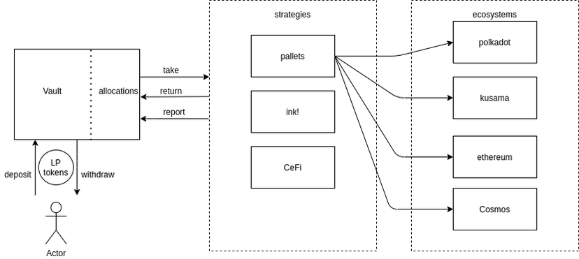

# Cubic: The Vault Pallet

---

The second pallet Composable is creating for our infrastructure (following our oracle pallet, Apollo) is for vaults, 
a critical DeFi component. The concept of a vault pallet does not currently exist in Polkadot. The hope is therefore 
that this vault pallet will set the standard for what vaults, that are a commonly used primitive in Ethereum 
decentralized finance, will be in the Polkadot and Kusama ecosystems.

## How Our Vaults Pallet Powers Our Infrastructure

Composable is working to deliver a comprehensive DeFi ecosystem to Polkadot and Kusama, and our vaults pallet will be a
key driver in this endeavor.

In general, vaults act to combine user funds into a single managed pool that can then perform many additional functions 
including yield farming. Their primary purpose is to aggregate these funds, which reduces the gas fees that users must 
pay.

In the Composable ecosystem, users are able to deposit liquidity provisioning(LP) tokens into vaults created through 
our vaults pallet. Funds can then be routed to various strategies like those in other pallets, other smart contracts 
written in ink! (the language of Solidity), or even those in centralized finance. This means that funds can be sent to 
and from a number of ecosystems, including Polkadot, its canary network Kusama, Ethereum, and Cosmos. This relationship 
is depicted below:

## Use Cases

The intention is that Cubic will evolve to become core infrastructure for projects that will utilize vaults, such as 
AMMs, strategies, lending protocols, and other money legos. The broader hope is that with vault infrastructure, 
Ethereum projects that leverage vaults will have familiar infrastructure to be able to build pallet versions of their 
protocols. Through this goal, we anticipate that Cubic will set the standard for cross-chain vault infrastructure, 
for use by the broader Web 3.0 ecosystem.

## Additional Vault Pallet Details

### Vault Features

Through this infrastructure, our vaults are thus capable of the following three overarching functionalities:

* Deposit and withdrawal management
 
* Governance

* LP token share management

These can be applied to innumerable DeFi strategies based on the particular vault and project it belongs to.

### User Incentives

Providing assets to a vault grants the user xTokens (receipt tokens), which can be exchanged for the locked assets. 
This also supplies the user with voting rights. xTokens can be seen as shares, which are diluted when more users join 
the vault, and burned when users exit the vault. As seen in the Ethereum ecosystem, these receipt tokens could then be 
used as collateral for lending protocols etc.

### Vault Management

There will be some type of reaping mechanism to remove unprofitable and unused vaults, akin to storage rent in ink! 
smart contracts. Further details of this are to be released, though we are considering working with an endowment locked 
up by the fund manager, and later moving to having a part of the management fee to be used to pay for storage rent.

### Funds Allocation Strategy

The allocation of funds is determined by the particular vault’s strategy. Initially we will release a single strategy, 
which maps Account IDs to predetermined ratios (PerBill). Each account will therefore be able to withdraw up to 
ratio * vault balance from the vault to be used. The actual strategy is performed by the pallet/smart contract 
associated with the account ID.

### Interfaces

Pallets using the vault funds can depend on the traits exposed by the vault pallet to determine the requested fund 
allocation. Strategies in the Composable ecosystem should expose an interface for fund managers/councils to request 
re-balancing. The vault itself does not impose any interface for strategies, but instead exposes methods to relay data 
on how the strategy is performing. Thus, interfaces are up to the developer and their unique needs.

### Security

To ensure that funds can be rescued in the case of a negative event such as a theft or hack, vaults have different 
methods to halt functionality and return funds to LP token holders:

1. Pausing deposits and investments

2. Pausing deposits, investments, and withdrawals

3. Destroying the vault and returning all funds to the users

These extrinsics may only be called by the multisig account of the Picasso Network council to ensure they are utilized 
appropriately.

## Advantages Over Solidity Vaults

By providing vaults through a pallet, they become the core infrastructure of the Composable blockchain. Usage of the 
vaults incurs lower fees through the more optimized pallet infrastructure. Strategies on our chain may still be 
implemented as smart contracts or pallets. The latter is capable of far more complex operations, such as cross-chain 
investing, delivering advanced functionality to our ecosystem.

Through this novel infrastructure, Cubic offers a new functionality into the Polkadot ecosystem (cross-chain vaults), 
and is positioned to be both a critical component of Composable and a plethora of other dApps emerging in the 
cross-chain space.

