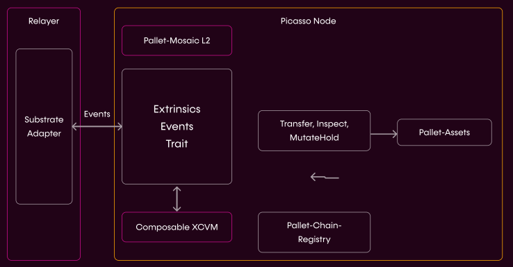

# L2 Transfer and Communication Interface

---

The core consists of a network of bridges, operated by relayers interacting with 
smart contracts on (blockchain where the cross-chain transfer originates from) 
and .

Phase 1 and 2 are based on a trusted relayer solution that monitors all 
connected chains for events, and enacts the transfers and communication 
accordingly.

Phase 3 improves on this model by decentralizing the relayer using different 
cutting-edge technologies such as Threshold-Secret-Sharing (TSS), and rooting 
this to the finality of a parachain.

This enables transfers and cross-layer communication with a lock and release 
model:

