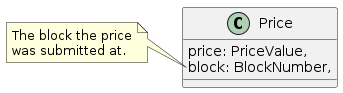
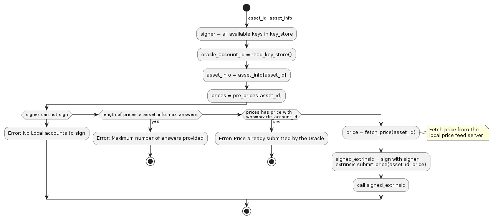

Design Document: Apollo Price Oracle
====================================

Table of Contents

-   [1. Abstract](#_abstract)
-   [2. Background](#_background)
    -   [2.1. What is the Oracle Problem?](#_what_is_the_oracle_problem)
    -   [2.2. Decentralized Price
        Oracles](#_decentralized_price_oracles)
-   [3. Requirements](#_requirements)
    -   [3.1. Utility](#_utility)
    -   [3.2. Accuracy (Observation
        Integrity)](#_accuracy_observation_integrity)
    -   [3.3. Security](#_security)
    -   [3.4. Scalability](#_scalability)
    -   [3.5. Decentralization](#_decentralization)
-   [4. Method](#_method)
    -   [4.1. System Overview](#_system_overview)
    -   [4.2. Component: Pallet Apollo](#_component_pallet_apollo)
        -   [4.2.1. Data Structure: Price](#_data_structure_price)
        -   [4.2.2. Data Structure: PrePrice](#_data_structure_preprice)
        -   [4.2.3. Data Structure:
            AssetInfo](#_data_structure_assetinfo)
        -   [4.2.4. Storage: AssetsInfo](#_storage_assetsinfo)
        -   [4.2.5. Storage: Prices](#_storage_prices)
        -   [4.2.6. Storage: PrePrices](#_storage_preprices)
        -   [4.2.7. Storage: PriceHistory](#_storage_pricehistory)
        -   [4.2.8. Storage: OracleStake](#_storage_oraclestake)
        -   [4.2.9. Storage:
            RewardTrackerStore](#_storage_rewardtrackerstore)
        -   [4.2.10. Interface: Oracle](#_interface_oracle)
            -   [4.2.10.1. get\_price](#_get_price)
            -   [4.2.10.2.
                get\_twap\_for\_amount](#_get_twap_for_amount)
            -   [4.2.10.3. get\_ratio](#_get_ratio)
            -   [4.2.10.4. get\_price\_inverse](#_get_price_inverse)
        -   [4.2.11. Interface: Pallet
            Extrinsics](#_interface_pallet_extrinsics)
            -   [4.2.11.1. add\_asset\_and\_info](#_add_asset_and_info)
            -   [4.2.11.2. set\_signer](#_set_signer)
            -   [4.2.11.3. adjust\_rewards](#_adjust_rewards)
            -   [4.2.11.4. add\_stake](#_add_stake)
            -   [4.2.11.5. remove\_stake](#_remove_stake)
            -   [4.2.11.6. reclaim\_stake](#_reclaim_stake)
            -   [4.2.11.7. submit\_price](#_submit_price)
        -   [4.2.12. Algorithm: Offchain
            Worker](#_algorithm_offchain_worker)
        -   [4.2.13. Algorithm: on\_initialize
            Hook](#_algorithm_on_initialize_hook)
    -   [4.3. Component: Price Feed
        Server](#_component_price_feed_server)
        -   [4.3.1. Interface: Price Feed
            Client](#_interface_price_feed_client)
        -   [4.3.2. Interface: Rest API](#_interface_rest_api)
    -   [4.4. Security and Price Accuracy
        Model](#_security_and_price_accuracy_model)
    -   [4.5. Becoming an Oracle
        Provider](#_becoming_an_oracle_provider)
        -   [4.5.1. Key Management](#_key_management)
-   [5. Rollout](#_rollout)
-   [6. Future Improvements](#_future_improvements)
-   [7. References](#_references)

## 1. Abstract

This is a post-facto engineering design document for the Apollo price
oracle. Apollo oracle serves price information from out of consensus
sources such as exchanges into the Picasso DeFi ecosystem.

## 2. Background

Composable Finance plans to launch a decentralized price oracle to
support the DeFi ecosystem in the Picasso parachain called Apollo.
Apollo would provide access to asset prices from various price feeds
coming from both centralized and decentralized off-chain sources such as
decentralized/centralized exchanges. Bringing off-chain prices on-chain
requires solving the infamous oracle problem.

### 2.1. What is the Oracle Problem?

The oracle problem in blockchains occur because of the need for pieces
of logic running on a blockchain such as smart contracts to access
off-chain data sources that do not fall within blockchain consensus and
verifiability by definition and hence would not be natively
"trustworthy" as they could be manipulated. For example if a smart
contract running on Picasso parachain wants to access the price of ETH
token it would require getting that price from an exchange such as
Binance or Uniswap. But that runs the risk of the price being
manipulated by the provider of the data or the original source itself
causing the smart contract logic to derive wrong results. Avoiding this
problem requires either implementing a) a fully trusted centralized
oracle or b) a decentralized oracle. While the centralized approach
could work for a variety of use cases, when designing a large DeFi
ecosystem such as Picasso it’s not the right choice as the oracle could
become the weakest element in terms of security in the system.

### 2.2. Decentralized Price Oracles

A decentralized price oracle provides certain guarantees that a provided
price is accurate and free of manipulation by employing a decentralized
set of price providers instead of a single centralized one. Refer
[\[1](https://hal.archives-ouvertes.fr/hal-03620931/document)\] or
[\[2](https://research.chain.link/whitepaper-v2.pdf)\] for more thorough
coverage of the topics involved.

## 3. Requirements

### 3.1. Utility

1.  Oracle MUST be configurable to provide prices for required assets
    types for the Picasso parachain DeFi ecosystem.

2.  Oracle MUST provide interfaces for any other on-chain protocol on
    Picasso to integrate with it to get price updates.

3.  Oracle MUST provide interfaces for any off-chain protocol such as a
    front end app to integrate with it to get price updates.

4.  Oracle system MUST be extensible to provide additional statistics on
    top of the Oracle prices such as time weighted average price(TWAP).

### 3.2. Accuracy (Observation Integrity)

Working under the assumption of an honest majority of Oracle providers,

1.  Oracle prices MUST be accurate to within a pre-defined level of
    error from the market consensus.

2.  Oracle prices MUST be resistant to temporary glitches in accuracy
    faced by a minority of the Oracle providers.

### 3.3. Security

Working under the assumption of an honest majority of Oracle providers,

1.  Oracle prices MUST be resistant to manipulation by an Oracle price
    provider.

2.  Oracle prices MUST be resistant to manipulation by a third party.

3.  Oracle MUST be resistant to denial of service attacks. i.e prices
    MUST be available at all required intervals.

4.  Oracle MUST be resistant to front-running.

### 3.4. Scalability

1.  The system MUST provide prices in the desired frequency(every `n`
    blocks) with low latency for the required asset types (Liveliness).

2.  The system MUST scale to be able to provide prices for any number of
    assets that Picasso DeFi ecosystem requires.

### 3.5. Decentralization

1.  The system MUST support the number of Oracle providers that
    governance deems necessary for the decentralization of the protocol.

2.  The system MUST support a wide variety of price sources.

## 4. Method

### 4.1. System Overview

Following diagram illustrates an overview of the Apollo design with some
minor components skipped over for clarity.

Figure 1. Apollo Price Oracle: The System Overview

<table>
<colgroup>
<col style="width: 50%" />
<col style="width: 50%" />
</colgroup>
<tbody>
<tr class="odd">
<td>

Note

</td>
<td>It is proposed to rename the existing pallet-oracle as pallet-apollo here.</td>
</tr>
</tbody>
</table>

The following sections drill down into these components and others in
more detail.

### 4.2. Component: Pallet Apollo

#### 4.2.1. Data Structure: Price

Represents a price of an asset accepted by the Oracle.

#### 4.2.2. Data Structure: PrePrice

Represents a price submitted by an Oracle provider.

#### 4.2.3. Data Structure: AssetInfo

Represents the asset information for an asset that prices would be
tracked for in the oracle.

#### 4.2.4. Storage: AssetsInfo

    asset_info = Map<AssetId, AssetInfo>

#### 4.2.5. Storage: Prices

    prices = Map<AssetId, Price>

#### 4.2.6. Storage: PrePrices

    pre_prices = Map<AssetId, Array<PrePrice>>

#### 4.2.7. Storage: PriceHistory

    price_history = Map<AssetId, Array<Price>>

#### 4.2.8. Storage: OracleStake

    oracle_stake = Map<AccountId, Balance>

#### 4.2.9. Storage: RewardTrackerStore

For further details refer
[rewards-design](https://github.com/ComposableFi/composable/blob/main/frame/oracle/design/rewards/rewards-design.md).

#### 4.2.10. Interface: Oracle

##### 4.2.10.1. get\_price

    fn get_price(asset_id: Self::AssetId, amount: Self::Balance, ) -> Result<Price<Self::Balance, Self::Timestamp>, DispatchError>;

TODO: Algo

##### 4.2.10.2. get\_twap\_for\_amount

    fn get_twap_for_amount(asset_id: Self::AssetId, amount: Self::Balance) -> Result<Self::Balance, DispatchError>;

TODO: Algo

##### 4.2.10.3. get\_ratio

    fn get_ratio(pair: composable_traits::defi::CurrencyPair<Self::AssetId>) -> Result<sp_runtime::FixedU128, DispatchError>;

TODO: Algo

##### 4.2.10.4. get\_price\_inverse

    fn get_price_inverse(asset_id: Self::AssetId, amount: Self::Balance) -> Result<Self::Balance, DispatchError>;

TODO: Algo

#### 4.2.11. Interface: Pallet Extrinsics

##### 4.2.11.1. add\_asset\_and\_info

    pub fn add_asset_and_info(
                origin: OriginFor<T>,
                asset_id: T::AssetId,
                threshold: Validated<Percent, ValidThreshold>,
                min_answers: Validated<u32, ValidMinAnswers>,
                max_answers: Validated<u32, ValidMaxAnswer<T::MaxAnswerBound>>,
                block_interval: Validated<T::BlockNumber, ValidBlockInterval<T::StalePrice>>,
                reward_weight: BalanceOf<T>,
                slash: BalanceOf<T>,
            ) -> DispatchResultWithPostInfo;

TODO: Algo

##### 4.2.11.2. set\_signer

    pub fn set_signer(
                origin: OriginFor<T>,
                signer: T::AccountId,
            ) -> DispatchResultWithPostInfo;

TODO: Algo

##### 4.2.11.3. adjust\_rewards

    pub fn adjust_rewards(
                origin: OriginFor<T>,
                annual_cost_per_oracle: BalanceOf<T>,
                num_ideal_oracles: u8,
            ) -> DispatchResultWithPostInfo;

TODO: Algo

##### 4.2.11.4. add\_stake

    pub fn add_stake(origin: OriginFor<T>, stake: BalanceOf<T>) -> DispatchResultWithPostInfo;

TODO: Algo

##### 4.2.11.5. remove\_stake

    pub fn remove_stake(origin: OriginFor<T>) -> DispatchResultWithPostInfo;

TODO: Algo

##### 4.2.11.6. reclaim\_stake

    pub fn reclaim_stake(origin: OriginFor<T>) -> DispatchResultWithPostInfo;

TODO: Algo

##### 4.2.11.7. submit\_price

    pub fn submit_price(
                origin: OriginFor<T>,
                price: T::PriceValue,
                asset_id: T::AssetId,
            ) -> DispatchResultWithPostInfo;

Figure 2. Extrinsic: SubmitPrice

#### 4.2.12. Algorithm: Offchain Worker

Figure 3. Offchain Worker: check\_requests

Following are the sub-procedures from above main algorithm,

Figure 4. Offchain Worker: is\_requested

Figure 5. Offchain Worker: fetch\_price\_and\_send\_signed

#### 4.2.13. Algorithm: on\_initialize Hook

Figure 6. on\_initialize: update\_prices

This algorithm is `O(A * P)` Where `A` = number of assets tracked and
`P` = number of prices. This possibly requires optimization to scale so
that it won’t take up the entire block weight.

Figure 7. update\_prices: update\_pre\_prices prunes PrePrices storage

Figure 8. update\_pre\_prices: prune\_old\_pre\_prices prunes PrePrices
storage based on stale\_price config

<table>
<colgroup>
<col style="width: 50%" />
<col style="width: 50%" />
</colgroup>
<tbody>
<tr class="odd">
<td>

Note

</td>
<td><code>AnswerInTransit</code> is used to calculate the minimum stake required to submit a price. Refer submit_price extrinsic.</td>
</tr>
</tbody>
</table>

Figure 9. update\_prices: update\_price calculates and updates the
actual asset price based on the already pruned pre\_prices.

Figure 10. update\_price: calculate\_price calculates the actual price
for asset

Figure 11. calculate\_price: get\_median\_price calculates the median
price for an asset among pre-prices

Figure 12. update\_price: handle\_payout pays the reward out

For further details on rewarding refer
[rewards-design](https://github.com/ComposableFi/composable/blob/main/frame/oracle/design/rewards/rewards-design.md).

### 4.3. Component: Price Feed Server

#### 4.3.1. Interface: Price Feed Client

TODO

#### 4.3.2. Interface: Rest API

TODO

### 4.4. Security and Price Accuracy Model

TODO

-   Manipulation range without getting slashed?

-   How much of bribe it takes for an Oracle provider to provide the
    wrong price?

-   Chance of collusion

-   Nothing at stake?

-   Ensuring continuous function?

### 4.5. Becoming an Oracle Provider

TODO flow chart of the process

#### 4.5.1. Key Management

TODO

## 5. Rollout

## 6. Future Improvements

- ❏ Measure and improve on\_initialize algorithm to use less block
    weight(possibly reusing some of the looping logic) or use a block
    fold abstraction when processing prices.

- ❏ Use a better statistical measure(standard deviation?) when
    assessing accuracy compare threshold of a provided price by an
    oracle.

- ❏ Possibly set maximum on `AssetInfo.max_answers` field. Use the
    field to short circuit the any additional logic that might be
    performed unnecessarily on pre\_prices.

- ❏ Improve the median for price accuracy calculation.

- ❏ Make the price server easily extensible by rewriting it in typescript.
    Ideally any party from the community should be able to integrate price-feeds into the price-server with the least possible effort.

## 7. References

1.  Distributed Blockchain Price Oracle.
    <a href="https://hal.archives-ouvertes.fr/hal-03620931/document" class="bare">https://hal.archives-ouvertes.fr/hal-03620931/document</a>

2.  Chainlink 2.0: Next Steps in the Evolution of Decentralized Oracle
    Networks.
    <a href="https://research.chain.link/whitepaper-v2.pdf" class="bare">https://research.chain.link/whitepaper-v2.pdf</a>

3.  Apollo docs.
    <a href="https://docs.composable.finance/products/the-picasso-parachain/the-picasso-tech-stack/apollo" class="bare">https://docs.composable.finance/products/the-picasso-parachain/the-picasso-tech-stack/apollo</a>

Last updated 2022-07-21 16:28:58 +0200
