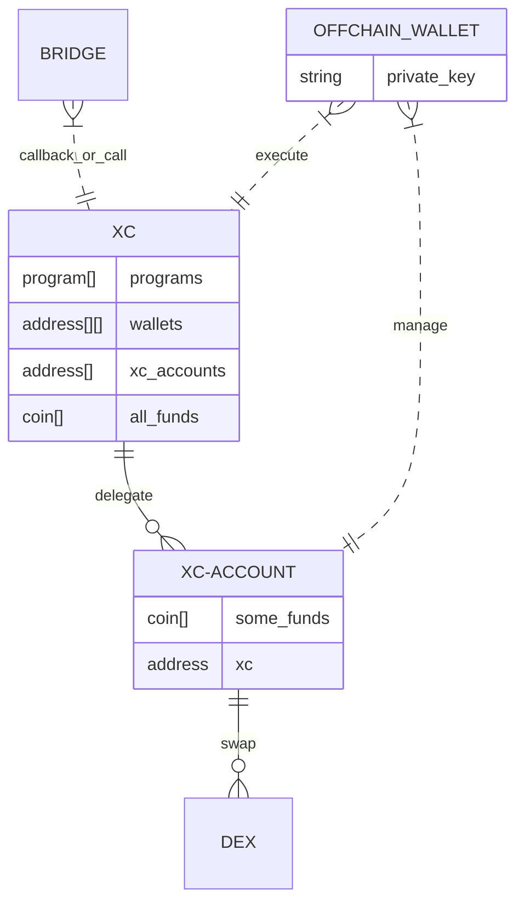

## XCVM Contracts state

```mermaid
erDiagram
    XC-ACCOUNT {        
        coin[] some_funds
        address xc
    }
    OFFCHAIN_WALLET {
        string private_key
    }
    XC {
        program[] programs
        address[][] wallets
        address[] xc_accounts  
        coin[] all_funds
    }
    BRIDGE }|..|| XC : callback_or_call
    XC ||--o{ XC-ACCOUNT : delegate
    XC-ACCOUNT ||--o{ DEX: swap
    OFFCHAIN_WALLET }|..|| XC-ACCOUNT : manage
    OFFCHAIN_WALLET }|..|| XC : execute  
```