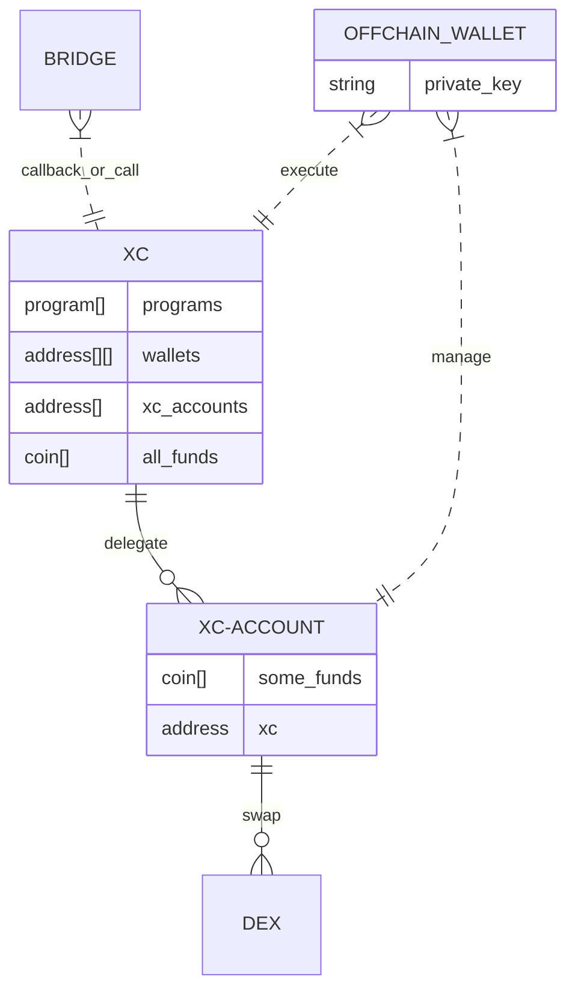
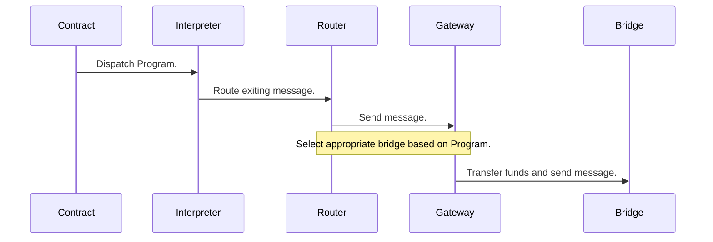

## XCVM Contracts state

### State

### Execution

Program execution touches the following components in this approximate manner:

For brevity, the receiving side of the chain has been omitted, although that goes through similar steps, but for the on-chain components in reverse order.

## Tech

Can be considered as 3 layers,

1. Full deployment of contract with all capabilities. Can do anything.
2. Partial fulfillment of XCVM spec using on chain features in case not deployment is possible (usually can multi hop transfer, swap). 
3. Edges which may start or terminate XCVM programs, but do not execute anything except simple sings (like one hop final transfer) 

For each chain and protocol it makes pragmatics hacks to use existing liquidity and execution primitives.

### ICS-20 Memo as `Spawn` carrier

`Spawn` forms `ICS-20` packet with `memo`.

`Assets` are put into `ICS-20` packet.

`Assets` are sent to `xc-account` contract, and  `wasm` termination callback is done to `xc` master contract with sender info and `Spawn` body.

`Memo` wasm message contains information to verify check sender from hash. 

`xc-master` contract verifies amount sent and proceed with move of assets up to amount in message via delegation from `xc-account`. 

Approach is needed because there is no `amount` information can be securely transferred in `memo`.