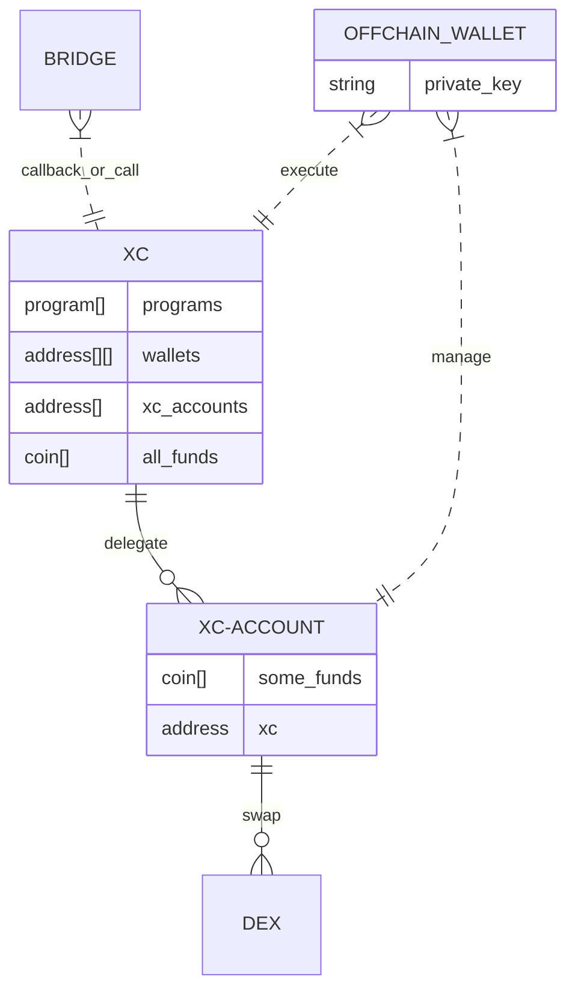

## XCVM Contracts state

### ICS-20 Memo as `Spawn` carrier

`Spawn` forms `ICS-20` packet with `memo`.

`Assets` are put into `ICS-20` packet.

`Assets` are sent to `xc-account` contract, and  `wasm` termination callback is done to `xc` master contract with sender info and `Spawn` body.

`Memo` wasm message contains information to verify check sender from hash. 

`xc-master` contract verifies amount sent and proceed with move of assets up to amount in message via delegation from `xc-account`. 

Approach is needed because there is no `amount` information can be securely transferred in `memo`.