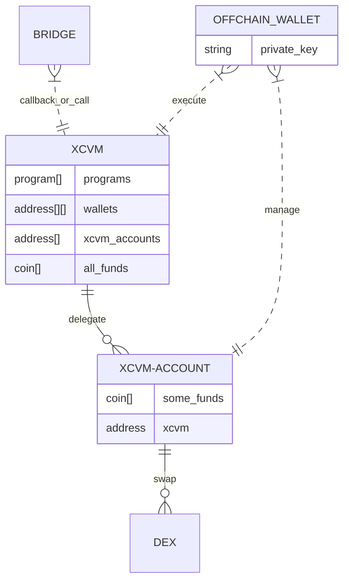

## XCVM Contracts state

```mermaid
erDiagram
    XCVM-ACCOUNT {        
        coin[] some_funds
        address xcvm
    }
    OFFCHAIN_WALLET {
        string private_key
    }
    XCVM {
        program[] programs
        address[][] wallets
        address[] xcvm_accounts  
        coin[] all_funds
    }
    BRIDGE }|..|| XCVM : callback_or_call
    XCVM ||--o{ XCVM-ACCOUNT : delegate
    XCVM-ACCOUNT ||--o{ DEX: swap
    OFFCHAIN_WALLET }|..|| XCVM-ACCOUNT : manage
    OFFCHAIN_WALLET }|..|| XCVM : execute  
```