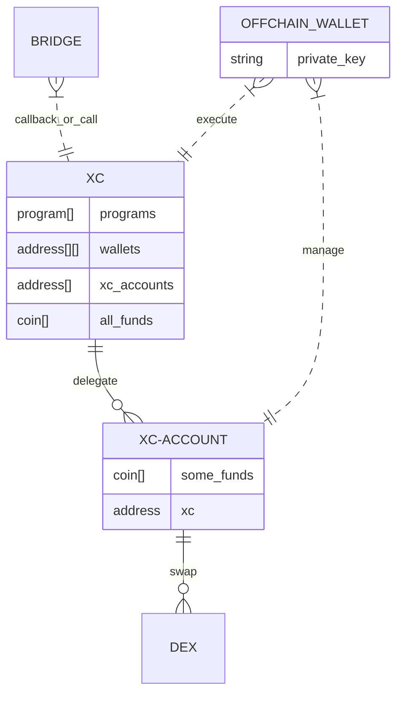
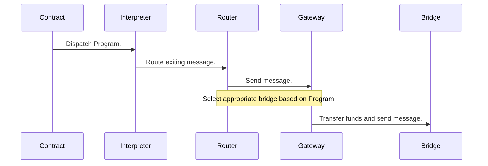

## XCVM Contracts state


### State



### Execution

Program execution touches the following components in this approximate manner:



For brevity, the receiving side of the chain has been omitted, although that goes through similar steps, but for the on-chain components in reverse order.

## Tech

Can be considered as 3 layers,

1. Full deployment of contract with all capabilities. Can do anything.
2. Partial fulfillment of XCVM spec using on chain features in case not deployment is possible (usually can multi hop transfer, swap). 
3. Edges which may start or terminate XCVM programs, but do not execute anything except simple sings (like one hop final transfer) 

For each chain and protocol it makes pragmatics hacks to use existing liquidity and execution primitives.

### Examples 

#### Stake on Strides

Program to `Stake` on Stride and transfer staked token to Osmosis
is detected as pattern expressed in XCVM.

That part of program is translated to IBC calls to Stride without contracts deployed.

So this program is possible
```
Osmosis ATOM -> 
Spawn(Stride, ATOM) -> Stake(ATOM) + Spawn(Osmosis, stATOM) 
-> Spawn(Centauri, stATOM)  
```

### ICS-20 Memo as `Spawn` carrier

`Spawn` forms `ICS-20` packet with `memo`.

`Assets` are put into `ICS-20` packet.

`Assets` are sent to `xc-account` contract, and  `wasm` termination callback is done to `xc` master contract with sender info and `Spawn` body.

`Memo` wasm message contains information to verify check sender from hash. 

`xc-master` contract verifies amount sent and proceed with move of assets up to amount in message via delegation from `xc-account`. 

Approach is needed because there is no `amount` information can be securely transferred in `memo`.

### Asset id encoding

Each asset id is 128 bit number with 4 first bytes are network id, means that numbers never overlap.

So it will not be the case that on one chain 123213 means PEPA and on other chain 123213 means SHIB.

Prefix allows to find network to look at for asset info.

For security reasons when assets sent from chain to chain, asset id changes.


## How to run local Cosmos nodes(devnet) with XCVM 

There are 2 options to run XCVM enabled devnet.

First is Nix installation guide, and run via nix. Another run via docker.

```bash
# this runs lightweight chain only with cosmos chains as on latest main branch
nix run composable#devnet-xc-cosmos-fresh
```

```bash
# run all cosmos and dotsama chain with relays
docker run composablefi/devnet-xc:main
```

Picasso, Centauri and Osmosis are uploaded with XCVM contracts.

Centauri and Osmosis main target of testing and configuration.


Wait for relayer start relaying.

Transfer ppica to Osmosis and uosmo to Centauri using command lines for daemons.
`nix run .#centauri-tx` and `nix run .#osmosis-tx` do it. 

Use preferred methods to observe transfer happened.
I look at logs at `/tmp/composable-devnet/`.

And finally run sample XCVM program: 
```bash
# ppica on Centauri -> ppica on Osmosis -> swap to uosmo -> uosmo on Centauri
nix run .#xc-swap-pica-to-osmo
```

## Deployment 

Interpreter MUST be instantiated only from code identifiers accepted by gateway.

Gateway queries interpreter code id and owner, ensuring it is gateway only.

## How to generate schema

For gateway 

```sh
cargo run --package xc-core --bin gateway
```

For interpreter

```
cargo run --package cw-xc-interpreter --bin interpreter

## How to configure

Shell into relevant net, and run (with relevant modifications):

```sh
osmosisd tx wasm execute "osmo18tq76p8zmj49jr5zmsytulrzluljvd6m7he2uavvy6f8lsp77jwqwr0z6a" "$(cat code/xcvm/cvm.json)" --gas=427753 --fees=2000$FEE --from=dz
```