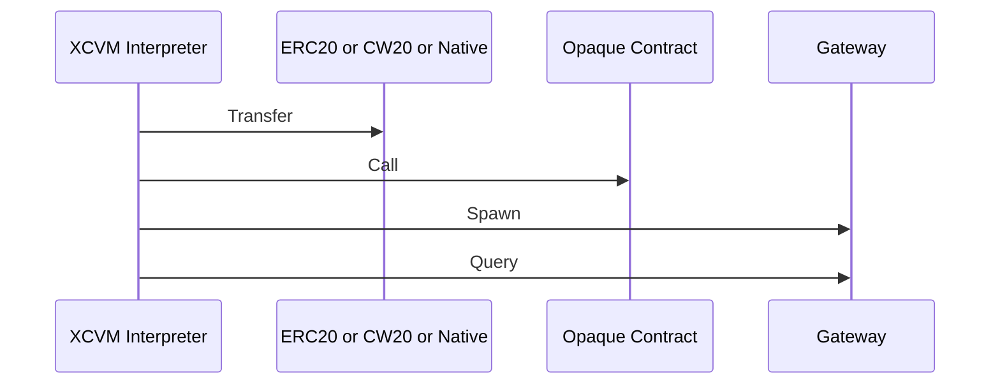

```
Composable Finance
Karel L. Kubat, Hussein Alt Laichen
2022-11-01
```

# Abstract

Cross-chain Virtual Machine (XCVM) is a specification outlining an application-level messaging protocol between state machines and other execution environments. It allows for a more sophisticated mechanism for cross-chain communication compared to message passing, by defining an interpreter-based communication interface between chains.

- Turing-Complete Interactions: Complicated business logic can be dynamically dispatched to other chains, without the need for developers to deploy contracts on the destination chain.
- Configurable Security Levels: Developers can opt-in to use less secure transports, with the advantage of cheaper and faster execution.

Most of all, `XCVM` has been designed in a very extensible way, building up small functionalities and by combining them, allows for immense complexity.

# Status of This Memo

This is a Composable Finance Protocol Specification document. It has not received public audits nor is the specification frozen. It is a product of the entire XCVM team.

# Copyright Notice

Copyright (c) 2022 Composable Finance and the persons identified as the
document authors. All rights reserved.

# Table of Contents

<!-- From this section onward, number each header -->
# 1. Overview

## 1.1. Document Structure

<!-- 

Describe each section of the ToC in 1 sentence, optionally grouping sections with a single sentence describing the sections:

*  Streams are the basic service abstraction that QUIC provides.

    -  Section 2 describes core concepts related to streams,

    -  Section 3 provides a reference model for stream states, and

    -  Section 4 outlines the operation of flow control.
-->

## 1.2. Terms and Definitions

The keywords "MUST", "MUST NOT", "REQUIRED", "SHALL", "SHALL NOT", "SHOULD", "SHOULD NOT", "RECOMMENDED", "MAY", and "OPTIONAL" in this document are to be interpreted as described in [RFC 2119](https://www.rfc-editor.org/rfc/rfc2119).

Commonly used terms in this document are described below.

`Transaction`: A (reversible) operation on a chain.

`Transfer`: Changing the ownership of an asset (token, NFT, etc) from one account to another.

`Identity`: An entity that has an address. Note that identities may not have a public/private key, as they can be contracts.

`Cross Chain Transfer`: The bridging of funds between two chains.

`Cross Chain Transaction`: Two or more transactions on two or more chains. Note that a cross-chain transaction is not `transactional`.

`XCVM Transaction`: A cross-chain transaction defined as XCVM instructions, being handled by interpreters. Technically an XCVM transaction can be single chain only, although the use case for that seems non-existent.

`Message Passing`: Sending bytes from one chain to another.

`Event`: A message emitted by a contract/module/pallet during transaction execution.

`XCVM Event`: An event emitted by part of the XCVM contracts.

## 1.3.  Notational Conventions

This document makes ample usage of a pseudo-Backus-Naur form to describe the format of messages and instructions without yet specifying the exact encoding. 

### 1.3.1. Types
A type is defined using `::=` and referenced using angle brackets `<>`, unless it is a primitive type:

```
<T> ::= u128
<A> ::= bytes
```

### 1.3.2. Unions
```
<T> ::= <A> | <B>
```

The above defines the message `T`, which is either `A` or `B` through the union `|` operator. In the Rust programming language, this would be modeled as

```
enum T {
    A(A),
    B(B)
}
```

### 1.3.3. Sums
Sum types are defined without any operators.

```
<A> ::= <C> <D>
```

The above defines the message `A`, consisting of `C` and `D`. In Rust, this would be

```
struct A (C, D)
```

### 1.3.4. Mappings
Mappings are defined using braces:

```
<Map> ::= {K: V}
```

The above defines a message `Map`, which is a map of `K -> V`. In Rust, this would be

```
struct Map(HashMap<K, V>)
```

### 1.3.5. Sequences
Sequences (lists) are defined using square brackets:

```
<T> ::= [<A>]
```

The above defines the message `T`, which consists of 0 or more `A`s

### 1.3.6. Sets
Sequences containing unique items are defined using braces, omitting the key definition:

```
<T> ::= {<A>}
```

### 1.3.7. Primitive types
Different primitive types are used:

| Type  | Description      | Rust type |
|-------|------------------|-----------|
| u128  | Unsigned Integer | u128      |
| bytes | Sequence of bits | Vec<u8>   |
| u32   | Unsigned Integer | u32       |


# 2. XCVM

The `XCVM` refers to both a set of on-chain contracts, orchestrating the bridging operations, ownership, and execution, as well as the interchain system of bridges and relayers. This document mainly specifies the logic within a single chain, and how implementors MUST execute messages and maintain state.

Although execution environments change depending on the chain, the `XCVM` protocol is generic over the differences and provides an abstract target for smart contracts to interact with. We describe components as separate contracts, but implementors MAY be a pallet, Cosmos SDK module, or a single contract as opposed to many. Here the choice is based made on gas optimizations, engineering standards, and security practices.

`XCVM` is bridge agnostic, as long as the underlying bridging protocol is capable of generic message passing. Developers can opt-in to their usages for each interpreter instance. We highly recommend `IBC` if available, and by default only allow communication across trustless bridges.

## 2.1. Versioning

`XCVM` protocol versions and implementations use [semantic versioning](https://semver.org/spec/v2.0.0.html) to identify capabilities and backward compatibility.

## 2.2. Instruction Set

Messages executed by the `XCVM` follow the `Program` format. 

```
<Program> ::= <Tag> [<Instruction>]

<Tag> ::= bytes
<Instruction> ::= 
    <Transfer>
    | <Call>
    | <Spawn>
    | <Query>
```

Each instruction is executed by the on-chain interpreter in sequence. The execution semantics are defined in section 2.4.5.

The following sequence shows possible high-level implementations for each instruction.



### 2.2.1. Transfer

Transfers funds within a chain between accounts.

```
<Transfer>     ::= <Account> <Assets> | <Relayer> <Assets>

<Account>      ::= bytes
<Assets>       ::= { <AssetId> : <Balance> }
<AssetId>      ::= <GlobalId> | <LocalId>
<GlobalId>     ::= u128
<LocalId>      ::= bytes 
<Balance>      ::= <Ratio> | <Absolute> | <Unit>
<Absolute>     ::= u128
<Unit>         ::= u128 Ratio
<Ratio>        ::= u128 u128
```

### 2.2.2. Call

Executes a payload within the execution context of the chain, such as an extrinsic or smart contract invocation. Call is guaranteed to execute on the specified `Network` of the `Spawn` context.

```
<Call>         ::= <Payload> <Bindings>
<Payload>      ::= bytes
<Bindings>     ::= { u16 : <BindingValue> }
<BindingValue> ::= <Self> | <Relayer> | <Result> | <Balance> | <GlobalId>
```

### 2.2.2.1. Late Bindings

The call instruction supports bindings values on the executing side of the program by specifying the `Bindings`. This allows us to construct a program that uses data only available on the executing side. For example, the swap call of the following smart contract snippet expects a `to` address to receive the funds after a trade.

```rust
fn swap(amount: u256, pair: (u128, u128), to: AccountId) { ... } 
```

If the caller wants to swap funds from the interpreter account and receive the funds into the interpreter account, we need to specify the BindingValue `Self`, using the index of the `to` field for the serialized data being passed to the smart contract.

On the executing instance, `BindingValue::Self` will be interpolated at byte index 13  of the payload before being executed, the final payload then becomes `swap(10,(1,2), BindingValue::Self)`, where `BindingValue::Self` is the canonical address of the interpreter on the destination side.

Besides accessing the `Self` register, `BindingValue` allows for lazy lookups of AssetId conversions, by using `BindingValue::AssetId(GlobalId)`, or lazily converting decimal points depending on the chain using the `Balance` type.

Bindings do not support non-byte aligned encodings.

### 2.2.3 Spawn

Sends a `Program` to another chain to be executed asynchronously. It is only guaranteed to execute on the specified `Network` if its `Program` contains an instruction that is guaranteed to execute on the `Network` of the `Spawn` context. 

```
<Spawn>      ::= <Network> <BridgeSecurity> <Salt> <Program> <Assets>

<Network>    ::= u128
<Salt>       ::= bytes
```

### 2.2.4. Query

Queries register values of an `XCVM` instance across chains. It sets the current `Result Register` to `QueryResult`. See section 3. on the semantics of registers and `RegisterValues`.

```
<Query>        ::= <Network> <Account>
<QueryResult>  ::= {<RegisterValues>}
```

## 2.3. Balances

Amounts of assets can be specified using the `Balance` type. This allows foreign programs to specify sending a part of the total amount of funds using `Ratio`, or express the amounts in the canonical unit of the asset: `Unit`,  or if the caller is aware of the number of decimals of the assets on the destination side: `Absolute`.

## 2.4. Abstract Virtual Machine 

Each `XCVM` instance is a bytecode interpreter with a limited set of specialized registers. 

### 2.4.1 Registers

Each interpreter keeps track of persistent states during and across executions, which are stored in different registers. Register values are always updated during execution and can be observed by other contracts.

```
<RegisterValues> ::= {<RegisterValue>}
<RegisterValue>  ::= <ResultRegister> | <IPRegister> | <RelayerRegister> | <SelfRegister>
```

#### 2.4.1.1 Result Register

The result register contains the result of the last executed instruction.

```
<ResultRegister> ::= 
    <Error> 
    | <ExecutionResult><

<Error ::= 
    <CallError> 
    | <TransferError>
    | <SpawnError>
    | <QueryError>

<ExecutionResult> ::= 
    <Ok> | bytes
<Ok> ::= '0'

<CallError> ::= bytes
<TransferError> ::= bytes
<SpawnError> ::= bytes
<QueryError> ::= bytes
```

#### 2.4.1.2 IP Register

The instruction pointer register contains the instruction pointer of the last executed program and is updated during program execution. Querying for the `IP` and `Result` can be used to compute the state of the interpreter on another chain.

```
<IPRegister> ::= u32
```

#### 2.4.1.3 Relayer Register

The relayer register contains the `Account` of the account triggering the initial execution. This can be the IBC relayer or any other entity. By definition, the relayer is the account paying the fees for interpreter execution.

```
<RelayerRegister> ::= u32
```

#### 2.4.1.4 Self Register

The self-register contains the `Account` of the interpreter. Most implementations will not need to use storage but have access to special keywords, such as `this` in Solidity.

```
<SelfRegister> ::= <Account>
```

### 2.4.5 Execution Semantics

Implementors MUST execute each instruction in the provided order. After each instruction is executed, the result register MUST be set to the return value of the instruction. The interpreter SHOULD NOT mangle the return values but store them as returned. If an error is encountered by executing an instruction, the defined transactional behavior for that instruction should be abided by. All instructions defined in this document require the transaction to be aborted on failure, however, subsequent addendums may define new instructions with different behavior. 

# X. Security considerations

<!-- Define security-related considerations to USERS and IMPLEMENTORS -->

# X+1. References

# X+2. Appendix

<!-- Pseudocode etc goes here -->

# X+3. Contributors

<!-- Who has worked on this RFC -->