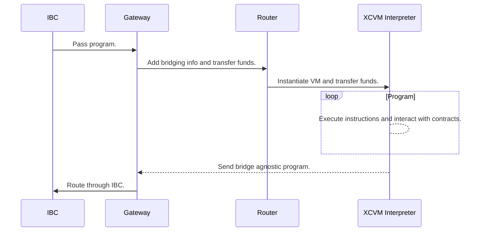
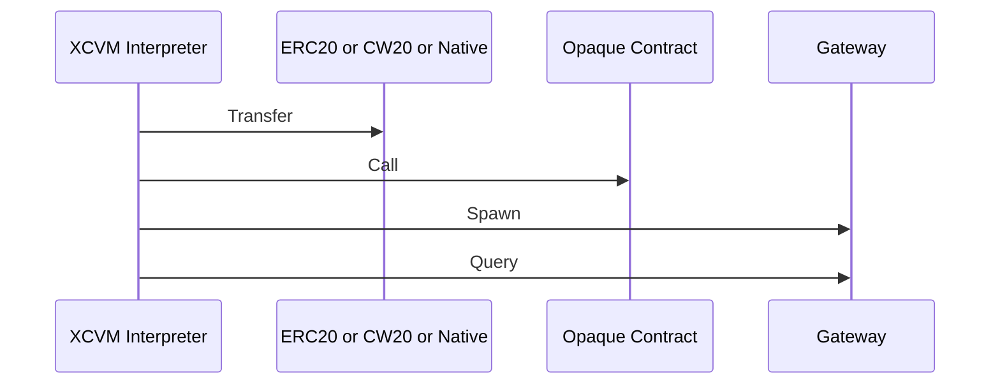
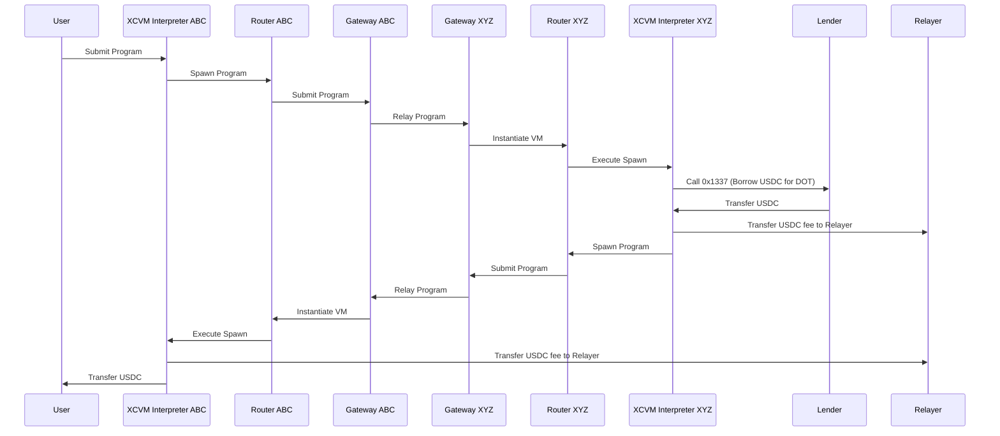

```
Composable Finance
Karel L. Kubat, Hussein Ait Lahcen
2022-11-01
```

# Abstract

Cross-chain Virtual Machine (XCVM) is a specification outlining an application-level messaging protocol between state machines and other execution environments. It allows for a more sophisticated mechanism for cross-chain communication compared to message passing, by defining an interpreter-based communication interface between chains.

- Turing-Complete Interactions: Complicated business logic can be dynamically dispatched to other chains, without the need for developers to deploy contracts on the destination chain.
- Configurable Security Levels: Developers can opt-in to use less secure transports, with the advantage of cheaper and faster execution.

Most of all, `XCVM` has been designed in a very extensible way, building up small functionalities and by combining them, allowing for immense complexity.

# Status of This Memo

This is a Composable Finance Protocol Specification document. It has not received public audits nor is the specification frozen. It is a product of the entire XCVM team.

# Copyright Notice

Copyright (c) 2022 Composable Finance and the persons identified as the
document authors. All rights reserved.

# Table of Contents

<!-- 
generated using https://ecotrust-canada.github.io/markdown-toc/ 
-->

- [Abstract](#abstract)
- [Status of This Memo](#status-of-this-memo)
- [Copyright Notice](#copyright-notice)
- [Table of Contents](#table-of-contents)
- [1. Overview](#1-overview)
  * [1.1. Document Structure](#11-document-structure)
  * [1.2. Terms and Definitions](#12-terms-and-definitions)
  * [1.3.  Notational Conventions](#13--notational-conventions)
    + [1.3.1. Types](#131-types)
    + [1.3.2. Unions](#132-unions)
    + [1.3.3. Sums](#133-sums)
    + [1.3.4. Mappings](#134-mappings)
    + [1.3.5. Sequences](#135-sequences)
    + [1.3.6. Sets](#136-sets)
    + [1.3.7. Primitive types](#137-primitive-types)
- [2. XCVM](#2-xcvm)
  * [2.1. Versioning](#21-versioning)
  * [2.2. Instruction Set](#22-instruction-set)
    + [2.2.1. Transfer](#221-transfer)
    + [2.2.2. Call](#222-call)
    + [2.2.2.1. Late Bindings](#2221-late-bindings)
    + [2.2.3 Spawn](#223-spawn)
    + [2.2.4. Query](#224-query)
  * [2.3. Balances](#23-balances)
  * [2.4. Abstract Virtual Machine](#24-abstract-virtual-machine)
    + [2.4.1 Registers](#241-registers)
      - [2.4.1.1 Result Register](#2411-result-register)
      - [2.4.1.2 IP Register](#2412-ip-register)
      - [2.4.1.3 Relayer Register](#2413-relayer-register)
      - [2.4.1.4 Self Register](#2414-self-register)
      - [2.4.1.5 Version Register](#2415-version-register)
    + [2.4.5 Program Execution Semantics](#245-program-execution-semantics)
  * [2.5. XCVM Execution Semantics](#25-xcvm-execution-semantics)
    + [2.5.1. Gateway](#251-gateway)
    + [2.5.2. Router](#252-router)
    + [2.6. Ownership](#26-ownership)
- [3. Encoding](#3-encoding)
  * [3.1. JSON Encoding](#31-json-encoding)
- [4. Fees](#4-fees)
  * [4.1. Execution Fees](#41-execution-fees)
- [5. Asset Registries](#5-asset-registries)
- [6. Further Work](#6-further-work)
  * [6.1 NFTs](#61-nfts)
  * [6.2 Name Service](#62-name-service)
- [7. Security considerations](#7-security-considerations)
- [8. References](#8-references)
- [9. Appendix](#9-appendix)
  * [A.](#a)
  * [B.](#b)
    + [Examples](#examples)
      - [Cross-chain borrowing](#cross-chain-borrowing)
- [10. Contributors](#10-contributors)

# 1. Overview

## 1.1. Document Structure


* XVCM is a DTCC-like protocol for blockchains.

    - Section 2.1. describes on-chain versioning.

    - Section 2.2. describes the instruction set.

    - Section 2.3. describes general asset amount handling.

    - Section 2.4. specifies the abstract virtual machine.

    - Section 2.5. outlines the execution semantics of a program.

* Encoding programs is primarily done using protobufs.

* Fees are charged at different stages, for bridging and execution.

* Asset Registries provide ways to deal with ERC20, CW20, or native assets across chains.

* Further work outlines planned extensions to the specification.

    - Section 6.1. elaborates on NFTs.

    - Section 6.2. provides a model for abstracting ownership and identities.

* Security considerations to be made by users and implementors.

## 1.2. Terms and Definitions

The keywords "MUST", "MUST NOT", "REQUIRED", "SHALL", "SHALL NOT", "SHOULD", "SHOULD NOT", "RECOMMENDED", "MAY", and "OPTIONAL" in this document are to be interpreted as described in [RFC 2119](https://www.rfc-editor.org/rfc/rfc2119).

Commonly used terms in this document are described below.

`Transaction`: A (reversible) operation on a chain.

`Transfer`: Changing the ownership of an asset (token, NFT, etc) from one account to another.

`Identity`: An entity that has an address. Note that identities may not have a public/private key, as they can be contracts.

`Cross Chain Transfer`: The bridging of funds between two chains.

`Cross Chain Transaction`: Two or more transactions on two or more chains. Note that a cross-chain transaction is not `transactional`.

`XCVM Transaction`: A cross-chain transaction defined as XCVM instructions, being handled by interpreters. Technically an XCVM transaction can be single chain only, although the use case for that seems non-existent.

`Message Passing`: Sending bytes from one chain to another.

`Event`: A message emitted by a contract/module/pallet during transaction execution.

`XCVM Event`: An event emitted by part of the XCVM contracts.

`Beneficiary`: Recipient of assets.

`Relayer`: Initiator of the destination side transaction, paying for the execution fees.

`Opaque Contract`: Any smart contract, module, or pallet.

`Chain`: A blockchain with its consensus and execution environment, but may also refer to rollups.

`User`: A third party user of XCVM contracts. Can be another contract, module, pallet or actual human.

`Implementor`: An entity implementing technology according to the XCVM specification.


## 1.3.  Notational Conventions

This document makes ample usage of a pseudo-Backus-Naur form to describe the format of messages and instructions without yet specifying the exact encoding. 

### 1.3.1. Types
A type is defined using `::=` and referenced using angle brackets `<>`, unless it is a primitive type:

```
<T> ::= u128
<A> ::= bytes
```

### 1.3.2. Unions
```
<T> ::= <A> | <B>
```

The above defines the message `T`, which is either `A` or `B` through the union `|` operator. In the Rust programming language, this would be modeled as

```
enum T {
    A(A),
    B(B)
}
```

### 1.3.3. Sums
Sum types are defined without any operators.

```
<A> ::= <C> <D>
```

The above defines the message `A`, consisting of `C` and `D`. In Rust, this would be

```
struct A (C, D)
```

### 1.3.4. Mappings
Mappings are defined using braces:

```
<Map> ::= {K: V}
```

The above defines a message `Map`, which is a map of `K -> V`. In Rust, this would be

```
struct Map(HashMap<K, V>)
```

### 1.3.5. Sequences
Sequences (lists) are defined using square brackets:

```
<T> ::= [<A>]
```

The above defines the message `T`, which consists of 0 or more `A`s

### 1.3.6. Sets
Sequences containing unique items are defined using braces, omitting the key definition:

```
<T> ::= {<A>}
```

### 1.3.7. Primitive types
Different primitive types are used:

| Type  | Description      | Rust type |
|-------|------------------|-----------|
| u128  | Unsigned Integer | u128      |
| bytes | Sequence of bits | Vec<u8>   |
| u32   | Unsigned Integer | u32       |


# 2. XCVM

The `XCVM` refers to both a set of on-chain contracts, orchestrating the bridging operations, ownership, and execution, as well as the interchain system of bridges and relayers. This document mainly specifies the logic within a single chain, and how implementors MUST execute messages and maintain state.

Although execution environments change depending on the chain, the `XCVM` protocol is generic over the differences and provides an abstract target for smart contracts to interact with. We describe components as separate contracts, but implementors MAY be a pallet, Cosmos SDK module, or a single contract as opposed to many. Here the choice is based made on gas optimizations, engineering standards, and security practices.

`XCVM` is bridge agnostic, as long as the underlying bridging protocol is capable of generic message passing. Developers can opt-in to their usages for each interpreter instance. We highly recommend `IBC` if available, and by default only allow communication across trustless bridges.



## 2.1. Versioning

`XCVM` protocol versions and implementations use [semantic versioning](https://semver.org/spec/v2.0.0.html) to identify capabilities and backward compatibility.

## 2.2. Instruction Set

Messages executed by the `XCVM` follow the `Program` format. 

```
<Program> ::= <Tag> [<Instruction>]

<Tag> ::= bytes
<Instruction> ::= 
    <Transfer>
    | <Call>
    | <Spawn>
    | <Query>
```

Each instruction is executed by the on-chain interpreter in sequence. The execution semantics are defined in section 2.4.5.

The following sequence shows possible high-level implementations for each instruction.



### 2.2.1. Transfer

Transfers funds within a chain between accounts.

```
<Transfer>     ::= <Account> <Assets> | <Relayer> <Assets>

<Account>      ::= bytes
<Assets>       ::= { <AssetId> : <Balance> }
<AssetId>      ::= <GlobalId> | <LocalId>
<GlobalId>     ::= u128
<LocalId>      ::= bytes 
<Balance>      ::= <Ratio> | <Absolute> | <Unit>
<Absolute>     ::= u128
<Unit>         ::= u128 Ratio
<Ratio>        ::= u128 u128
```

### 2.2.2. Call

Executes a payload within the execution context of the chain, such as an extrinsic or smart contract invocation. Call is guaranteed to execute on the specified `Network` of the `Spawn` context.

```
<Call>         ::= <Payload> <Bindings>
<Payload>      ::= bytes
<Bindings>     ::= { u16 : <BindingValue> }
<AssetAmount>  ::= <AssetId> <Balance>
<BindingValue> ::= <Self> | <Relayer> | <Result> | <AssetAmount> | <GlobalId>
```

### 2.2.2.1. Late Bindings

The call instruction supports bindings values on the executing side of the program by specifying the `Bindings`. This allows us to construct a program that uses data only available on the executing side. For example, the swap call of the following smart contract snippet expects a `to` address to receive the funds after a trade.

```rust
fn swap(amount: u256, pair: (u128, u128), to: AccountId) { ... } 
```

If the caller wants to swap funds from the interpreter account and receive the funds into the interpreter account, we need to specify the BindingValue `Self`, using the index of the `to` field for the serialized data being passed to the smart contract.

On the executing instance, `BindingValue::Self` will be interpolated at byte index 13  of the payload before being executed, the final payload then becomes `swap(10,(1,2), BindingValue::Self)`, where `BindingValue::Self` is the canonical address of the interpreter on the destination side.

Besides accessing the `Self` register, `BindingValue` allows for lazy lookups of AssetId conversions, by using `BindingValue::AssetId(GlobalId)`, or lazily converting decimal points depending on the chain using the `Balance` type.

Bindings do not support non-byte aligned encodings.

### 2.2.3 Spawn

Sends a `Program` to another chain to be executed asynchronously. It is only guaranteed to execute on the specified `Network` if its `Program` contains an instruction that is guaranteed to execute on the `Network` of the `Spawn` context. 

```
<Spawn>      ::= <Network> <BridgeSecurity> <Salt> <Program> <Assets>

<Network>    ::= u128
<Salt>       ::= bytes
```

### 2.2.4. Query

Queries register values of an `XCVM` instance across chains. It sets the current `Result Register` to `QueryResult`. See section 3. on the semantics of registers and `RegisterValues`.

```
<Query>        ::= <Network> <Account>
<QueryResult>  ::= {<RegisterValues>}
```

## 2.3. Balances

Amounts of assets can be specified using the `Balance` type. This allows foreign programs to specify sending a part of the total amount of funds using `Ratio`, or express the amounts in the canonical unit of the asset: `Unit`,  or if the caller is aware of the number of decimals of the assets on the destination side: `Absolute`.

## 2.4. Abstract Virtual Machine 

Each `XCVM` instance is a bytecode interpreter with a limited set of specialized registers. 

### 2.4.1 Registers

Each interpreter keeps track of persistent states during and across executions, which are stored in different registers. Register values are always updated during execution and can be observed by other contracts.

```
<RegisterValues> ::= {<RegisterValue>}
<RegisterValue>  ::= <ResultRegister> | <IPRegister> | <RelayerRegister> | <SelfRegister> | <VersionRegister>
```

#### 2.4.1.1 Result Register

The result register contains the result of the last executed instruction.

```
<ResultRegister> ::= 
    <Error> 
    | <ExecutionResult><

<Error ::= 
    <CallError> 
    | <TransferError>
    | <SpawnError>
    | <QueryError>

<ExecutionResult> ::= 
    <Ok> | bytes
<Ok> ::= '0'

<CallError> ::= bytes
<TransferError> ::= bytes
<SpawnError> ::= bytes
<QueryError> ::= bytes
```

#### 2.4.1.2 IP Register

The instruction pointer register contains the instruction pointer of the last executed program and is updated during program execution. Querying for the `IP` and `Result` can be used to compute the state of the interpreter on another chain.

```
<IPRegister> ::= u32
```

#### 2.4.1.3 Relayer Register

The relayer register contains the `Account` of the account triggering the initial execution. This can be the IBC relayer or any other entity. By definition, the relayer is the account paying the fees for interpreter execution.

```
<RelayerRegister> ::= u32
```

#### 2.4.1.4 Self Register

The self register contains the `Account` of the interpreter. Most implementations will not need to use storage but have access to special keywords, such as `this` in Solidity.

```
<SelfRegister> ::= <Account>
```

#### 2.4.1.5 Version Register

The version register contains the semantic version of the contract code, which can be used to verify the subset of XCVM functionality supported by the contract. Implementations that support upgradable contracts MUST update the version register. Functionality advertised through the version register MUST be supported by the contract.

### 2.4.5 Program Execution Semantics

Execution of a program is a two-stage process. First, the virtual machine MUST verify that the caller is allowed to execute programs for that specific instance, by verifying that the caller is one of the owners. See section XYZ for ownership semantics. Second, the RelayerRegister must be set. Third, the instructions are iterated over and executed. Implementors MUST execute each instruction in the provided order and MUST update the IP register after each instruction is executed. After each instruction is executed, the result register MUST be set to the return value of the instruction. The interpreter SHOULD NOT mangle the return values but store them as returned. Because the return values are chain specific, the actual structure is left *undefined*. 

If an error is encountered by executing an instruction, the defined transactional behavior for that instruction should be abided by. All instructions defined in this document require the transaction to be aborted on failure, however, subsequent addendums may define new instructions with different behavior. 

After the final instruction has been executed and registers are set, the execution stops and the transaction ends.

See Appendix A for the algorithm.

## 2.5. XCVM Execution Semantics

Each chain within the `XCVM` contains a singleton entity, the router, and the gateway. Implementors MAY choose to create a monolithic smart contract or a set of modular contracts.

### 2.5.1. Gateway

Each chain contains a bridge aggregator contract (`Gateway`), which abstracts over transports.

The `Gateway` is configured to label bridges with different security levels. We define three security levels as of now:

```
<BridgeSecurity> ::= 
    <Deterministic> 
    | <Probabilistic> 
    | <Optimistic> 
```

- `Deterministic` bridges are light client based using a consensus protocol that has deterministic finality (IBC and XCM). Messages arriving from these bridges MUST never be fraudulent.
- `Probabilistic` bridges are still light client-based, but use a consensus protocol that at most has probabilistic finality (IBC with a PoW chain). Messages arriving from these bridges MUST never be fraudulent but MAY lead to inconsistent state because of block reorganizations.
- `Optimistic` bridges do not use proofs, but instead, have disputing mechanisms associated (Nomad). Messages arriving from these bridges MAY be fraudulent.

Outgoing messages are routed based on bridge security, or by specifying the bridge contract directly.

Each XCVM execution has access to its message `MessageOrigin` and can be configured to deny execution depending on the address or security level:

```
<MessageOrgin> ::=
    <IBC>
    | <XCM>
    | <OTP>

<OTP> ::= <BridgeId> BridgeSecurity
<BridgeId> ::= bytes
```

The `Gateway` allows for third parties to add their bridges as well, using our open transport protocol (`OTP`), although this is a feature that we will only later make public. `OTP` provides the following functionality

- Registration of bridges.
- Deregistration.
- Pausing.

`OTP` will later be extended to handle more granular black/whitelisting of beneficiaries, assets, and message filters.

### 2.5.2. Router

Each program arriving through the `Gateway` is passed to the `Router`, which becomes the initial beneficiary of the provided `Assets` before finding or instantiating an `Interpreter` instance. The router then transfers funds to the `Interpreter` instance.

Subsequent calls by the same `Origin` will not result in an instantiation, but instead in re-use of the `Interpreter` instance. This allows foreign Origins to maintain state across different protocols, such as managing LP positions.

If no interpreter instance has been created for a given caller, the call to the router must either come from the `IBC`, `XCM`, `OTP` with `Deterministic` security, or a local origin. After the instance has been created, it can be configured to accept other origins by the caller.

### 2.6. Ownership

XCVM interpreter instances maintain a set of owners.

```
<Owners> ::= {<Identity>}
<Identity> ::= <Network> <Account>
```

Programs are only executed by the interpreter if the caller is in the set of owners. 

On initial instantiation of the `XCVM` interpreter, the calling `Identity` is the owner. This can be a local or foreign account, depending on the origin. The owning `Identity` has total control of the interpreter instance and the funds held and can make delegate calls from the instance's account.

Oftentimes, multiple `Identities` represent a single real-world entity, such as a cross-chain protocol or a user. To accommodate for shared/global ownership of resources, each interpreter keeps track of a set of `Identities`, which share ownership of the interpreter. Each owning `Identity` has full permissions on the interpreter instance.

Owners may be added by having the interpreter call the appropriate setters. We will consider adding specialized instructions later. Owners may be removed by other owners. An XCVM instance MUST always have at least one owner.

# 3. Encoding

Different chains may choose to accept different encodings as the main entry point for contract calls. Such encodings can include but are not limited to `scale`, `ethabi`, or `bors`. Chain-to-chain calls are always in a single encoding: `protobuf`, which is used within the transport.

`protobuf` is generally not deterministic. XCVM restricts encoders and decoders to a deterministic subset of protobuf.

## 3.1. JSON Encoding

The current prototyping of `XCVM` uses JSON encoding, although users SHOULD not rely on this feature.

# 4. Fees

There are three different components to the fees charged for interacting with the `XCVM`:

1. Gas fees on the origin chain, are used to pay for local submission and partial execution.
2. Bridging fees (optional): Some bridges charge a dynamic fee based on the number of assets sent. If possible, fees are folded into 1., otherwise charged during transmission.
3. Execution fees (optional): A reward added by the instruction author to reward the relayer for paying for the execution on the destination chain.

## 4.1. Execution Fees

Gas and Bridging fees are handled during the invocation and at the `Router` level, however, Execution fees are opt-in and paid by the user by using the `Relayer` registry value. The following example program performs an operation, and rewards the relayer:

```
<Call> 0x13371337...
<Transfer> <Relayer> { USDC: 15000000000000 }
```

This model is very much like Bitcoin's UTXOs, where the difference between inputs and outputs defines the tip. Here we are more explicit with the actual fee, which allows for more fine-grained control. Together with branching (to be implemented later), this fee model can be used to incentivize the relayer to precompute the outcome, and only submit the program if it were to succeed at the current state of the destination chain.

# 5. Asset Registries

Assets can be identified using a global asset identifier.

```
<AssetId> ::= u128
```

Each chain contains a registry contract, which maps assets to their local representations, such as erc20 addresses. The `Transfer` instruction uses this registry to look up the correct identifiers. Interpreter instances can be reconfigured by the owner to use alternative registries.

Propagating updates across registries is handled by the `XCVM` too. We will go more in-depth on how we bootstrap this system in a later specification.

# 6. Further Work

## 6.1. NFTs

The design specification currently does not take NFTs into account. We have chosen to not (yet) specify NFTs as part of `Assets` due to the complexity of owning and value accruing NFTs. We do however intend to update the specification once the approach has been finalized.

## 6.2. Name Service

The `CNS` provides an abstraction on top of the `Identity` system, allowing developers and users to use a single name across interpreter instances. Each `XCVM` chain contains a `CNS` registry, which maps `Identity` to `Name`. On bridge relays, the calling program can specify to use an associated `Name` instead of its `Identity`. The `XCVM` interpreter has to be configured to accept the `CNS` as an owner. 

```
<Name> ::= bytes 
```

We will later elaborate on using alternative name registries such as [`ENS`](https://ens.domains/).

# 7. Security Considerations

Ensuring that the caller is an owner is an incredibly important check, as the owner can delegate calls through the interpreter, directly owning all state, funds, and possible (financial) positions associated with the interpreter account. Since each interpreter has their own `Identity`, they might own other accounts as well. Thus the owners control more accounts than just the contract storing the owners.

The Call instruction has the same security risks as calling any arbitrary smart contract, such as setting unlimited allowances.

Adding an owner to the set of owners grants them the ability to evict other owners.

Failure to execute an instruction will lead to a transaction being reverted, however, the funds will still be in the interpreter account's control. Ensure that changing ownership is always done atomically (add and remove in the same transaction) to ensure funds are not lost forever.

Using insecure bridges such as LayerZero or Wormhole is equivalent to adding them as owners on your interpreter instance.

# 8. References

# 9. Appendix

## A.
```rust
fn execute(&mut self, sender: Account, relayer: Account, caller: Identity, instructions: Vec<u8>) {
    assert_eq!(sender, ROUTER::ACCOUNT);
    assert!(self.owners.contains(&caller))
    
    // reset the IP from the last execution
    self.IP = 0;
    self.relayer = relayer;

    while let Some(instr) = take_next(&mut instructions).unwrap() {
        self.IP += 1;
        self.result = self.execute(instr).unwrap();
    }
}
```

## B.

### Examples

#### Cross-chain borrowing

A concrete example of using the XCVM protocol is to transfer funds to a different chain, use them as collateral in a loan, transmit funds back to the source chain, and use them there. For this example, we'll omit querying for current account `health` and repayments.

Concretely, we want to execute the following operations:

- Transfer funds to chain XYZ.
- Call a smart contract to take out a loan.
- Reward the relayer, to incentivize execution.
- Send funds back.

Since we might not know the current interest rates, we'll use relative values for fund transfers, instead of absolute ones. 

For this example, we have the source initiator be a regular user, however, a smart contract is capable of executing the same operations.



Although these operations are quite complicated to code by hand, using the XCVM protocol, we can very succinctly express them:

```
Spawn XYZ BridgeSecurity::Deterministic 0 [
   Call 0x1337,                                 //chain-specific encoding to make a smart contract call.
   Transfer Relayer USDC Unit 50,               // 50 bucks for the fee. The relayer earns this if the inner spawn is dispatched.
   Spawn HOME BridgeSecurity::Deterministic 0 [
       Transfer Relayer USDC Unit 50            // Another 50 bucks fee for the operation, but now reverse direction.
       Transfer USER { USDC: Ratio::ALL }       // On ABC, we transfer all USDC to the user. 
       ] { USDC: ALL },                         // We send over all our USDC back to ABC.
   ] { DOT: UNIT 100 },                         // We send over 100 DOT from ABC to XYZ.
```

# 10. Contributors

- Karel L. Kubat
- Hussein Ait Lahcen
- Abdullah Eryuzlu
- Cor Pruijs
- Sofia de Proença
- Jiang Qijong 
- Joon Whang
- 0xbrainjar
- 0xslenderman