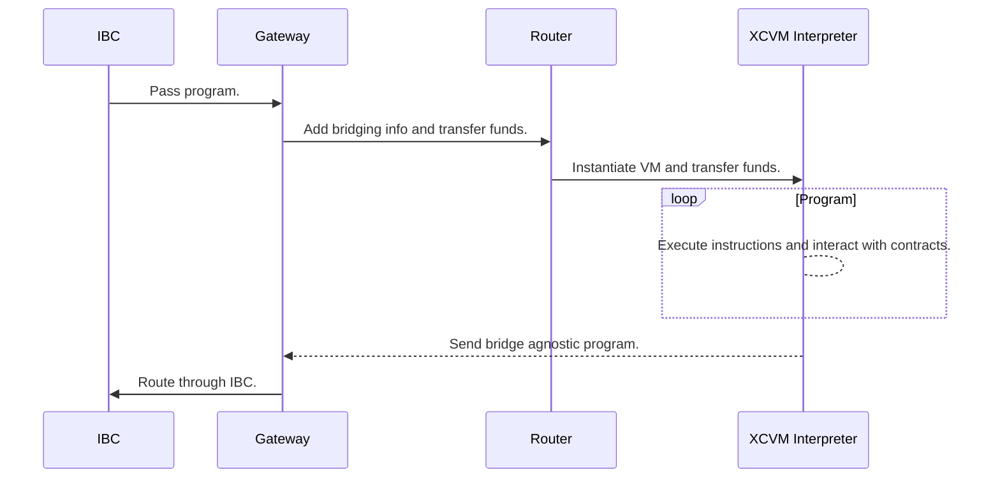
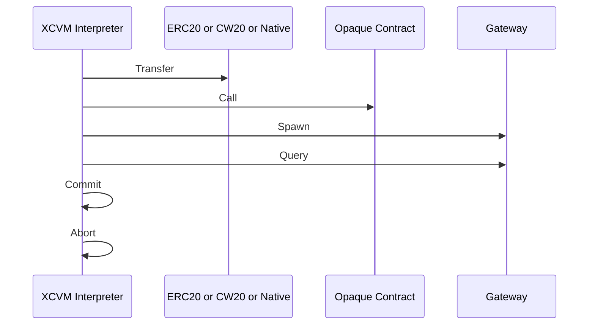
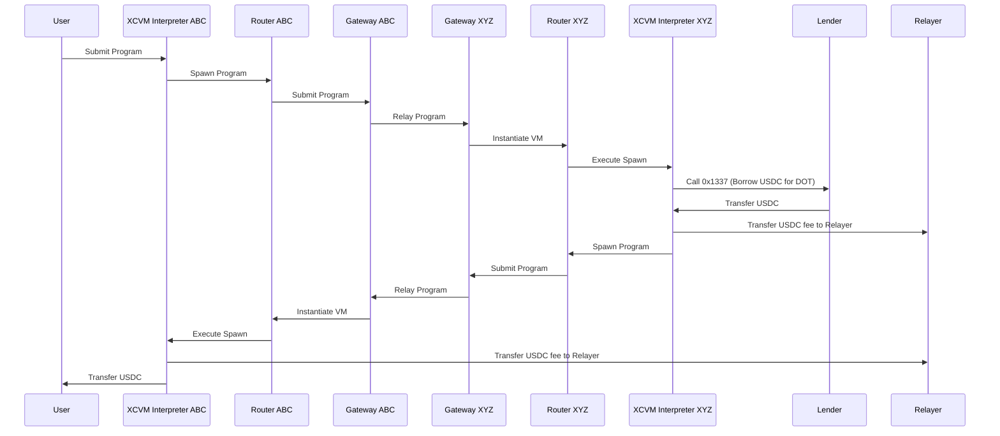

# Summary

`XCVM` is a specification outlining an application-level messaging protocol for smart contracts (and other execution environments). It allows for a more sophisticated mechanism for cross-chain communication compared to message passing, by defining an interpreter-based communication interface between chains.

The combined set of contracts and bridges across chains achieve the following properties:

- Turing-Complete Interactions: Complicated business logic can be dynamically dispatched to other chains, without the need for developers to deploy contracts on the destination chain.
- Configurable Security Levels: Developers can opt-in to use less secure transports, with the advantage of cheaper and faster execution.
- Coincidence of Wants: Developers can opt-in to having their cross-chain operations canceled if an off-chain actor can fulfill the end state directly.

Most of all, `XCVM` has been designed in a very extensible way, building up small functionalities and by combining them, allows for immense complexity.

> **Note**
> This document is still subject to change.

## Terminology

- Origin: the contract or user creating the `XCVM` program from the `source` chain.
- Relayer: initiator of the destination side transaction, paying for the execution fees.
- Opaque Contract: any smart contract.
- Chain: a blockchain with its own consensus and execution environment, but may also refer to rollups.

## Development Phases

The roadmap for `XCVM` looks approximately like so:

- [X] Basic instructions (Transfer, Spawn, Call).
- [X] Registers
- [ ] Extended instructions (Swap, LP, Jump, If)
- [ ] IBC based transports.
- [ ] Optimistic transports.
- [ ] XCM based transports.
- [ ] CoWs

> **Note**
The priority of features may change. Items are additive in functionality and will not break semantic version guarantees.

## Overview

The `XCVM` refers to both a set of on-chain contracts, orchestrating the bridging operations, ownership, and execution, as well as the interchain system of bridges and relayers. This document mainly specifies the logic within a single chain.

Although execution environments change depending on the chain, the `XCVM` protocol is generic over the differences and provides an abstract target for smart contracts to interact with. We describe components as separate contracts, but depending on the environment, they might be a pallet, Cosmos SDK module, or a single contract as opposed to many. Here the choice is based made on gas optimizations, engineering standards, and security practices.



The `XCVM` is bridge agnostic, as long as the underlying bridging protocol is capable of transmitting bytes across chains. Developers can opt-in to their usages for each interpreter instance. We highly recommend `IBC` if available, and by default only allow communication across trustless bridges.

## Specification

In this document, we specify the `XCVM` format, router, interpreter, and state. Transport requirements may be briefly touched upon, but are not the main focus.

Each chain within the `XCVM` ecosystem has a set of contracts to enable the execution of `XCVM` instructions. Depending on the chain and ecosystem, these may be very differently implemented to account for different contract models.

### Encoding

Different chains may choose to accept different encoding as the main entry point for contract calls. Such encodings can include but are not limited to `scale`, `ethabi`, or `bors`. Chain-to-chain calls are always in a single encoding: `protobuf`, which is used within the transport.

`protobuf` is generally not deterministic. XCVM restricts encoders and decoders to a deterministic subset of protobuf.

### Gateway

Each chain contains a bridge aggregator contract (`Gateway`), which connects incoming and outgoing channels over different transports.

The `Gateway` is configured to label bridges with different security levels, using oracle-based, disputable governance. We define three security levels as of now:

```
BridgeSecurity ::= 
    Deterministic 
    | Probabilistic 
    | Optimistic 
```

- `Deterministic` bridges are light client based using a consensus protocol that has deterministic finality. (IBC with tendermint)
- `Probabilistic` bridges are still light client-based, but use a consensus protocol that at most has probabilistic finality. (IBC with a PoW chain)
- `Optimistic` bridges do not use proofs, but instead, have disputing mechanisms associated. (Nomad, Mosaic)

Outgoing messages are routed based on bridge security, or by specifying the bridge contract directly.

Each XCVM execution has access to its message `MessageOrigin` and can be configured to deny execution depending on the address or security level:

```
MessageOrigin ::=
    IBC
    | XCM
    | (OTP bytes BridgeSecurity)
```

The `Gateway` allows for third parties to add their bridges as well, using our open transport protocol (`OTP`), although this is a feature that we will only later make public. `OTP` provides the following functionality

- Registration of bridges.
- Deregistration.
- Pausing.

`OTP` will later be extended to handle more granular black/whitelisting of beneficiaries, assets, and message filters.

### Router

Each program arriving through the `Gateway` is passed to the `Router`, which receives the provided `Assets` as well as instantiates an `Interpreter` instance. The router then transfers funds to the `Interpreter` instance.

Subsequent calls by the same `Origin` will not result in an instantiation, but instead in a re-use of the `Interpreter` instance. This allows foreign Origins to maintain state across different protocols, such as managing LP positions.

If no interpreter instance has been created for a given caller, the call to the router must either come from the `IBC`, `XCM`, `OTP` with `Deterministic` security, or a local origin. After the instance has been created, it can be configured to accept other origins by the caller.

### Interpreter

The `XCVM` interpreter is a bytecode interpreter, very similar to the `XCM` interpreter used in `Polkadot` based chains, but tailored to handle application logic.

#### Interface

The `XCVM` is callable by the router and owners.

Depending on the implementation, the XCVM may accept a typed `Program`, or a `protobuf` encoded program. The typed interface is the most performant for most ecosystems, although unavailable for EVM implementations for now.

#### State and Registers

Each instance of the `XCVM` keeps track of certain persistent states, such as the `MessageFilter`, which determines which `MessageOrigins` are accepted. Note that `IBC` and `XCM` are accepted by default.

Each `Interpreter` instance keeps track of a set of owners, which may configure and operate on behalf of the instance.
`Router` is in set of owners of `Interpreter` instance.

##### Registers

Each interpreter keeps track of persistent states during and across executions, which are stored in different registers.

- `Result Register`: Contains the result of the last executed instruction.

```
Result ::= 
    Error 
    | Value

Error ::= 
    CallError 
    | TransferError
    | SpawnError
    | BridgeError
    | QueryError
    | CommitError

CallError ::= bytes
```

- `IP Register`: Contains the instruction pointer. Querying for the `IP` and `Result` can be used to compute the state of the interpreter on another chain.
- `Relayer Register`: Contains the `Account` of the account triggering the initial execution.
- `Self Register`: Contains the `Account` of the interpreter

As we add conditionals, such as the `If` instructions, the coercion of the `Result` registry will be defined. Note that the `Result` of the `Call` instruction can never be coerced into a `boolean`, and thus the execution of the following program is always undefined:

```
Call 0x1337
If 
    Transfer
Else
    Abort
```

However, it will be possible to mutate the value of the result registry by calling a contract on the executing chain to perform the coercion:

```
Call 0x1337 // Perform the actual call.
Call 0x9999 // A contract deployed locally, which will:
            // 1. Get the value in the `Result` register.
            // 2. Coerce the value into a `bool`.
            // 3. Return the value to be stored in the register.
If 
    Transfer
Else
    Abort b'abortion message'       
```

Specialized instructions, such as `Transfer`, `Swap`, etc will always be coercible.

#### Instruction Set

```
Program      ::= Tag [Instruction]

Instruction  ::= 
    Transfer
    | Call
    | Spawn
    | Query
   
Balance      ::= Ratio | Absolute | Unit
Absolute     ::= u128
Unit         ::= u128 Ratio
Ratio        ::= u128 u128
Account      ::= bytes
AssetAmount  ::= AssetId Ratio | Unit 
Asset        ::= AssetId Balance
Assets       ::= [ asset ]
Transfer     ::= Account Assets  |  Relayer Assets 
Call         ::= Payload Bindings
Payload      ::= bytes
Binding      ::= u16 BindingValue
Bindings     ::= [ Binding ]
BindingValue ::= Self | Relayer | Result | AssetAmount | AssetId
Spawn        ::= Network BridgeSecurity Salt Program Assets
Query        ::= Network Salt
Account      ::= bytes
Tag          ::= bytes
Salt         ::= bytes
```

- `Transfer`: Transfers funds within a chain between accounts.
- `Call`: Executes a payload within the execution context of the chain, such as an extrinsic or smart contract invocation.
- `Spawn`: Sends a `Program` to another chain to be executed asynchronously. The calling program is not informed of the execution state, but must `Query` explicitly.
- `Query`: Queries register values of an `XCVM` contract across chains. The provided `Salt` is used to look up the interpreter instance. It sets the current `Result Register` to `QueryResult`.

For each instruction, this diagram approximately displays what happens:



##### Call Instruction and Late Bindings

The call instruction supports bindings values on the executing side of the program by specifying the `Bindings`. This allows us to construct a program that uses data only available on the executing side. For example, the swap call of the following smart contract snippet expects a `to` address to receive the funds after a trade.


```rust
fn swap(amount: u256, pair: (u128, u128), to: AccountId) { ... } 
```

If we want to swap funds from the interpreter account and receive the funds into the interpreter account, we need to specify the BindingValue `Self`, using the index of the `to` field for the serialized data being passed to the smart contract. For the `Call` instruction of `swap(10, (1, 2), ${UNKNOWN})`, we then serialize it into the following struct:

```
Call {
    payload: encode(swap(10,(1,2))),
    bindings: [(13, BindingValue::Self)],
}
```

On the executing interpreter, `BindingValue::Self` will be interpolated at byte index 13  of the payload before being executed, the final payload then becomes `swap(10,(1,2), BindingValue::Self)`, where `BindingValue::Self` is the canonical address of the interpreter on the destination side.

Besides accessing the `Self` register, `BindingValue` allows for lazy lookups of AssetId conversions, by using `BindingValue::AssetId(GlobalId)`, or lazily converting amount value depending on the chain using the `AssetAmount` type.

Bindings do not support non byte aligned encodings. To correctly bind values in the execution layer, the binding values should be ordered by their position index(u16) respectively since to process them interpreters will iterate over the bindings in sequence, after each iteration, the original payload will be updated with the new binding value and the next binding value position will be shifted by the length of the binding value. 

#### Handling Balances

Amounts of assets can be specified using the `Balance` type. This allows foreign programs to specify sending a part of the total amount of funds using `Ratio`, or express the amounts in the canonical unit of the asset: `Unit`,  or if the caller is aware of the number of decimals of the assets on the destination side: `Absolute`.

#### Querying 

Registers are persisted after `Program` invocations and `Query`able from other chains. Querying does not alter the registry state, so multiple `Query` invocations will always return the same `IP` and `Result`.  

A query returns a `QueryResult`:

```
QueryResult ::= Header Data
Header ::= Hash Number
Data ::= 
    Assets
    | (Result IP)
    | bytes
```

To inspect a Query result from an XCVM program, use `Call` to a contract with the capabilities to handle it properly.

```
Query Ethereum 1                    // Pauses execution, which will be resumed once the 
                                    // result values have been loaded.
Call 0xmy_contract_on_this_chain    // my_contract_on_this_chain can inspect the Result Register of his
                                    // instance and do something with the actual result
```

### Fees

There are three different components to the fees charged for interacting with the `XCVM`:

1. Gas fees on the origin chain, are used to pay for local submission and partial execution.
2. Bridging fees (optional): Some bridges charge a dynamic fee based on the number of assets sent. If possible, fees are folded into 1., otherwise charged during transmission.
3. Execution fees (optional): A reward added by the instruction author to reward the relayer for paying for the execution on the destination chain.

#### Execution Fees

Gas and Bridging fees are handled during the invocation and at the `Router` level, however, Execution fees are opt-in and paid by the user by using the `Relayer` registry value. The following example program performs an operation, and rewards the relayer:

```
Call 0x13371337...
Transfer Relayer { USDC: 15000000000000 }
```

This model is very much like Bitcoin's UTXOs, where the difference between inputs and outputs defines the mining fee. Here we are more explicit with the actual fee, which allows for more fine-grained control. Together with branching (to be implemented later), this fee model can be used to incentivize the relayer to precompute the outcome, and only submit the program if it were to succeed.

### Identities and Ownership

Within the `XCVM`, we define an `Identity` as a global, unique identifier of an on-chain account.

```
Identity ::= Network Account
```

On initial instantiation of the `XCVM` interpreter, the calling `Identity` is the owner. This can be a local or foreign account, depending on the origin. The owning `Identity` has total control of the interpreter instance and the funds held and can make delegate calls from the instance's account.

Oftentimes, multiple `Identities` represent a single real-world entity, such as a cross-chain protocol or a user. To accommodate for shared/global ownership of resources, each interpreter keeps track of a set of `Identities`, which share ownership of the interpreter. Each owning `Identity` has full permissions on the interpreter instance.

Owners may be added by having the interpreter call the appropriate setters. We will consider adding specialized instructions later.

### Composable Name Service

The `CNS` provides an abstraction on top of the `Identity` system, allowing developers and users to use a single name across interpreter instances. Each `XCVM` chain contains a `CNS` registry, which maps `Identity` to `Name`. On bridge relays, the calling program can specify to use an associated `Name` instead of its `Identity`. The `XCVM` interpreter has to be configured to accept the `CNS` as an owner. 

```
Name ::= string 
```

We will later elaborate on using alternative name registries such as [`ENS`](https://ens.domains/).

### Asset Registries

Assets are identified using a global asset identifier.

```
AssetId ::= u128
```

Each chain contains a registry contract, which maps assets to their local representations, such as erc20 addresses. The `Transfer` instruction uses this registry to look up the correct identifiers. Interpreter instances can be reconfigured by the owner to use alternative registries.

Propagating updates across registries is handled by the `XCVM` too. We will go more in-depth on how we bootstrap this system in a later publication.

## NFTs

The design specification currently does not take NFTs into account. We have chosen to not (yet) specify NFTs as part of `Assets` due to the complexity of owning and value accruing NFTs. We do however intend to update the specification once the approach has been finalized.

## Examples

### Cross-chain borrowing

A concrete example of using the XCVM protocol is to transfer funds to a different chain, use them as collateral in a loan, transmit funds back to the source chain, and use them there. For this example, we'll omit querying for current account `health` and repayments.

Concretely, we want to execute the following operations:

- Transfer funds to chain XYZ.
- Call a smart contract to take out a loan.
- Reward the relayer, to incentivize execution.
- Send funds back.

Since we might not know the current interest rates, we'll use relative values for fund transfers, instead of absolute ones. 

For this example, we have the source initiator be a regular user, however, a smart contract is capable of executing the same operations.



Although these operations are quite complicated to code by hand, using the XCVM protocol, we can very succinctly express them:

```
Spawn XYZ BridgeSecurity::Deterministic 0 [
   Call 0x1337,                                 //chain-specific encoding to make a smart contract call.
   Transfer Relayer USDC Unit 50,               // 50 bucks for the fee. The relayer earns this if the inner spawn is dispatched.
   Spawn HOME BridgeSecurity::Deterministic 0 [
       Transfer Relayer USDC Unit 50            // Another 50 bucks fee for the operation, but now reverse direction.
       Transfer USER { USDC: Ratio::ALL }       // On ABC, we transfer all USDC to the user. 
       ] { USDC: ALL },                         // We send over all our USDC back to ABC.
   ] { DOT: UNIT 100 },                         // We send over 100 DOT from ABC to XYZ.
```
