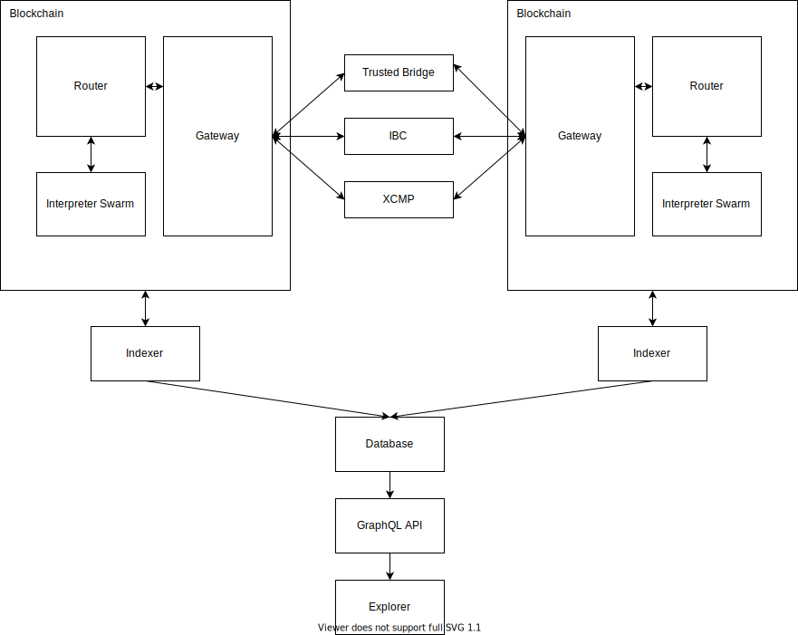
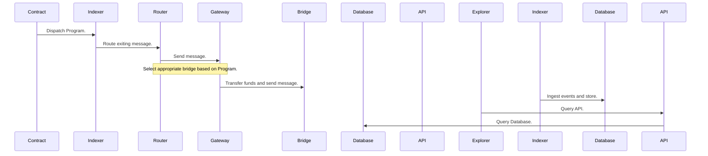

# Overview

## Components

On each blockchain, we deploy 3 components, which can be modular smart contracts, pallets, or SDK modules:

- [Gateway](./gateway.md): Entrypoint and exit for Programs. Also handles interactions with [OTP](transports/otp.md).
- [Router](./router.md): Main bookkeeper for per-chain state. Holds the address mappings for cross-chain accounts and instantiates new interpreters.
- [Interpreter](./interpreter.md): The XCVM interpreter swarm consists of many instances of the XCVM interpreter contract. On some chains, we can use probabilistically generated sub_accounts, but for most, we instantiate a contract instance.

Off-chain, we run services to provide insights and ease integration. Note that none of these services are crucial to the functioning of the system.

- [Indexer](): Indexes chains and uniformly transforms the data.
- [Database & GraphqlAPI](): Grants easily queryable access to this indexed data.
- [Explorer](): Our developer-geared explorer, providing full traces of cross-chain programs.

## Interactions

Program execution touches the following components in this approximate manner:

For brevity, the receiving side of the chain has been omitted, although that goes through similar steps, but for the on-chain components in reverse order.