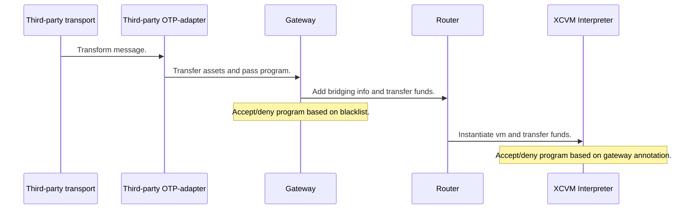
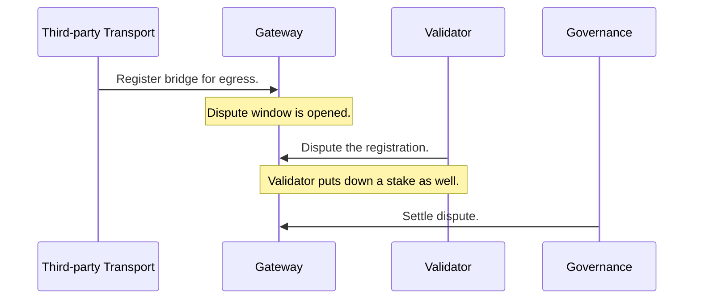
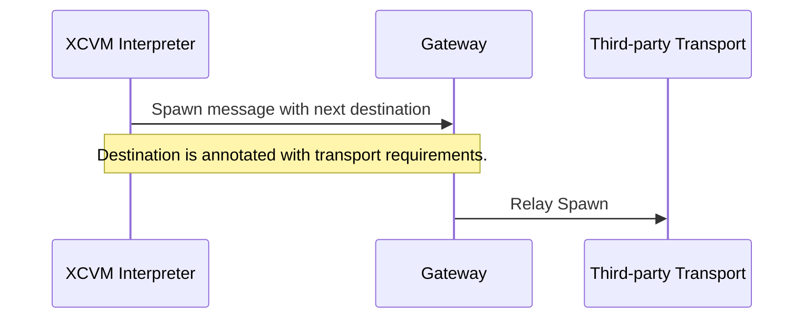
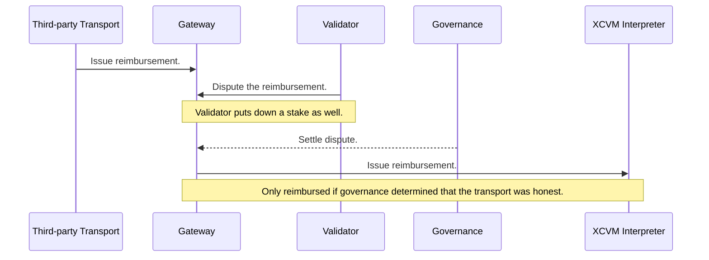
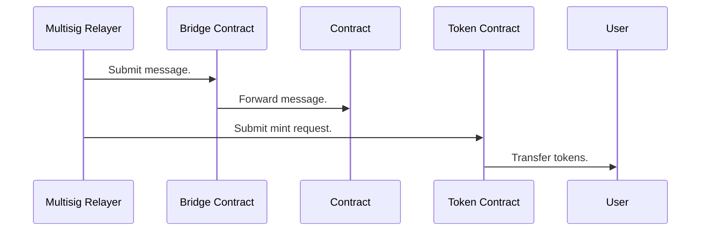
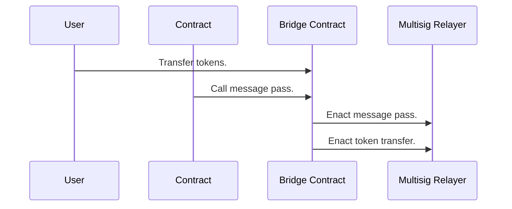
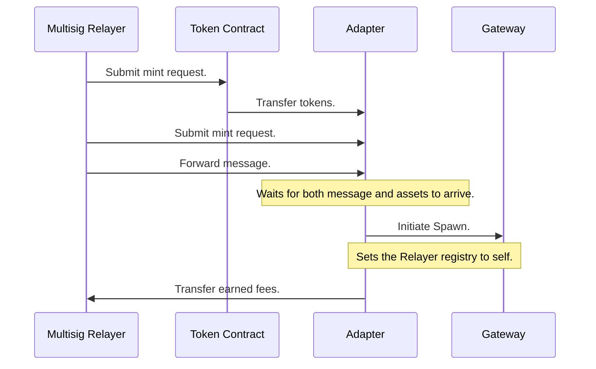
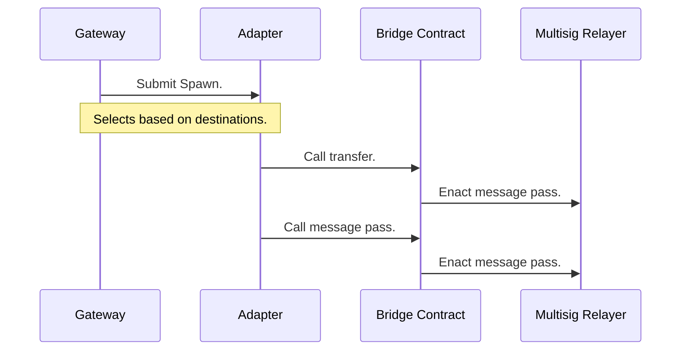
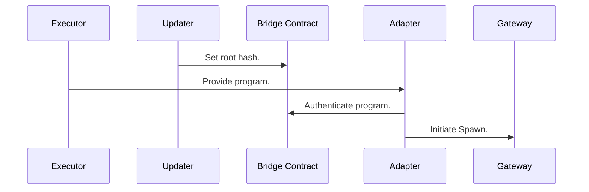
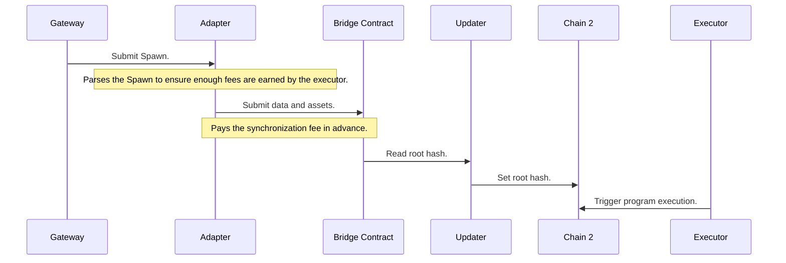

# Open Transport Protocol (OTP)

This document describes the on-chain components related to registration and dispatching XCVM programs over different transports. 

Although [IBC](./ibc.md) is the default and preferred transport method within the `XCVM`, we also support arbitrary third party protocols. The abstract interface for registration and participation in `XCVM` transactions is what we call `OTP`.

For a transport to be OTP compatible, it has to support the following operations:

1. Fungible token transfers.
2. Opaque data transfers.

Ideally, a protocol supports both in a single operation, although most bridges will need to be wrapped in an additional set of contracts to be fully compatible.

`OTP` handles the following operations:

1. Maintaining a blacklist of transports.
2. Ingress of messages on the chain.
3. Registration of routing.
4. Egress of messages on the chain. 

## Blacklist

The blacklist is used to enact emergency operations in case of bridge fraud, which can be caused by hacks, or bugs within the system. The blacklist globally disables bridges based on `LAYR` governance.

Note that the blacklist is not used to manage ecosystem specific risk, such as toxic assets. It only concerns itself with bridges where the message authenticity can no longer be guaranteed.

## XCVM Ingress

A transport does not need to register itself to pass messages into the `XCVM`, it can do so directly, assuming that the interpreter instance accepting the transport's messages has whitelisted this transport. 

The following diagram describes the flow of data (and funds) when OTP is used to for ingress of programs.



Although the diagram simplifies the work that the OTP-adapter might need to perform, it can be relatively complicated depending on how the transport operates. We go into more concrete implementations [later](#possible-implementations) in this document. 

## Registration of Routes

For a transport to be possible be selected by the Gateway to transfer messages to different chains, a more involved registration process is required. 

- A stake needs to be put down, which is used to reward disputers in case of bridge fraud.
- Metadata on the bridge must be provided, including 
    1. The `Account` of the administrator, used to deregister the bridge, and add routes.
    2. Destinations reachable through this bridge.

```
RegistrationInfo ::= Account [Destination]
Destination      ::= NetworkId [AssetId]
```

Immediately after registration, the bridge registration can be disputed for approximately 72 hours. The stake can be lost during this time, if governance determines that the registration is fraudulent. If a dispute is triggered, the registration can be delayed by up to 2 weeks.

#### Disputed Registration

The following diagram displays the sequence of a registration, including the dispute by a validator.



Validators can be any entity, including a user triggering the dispute through our UI, as well as nodes automatically tracking registrations. For bridging teams, it is especially important to dispute registrations of your bridge with an incorrect administrator account.

## Egress of messages

Once a transport has been successfully registered, it becomes accessible to the `Gateway`, which might route traffic based on transport requirements from the interpreter instance dispatching the program. By default, all OTP transports are considered `Trusted`, meaning that no traffic is routed through them unless specifically opted-in by the interpreter instance. 

Later we may add means to upgrade transports to the `Trustless` status using governance. This will accommodate transports such as `XCMP`.



### Fees

`XCVM` is not opinionated about handling fees, leaving that up to the users by adding an output to reward the relayer. Read more on how we defined fees [here](../../SPEC.md#fees). 

A note on this, fees are specified by the program, meaning that the bridge itself cannot charge a fee directly on the `Assets` being transferred. The third-party OTP-adapter will need to take this into account, by possibly using internal APIs of the bridging contract to ensure that no fees are charged based on the `Assets` transferred.

## Reimbursements

When a transports fails to transmit a message (such as an IBC timeout or network congestion) the `Third-party Transport` issues a reimbursement to the `Gateway` which then informs the interpreter instance of the failure.

For `OTP`-registered transports, the reimbursement itself can be disputed as well. After issuing the reimbursement to the Gateway, a short-lived dispute window (hours) allows validators to dispute the reimbursement. This avoids the attack vector where a bridge has identified a contract which will retry a cross-chain operation until success, and extract value from that by issuing malicious reimbursements (a cross-chain reentrancy attack).



## Example Implementations

Here we expand on two architectures, `multisig` and `updater` already in existence, and how to adapt them to become OTP compatible. Multisig or TSS-based bridges are custodial solutions, where multiple parties take custody of the funds and act on behalf of the user/contract. In `updater` based solutions, a message is stored inside a Merkle tree, and a single entity broadcasts this hash to other chains. Users/relayers are then required to submit the actual message to the other chain, plus a proof-of-inclusion for message authenticity.

### Multisignature (or TSS based) Bridge

The theoretical multisig based bridge already exposes the following protocol:

- It has a smart contract, which accepts a `NetworkId`, `Account`, `Assets` for token transfers, or instead of the assets, a `data` payload. (Ideally it would accept both, and some bridges do).
- It can call a contract with a `data` payload. The contract is expected to verify that the `caller` is the multisig bridge contract for message authenticity.

#### Sequence diagram of incoming assets and data




#### Sequence diagram of outgoing assets and data



A new contract needs to be introduced to handle the requirement to compound the asset and data transfer, as well as reimbursements. We'll also make sure to have our adapter's contract address in the `Relayer` registry so that the fees can be fairly distributed to the multisig validators. 

#### Sequence diagram of incoming Spawn.



For outgoing messages, the pattern is very similar:



Reimbursements can be constructed similarly to an incoming spawn.

### Updater Architecture using Merkle Roots

Updater style bridges do not actually pay for XCVM execution on the destination chain, but instead synchronize a proof across chains, this decouples synchronization and execution, but means that we will need to add payment for synchronization as part of the adapter, as the Relayer receives payment after synchronization and execution has taken place. Luckily `updater` based protocols are quite cheap.

#### Sequence diagram of incoming Spawn.



For outgoing messages, our adapter will need to take into account the synchronization fee charged by the updater: 



In the example of the updater-based protocol, we are assuming that the `Adapter` does not have any special privileges. The fee handling could be immensely simplified if the `Bridge Contract` would allow fees to be charged on the destination side, as that would remove the need for the `Adapter` to parse the `Spawn`. An added benefit is that the executor can be any party, not just the one controlling the Adapter contract.

> **Note**
> Fees should always be paid on the destination side. This avoids opening a Pandora's box of headaches related to reimbursements and gas price fluctuations.