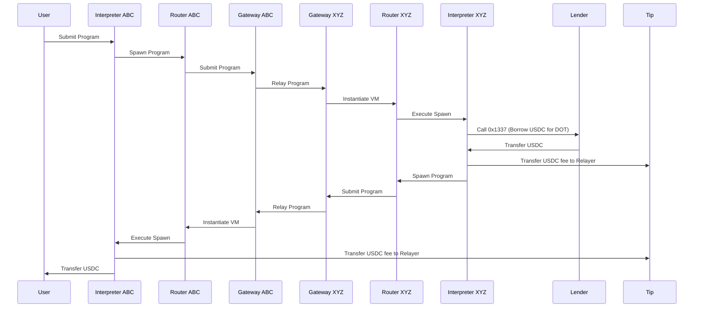

# Overview 

This documents shows some usage example of CVM


# Unwrap token

Shorten path of wrapped token. 

Just spawn on unwrapping chain and spawn to target chain for execution.

# Bond (lock)

Call Bond instruction or do raw Call.

## Stake on Stride

Program to `Stake` on Stride and transfer staked token to Osmosis
is detected as pattern expressed in CVM.

That part of program is translated to IBC calls to Stride without contracts deployed.

So this program is possible
```
Osmosis ATOM -> 
Spawn(Stride, ATOM) -> Stake(ATOM) + Spawn(Osmosis, stATOM) 
-> Spawn(Centauri, stATOM)  
```

#### Borrow

A concrete example of using the CVM protocol is to transfer funds to a different chain, use them as collateral in a loan, transmit funds back to the source chain, and use them there. For this example, we'll omit querying for current account `health` and repayments.

Concretely, we want to execute the following operations:

- Transfer funds to chain XYZ.
- Call a smart contract to take out a loan.
- Reward the relayer, to incentivize execution.
- Send funds back.

Since we might not know the current interest rates, we'll use relative values for fund transfers, instead of absolute ones.

For this example, we have the source initiator be a regular user, however, a smart contract is capable of executing the same operations.



Although these operations are quite complicated to code by hand, using the CVM protocol, we can very succinctly express them:

```json
Spawn XYZ 0 [
    Call 0x1337,                                 // chain-specific encoding to make a smart contract call.
    Transfer Tip USDC Unit 50,               // 50 bucks for the fee. The relayer earns this if the inner spawn is dispatched.
    Spawn HOME 0 [
        Transfer Tip USDC Unit 50            // Another 50 bucks fee for the operation, but now reverse direction.
        Transfer USER { USDC: Ratio::ALL }       // On ABC, we transfer all USDC to the user.
    ] { USDC: ALL },                             // We send over all our USDC back to ABC.
] { DOT: UNIT 100 },                             // We send over 100 DOT from ABC to XYZ.
```