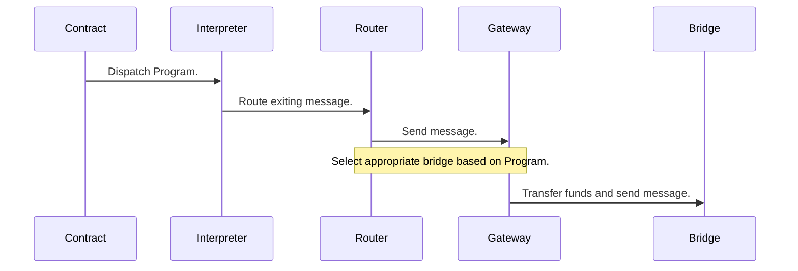

# Overview

## Components

On each blockchain, we deploy 3 components, which can be modular smart contracts, pallets, or SDK modules:

- Gateway is Entrypoint and exit for Programs. Also handles interactions with [OTP](otp.md).
- Router is Main bookkeeper for per-chain state. Holds the address mappings for cross-chain accounts and instantiates new interpreters.
- Interpreter is The XCVM interpreter swarm consists of many instances of the XCVM interpreter contract. On some chains, we can use probabilistically generated sub_accounts, but for most, we instantiate a contract instance.

## Interactions

Program execution touches the following components in this approximate manner:

For brevity, the receiving side of the chain has been omitted, although that goes through similar steps, but for the on-chain components in reverse order.