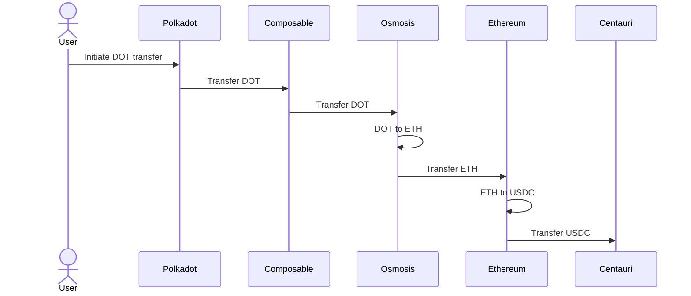
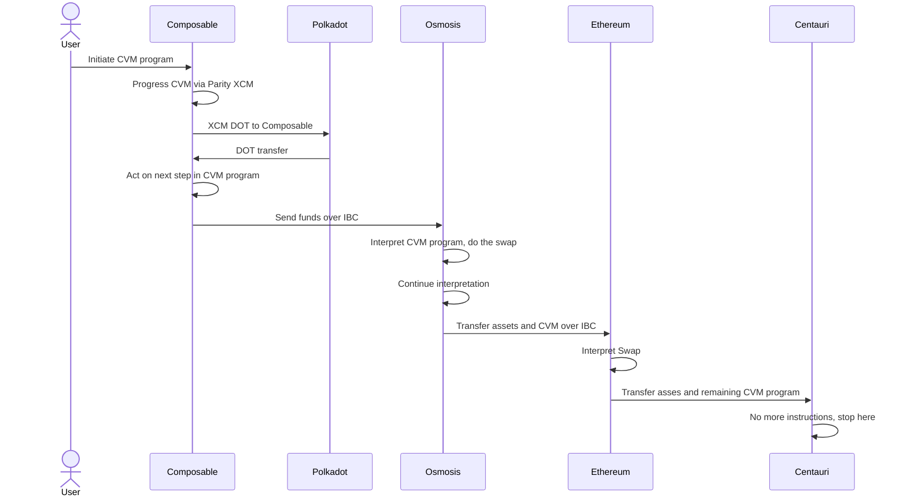
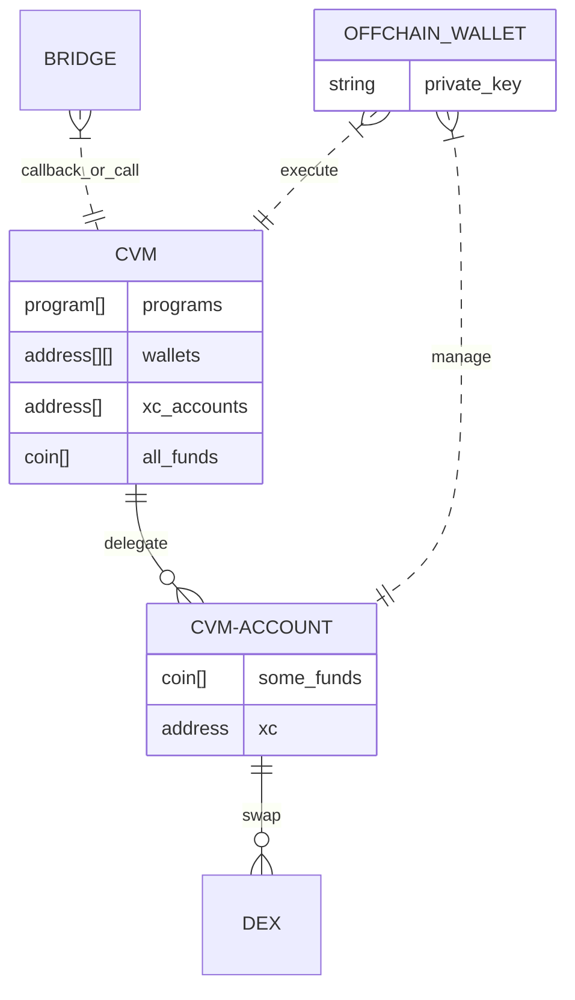
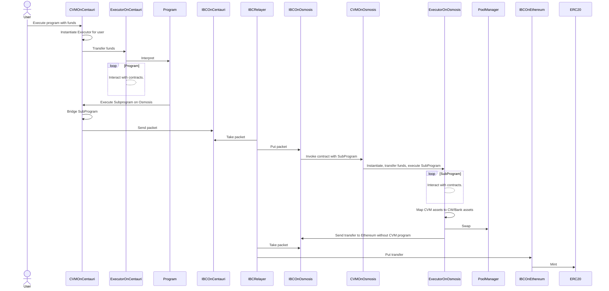

# Overview

CVM are opaque contracts for execution of non atomic, asynchronous, trust minimized, non custodial, bridge agnostic and  non turing complete cross chain programs with code propagated along with data, accessing de facto native liquidity markets on each chain and abstracting away several underlying transports,encodings, assets systems and messaging protocols.

Lest try to define what above means.

## Why?

Enable ability to `move Polkadot DOT to Osmosis, swap to DOT to ETH, move ETH to Ethereum, swap to ETH to USDC, and move funds to Centauri in one user signed transaction` should be express as simple as english phrase you read.

Here is what should happen semantically:



Sounds simple, but you need to know several encodings, transports protocols and SDKs to do that. 
Also one may not easy start on Polkadot and proceed to the end using single transaction.

CVM solves it this way (still simplified):


Later will show more deep diagrams on how it is implemented.

Exchange is one of many operations possible.

## Some definitions

First, assets, tokens, coins, funds, amounts - used semirandomly for same thing.

Second,  chain, blockchain, consensus, domain - are same. I feel that best definition for that are `execution systems using different instances of proofs systems`.

Third, address, account, wallet. Each of this can do something on chain from own identity and hold some funds. I use these interchanged.

Last, bridge, relayer. Something which can act on one chain on behalf of other, for example mint tokens (transfer).  

For anything else looks into Blockchain academies.

## Prerequisites

Assuming you know most common blockchain nomenclature and definitions. I stick to that as possible. 

Would be helpfull if you are aware of anything cross chain.
I touching application side of messaging protocols, like Parity XCM or Cosmos IBC-ICS-20/27 or Axelar GMP useful. 
Also NEAR multi block execution very inspiring.

This text targets people who can read basic programming notations, but tries to text them around a lot, so hopefully non tech people get that. 

For layman description look at product and marketing materials, and presentations.

## What is CVM

Next 3 sections try to answer that question. 

Please pick up to start what is best for you, may be switch back and forth several times.

Text partially overlap.

### Building blocks

CVM is set of opaque contracts on chains.
`Opaque contract`  may be one contract on specific chain or several, or it can be module.
Just contract in all text after.
 
CVM `program`s is tree of instructions with attached assets.
Opaque contract has program as input.
Program format is executable language to describe what user wants to do cross chains.

Instructions in side programs are interpreted by `Executor`.
It owns all user funds and fully owned by she. 
Executor delegates bridges to manage funds operations cross chain.
`Executor` is user's cross chain account. 

Inductions are, but not limited to:
- Transfer, transfer funds from account to account on single chain
- Spawn, transfer leaf of tree (subprogram) to other chain with assets, for further execution
- Call, arbitrary ABI builder call per chain allowing invoke arbitrary opaque contracts
- Exchange, most used operation, allowing to give some tokens and get other tokens back

Detailed description of each instruction are described later, but most important aspects are described in this section.

Spawn uses path dependant reserve transfer escrow/mint protocol to move funds.

Call is way to represent native call in encoding executable on each chain, and yet able to fill in(bind) some context details like amount of assets and some addresses in cross chain(CVM) way.

Exchange requires configuration of pool in CVM contract storage. 
So do mapping of native assets and chains routing capabilities available for CVM programs. 
Routing information describes what type of bridge with what capabilities and limitations connecting chains.
There is no requirement for CVM contracts to be deployed on chains as long as chains reachable by some form of execution.

Exchange/Transfer/Spawn are just shortcuts for specific Calls.
From no will use Call to refer any on chain execution.

During program interpretation, current executing instruction, result of call execution and bridging state (internal of Spawn) are recorded in Executor state.
In case of CVM program error, funds are retained on sender or receiving Executor.
User can observe state of Executor and send program to handle current state.
For example move funds to other account or chain.   

### CVM definition deconstruction

`opaque contracts` - CVM may be module or contract, one or many on chain it executes

`non atomic` - it is not the case that whole program executed in single block, it is not all or nothing transaction

`asynchronous` - two Spawns in single program, but are sent to bridges at same time, execute concurrently on on several chains, other instruction are sequential

`trust minimized` - internally CVM uses most secured, trustless bridges, to execute CVM programs, CVM contracts are subject for cross chain governance

`non custodial` - each user owns all assets on each chain, he just delegates ability to move this funds cross chain from cross chain account (Executor).

`non turing complete` - means that there are no procedural loops or recursion, means CVM programs are predictable, determinist and will stop

`code propagated along with data` - you do not need to deploy programs, you just send program, as subprograms move from chain to chain, they move assets along.

`cross chain programs` - same program input works consistently on all supported chain, write once run anywhere

`accessing de facto native liquidity markets` - CVM uses native assets contracts contracts on each chain and each bridge it use, programs can defi existing liquidity on chains, as new bridges and chains added, CVM incorporates these without any modification from user

`abstracting away in several underlying transports, encodings, assets systems and messaging protocols` - you do not need to know assets systems, way to talk to bridges, encode common operation on each chain you want to act on, you learn CVM, and it helps you to handle details

### More formally


This is simplified model of CVM design:


```typescript
/// CVM may be physically implemented differently on different chains
type OpaqueContract = SmartContract | Module 
type OpaqueUser = OpaqueContract | Wallet


type Network = number

interface Program {
    instructions: Instruction[]
}

/// random number to easy invocation tracing
type Tag = Uint8Array


/// allows one user to have several Executors to isolate funds and allowances
type Salt = Uint8Array

type Instruction = Transfer | Call | Spawn | Query | Exchange | Bond | Order 

/// Exchange - can be deposit into pool for LP token, Stake to get liquid stake token, borrow or lend.
/// Set `ExchangeError` to result register in case of fail.
interface Exchange {
    in: AssetAmount[]
    min_out: AssetAmount[]
}

// time locks tokens, potentially getting some tokens out
interface Bond {
    exchange : Exchange 
    /// maximum time for bonding, so as close as possible to it 
    time: Duration
}

/// exchange which may happen in future
/// puts into ResultRegister either cross chain error error or OrderPositionId
interface Order {
    exchange : Exchange
    timeout : Duration
    partial: Ratio[]
}

type OrderPositionId = Uint128 

/// cross chain transaction/tracing identifier
interface ProgramInvocation {
    /// for tracing
    tag : Tag
    /// network on which to execute program
    network : Network
}
    
interface Spawn {
    invocation: ProgramInvocation
    program : Program
    salt : Salt
    assets : Assets
}

/// is target chain dependant
type Payload = Uint8Array

/// copies RegisterValue into program stack which drained into first Spawn 
type Query = RegisterValue | Id

type RegisterValue = RegisterValue[]

type RegisterValue = ResultRegister | IPRegister | TipRegister | SelfRegister | VersionRegister

type IPRegister = Uint8

type TipRegister = Account

interface Call {
    payload : Payload
    bindings : Bindings
}

interface Binding {    
    index : Uint8
    value : BindingValue
}

/// sorted keys by `index`
type Bindings = Binding[]

interface AssetAmount {
    asset_id: AssetId
    balance : Balance
} 

type Account = Uint8Array

/// Self is account of Executor
type Self = Account

/// Pop - pops value from program stack into binding placeholder
type BindingValue = Self | Tip | Result | AssetAmount | GlobalId | Pop

/// transfer from Executor account to
interface Transfer {
    assets : Assets,
    to: Tip | Account
} 

/// sorted with unique ids
type Assets = { AssetId,  Balance}[]
type AssetId = GlobalId | LocalId
type GlobalId = Uint128
type LocalId  = Uint8Array
type Balance   = Ratio | Absolute | Unit
/// Absolute amount
type Absolute = Uint128
type Unit     = Uint128 Ratio
/// parts of whole
type Ratio    = { numerator : Uint64, denominator: Uint64}

interface UserOrigin = {
    account : Account
    network: Network
}

type ExecutorOrigin = Account

/// data send to other chain
interface SpawnPackage = {
    Executor_origin : ExecutorOrigin
    user_origin: UserOrigin
    /// used by the while instantiating the Executor
    /// so user can have several Executors on same chain or reuse existing (same salt)
    salt: Salt
    program : Program
    assets: Assets
    stack: ResultRegister[]
}


type ResultRegister = Error | ExecutionResult

type Error = CallError | TransferError | SpawnError | QueryError | OrderError | BondError | ExchangeError

/// open set of well know exchange errors
type ExchangeError = Uint8

type ExecutionResult = Ok | bytes
type Ok = '0'


type Owners = Identity[]
type Identity = [Network, Account]

/// this happens in Executor
function execute_program(caller: Account, program: Program) {
    ensureOneOf(caller, this.owners, this.gateway)
    
    // reset from the last execution
    this.InstructionPointer = 0;
    this.TIP = tip;


    for (var instruction in program.instructions) {
        this.InstructionPointer += 1;
        this.result = this.execute_instruction(instruction);
        if (is_error(this.result)) {
            break;
        }
    }
}
```

## Detailed

Here are more details for each instructions, roles and security model of things above.

### Architecture and flows

Here is logical state of CVM:



So user(wallet) has Executor(CVM account) on each chain (instantiated on demand).

CVM account delegates CVM contract to bridge assets and execution on behalf of user across chains.

CVM is bridge agnostic, it has full capabilities when target chain allows permissionless contracts an general message passing, 
and limited `shortcut`s when no custom code allowed and only subset of target cross chain operations possible.


Let look into one hop from one chain to other chain in detail (three hops will just repeat part of picture):



Above diagram starts with fully CVM enabled flow. 

In the end it short cuts VM execution to standard protocol without doing SubProgram execution.
This happens if there is incentive to do shortcut (for example, gas costs or limited CVM support on target) 
and subprogram is simple like transfer (or other build in cross chain protocol).
 
All CVM receives CVM programs, uses routing configuration (of assets and bridges, and their features)
to dispatch programs over underlying protocols.

### Instructions

Spawn instructions executed concurrently.

All other instruction executed sequentially in subprogram. 

### Call

Executes a payload which is ABI call to opaque contract within the execution context of the chain. 

The call instruction supports bindings values on the executing side of the program by specifying the `Bindings`.
This allows us to construct a program that uses data only available on the executing side.
Binding values are lazy filled in on target chain.

Binding value `Self` injects account in Executor into call.

Besides accessing the `Self` register, `BindingValue` allows for lazy lookups of `AssetId` conversions, by using `BindingValue::AssetId(GlobalId)`, or lazily converting `Ratio` to absolute `Balance` type.

Bindings support byte aligned encodings (all prominent in crypto).


**Example**

For example, the swap call of the following contract snippet expects a `to` address to receive the funds after a trade.

```typescript
function swap(in_amount: number, in_asset: String, min_out: number, out_asset: String, to: AccountId) { 
  // ...
}
```

If the caller wants to swap funds from the Executor account and receive the funds into the Executor account, we need to specify the BindingValue `Self`, using the index of the `to` field for the payload being passed to the contract.

Sender chain spawns with  `swap(100, "dot", "eth", 1, BindingValue::Self)` call, and on target chain Self replaced with address on execution Executor.  


### Spawn

Sends a `Program` to another chain to be executed asynchronously. It is only guaranteed to execute on the specified `Network` if its `Program` contains an instruction that to execute on the `Network` of the `Spawn` context.

If Spawn fails it may fail on sender chain or on receiver chain, but not both. 

Funds are retained in Executor. 

`ResultRegister` is written.


`AssetId` in `Assets` are converted from sender to receiver identifiers by Executor. 


#### How Spawn fails

Failure on sender chain is asynchronously too.

There 2 types of failures.

First when `SpawnPackage` failed fully without event calling `Inteprter`, in this case all funds are rollback to sending interpret.
Target chain will not have on chain trace of execution.

Second when `SpawnPackage` reach target chain, started execution in Executor and failed. In this case `ResultRegister` is filled on target chain and funds stay here.
Sender chain considers Spawn to be success.

There no in between scenario when fail spread onto to chains.

### Query

Queries register values of an `CVM` instance across chains. It sets the current `Result Register` to `QueryResult`. on the semantics of registers and `RegisterValues`.


###  Balances

Amounts of assets can be specified using the `Balance` type. This allows foreign programs to specify sending a part of the total amount of funds using `Ratio`.  or if the caller knows amount of the assets on the destination side: `Absolute`.

### Registers

Each Executor keeps track of persistent states during and across executions, which are stored in different registers. Register values are always updated during execution and can be observed by other contracts.

#### Result Register

The result register contains the result of the last executed instruction.


If `ResultRegister` was set to `Error` and there is `Restoration` register contains CVM program it will be executed.

#### IP Register

The instruction pointer register contains the instruction pointer of the last executed program and is updated during program execution. Querying for the `IP` and `Result` can be used to compute the state of the Executor on another chain.


#### Tip Register

The Tip register contains the `Account` of the account triggering the initial execution. This can be the IBC relayer or any other entity. By definition, the tip is the account paying the fees for Executor execution.

#### Self Register

The self register contains the `Account` of the Executor. Most implementations will not need to use storage but have access to special keywords, such as `this` in Solidity.

####  Version Register

The version register contains the semantic version of the contract code, which can be used to verify the subset of CVM functionality supported by the contract. Implementations that support upgradable contracts MUST update the version register. Functionality advertised through the version register MUST be supported by the contract.

### Program Execution Semantics

Execution of a program is a two-stage process. First, the virtual machine MUST verify that the caller is allowed to execute programs for that specific instance, by verifying that the caller is one of the owners. Third, the instructions are iterated over and executed. Implementors MUST execute each instruction in the provided order and MUST update the IP register after each instruction is executed. After each instruction is executed, the result register MUST be set to the return value of the instruction. The Executor SHOULD NOT mangle the return values but store them as returned. Because the return values are chain specific, the actual structure is left *undefined*.

If an error is encountered by executing an instruction, the defined transactional behavior for that instruction should be abided by. All instructions defined in this document require the transaction to be aborted on failure, however, subsequent addendums may define new instructions with different behavior.

After the final instruction has been executed and registers are set, the execution stops and the transaction ends.

See Appendix A for the algorithm.

## CVM Execution Semantics

Each chain within the `CVM` contains a singleton entity consisting of the Router, and the Gateway. Implementors MAY choose to create a monolithic smart contract or a set of modular contracts.

### Gateway

Each chain contains a singleton bridge aggregator, the `Gateway`, which abstracts over transports.

### Router

Each program arriving through the `Gateway` is passed to the `Router`, which becomes the initial beneficiary of the provided `Assets` before finding or instantiating an `Executor` instance. The router then transfers funds to the `Executor` instance.

Subsequent calls by the same `Origin` will not result in an instantiation, but instead in re-use of the `Executor` instance. This allows foreign `Origins` to maintain state across different protocols, such as managing LP positions.

If no Executor instance has been created for a given caller, the call to the `Router` must either come from the `IBC`, `XCM`, `OTP`, or a local origin. After the instance has been created, it can be configured to accept other origins by the caller.

**Example**

For a given CVM program, its Executor instance is derived from `Network Account Salt`. This allows users to create different Executor instances to execute programs against. Note that the `Salt` is not additive and only the composite `Network Account` is forwarded to remote chains as the user origin:
```kdl
spawn network=A salt=0x01 { // the origin for the instructions is (A, AccountOnA, 0x1)
    call 0x1337 // Call instruction executed on A
    spawn network="B" salt=0x02 {} // Sub-program spawned on B, with 0x02 as salt, the origin for the instructions is (A, AccountOnA, 0x2) 
}
```
Possible usage is to allow one program execution to act on state of other program execution to restore funds. 


In the above CVM program, the parent program salt `0x01` is not a prefix of the sub-program salt `0x02`. The user is able to make it's Executor origin using a fine grained mode. The following program is an example on how we can spread a salt:
```kdl
Spawn A 0x01 [             // Parent program spawned on A, with 0x01 as salt, the origin for the instructions is (A, AccountOnA, 0x01)
    Call 0x1337,                                        // Call instruction executed on A
    Spawn B 0x0102 [] {}, // Sub-program spawned on B, with 0x0102 as salt, the origin for the instructions is (A, AccountOnA, 0x0102)
] {}
```

In next program, all spawned instances on all chains share state (including assets):
```kdl
Spawn A 0x01 [
    Call 0x1337,
    Spawn B 0x01 [] {}, // Sub-program spawned on B, with 0x01 as salt, the origin for the instructions is (A, AccountOnA, 0x01) allows to share 
] {}
```

### Ownership

Executor instances maintain a set of owners.

Programs are only executed by the Executor if the caller is in the set of owners.

On initial instantiation of the `CVM` Executor, the calling `Identity` is the owner. This can be a local or foreign account, depending on the origin. The owning `Identity` has total control of the Executor instance and the funds held and can make delegate calls from the instance's account.

Oftentimes, multiple `Identities` represent a single real-world entity, such as a cross-chain protocol or a user. To accommodate for shared/global ownership of resources, each Executor keeps track of a set of `Identities`, which share ownership of the Executor. Each owning `Identity` has full permissions on the Executor instance.

Owners may be added by having the Executor call the appropriate setters. We will consider adding specialized instructions later. Owners may be removed by other owners. An CVM instance MUST always have at least one owner.


# Fees

Execution fees are opt-in and paid by the user by using the `Tip` registry value. 

The following example program performs an operation, and rewards the tip address:

```json
{
    "call" : 
}
<Call> 0x13371337...
<Transfer> <Tip> { USDC: 15000000000000 }
```


# Asset Registries

Assets can be identified using a global asset identifier.

Each chain contains data which maps assets to their local representations, such as erc20 addresses. The `Transfer` instruction uses this registry to look up the correct identifiers. Executor instances can be reconfigured by the owner to use alternative registries.

Propagating updates across registries is handled by the `CVM` too. We will go more in-depth on how we bootstrap this system in a later specification.

## Security Considerations

Ensuring that the caller is an owner is an incredibly important check, as the owner can delegate calls through the Executor, directly owning all state, funds, and possible (financial) positions associated with the Executor account. Since each Executor has their own `Identity`, they might own other accounts as well. Thus the owners control more accounts than just the contract storing the owners.

The `Call` instruction has the same security risks as calling any arbitrary smart contract, such as setting unlimited allowances.

Adding an owner to the set of owners grants them the ability to evict other owners.

Failure to execute an instruction will lead to a transaction being reverted, however, the funds will still be in the Executor account's control. Ensure that changing ownership is always done atomically (add and remove in the same transaction) to ensure funds are not lost forever.

Using bridges is equivalent to adding them as owners on your Executor instance.

In general different security can be applied to different programs.

### Anonymous programs

These programs operating only on funds inside program and with limited set of instructions can be executed without sender authentication. 

Specific case is program consist of `Transfer`, `Spawn`, `Exchange` only on assets transferred.


### Cross protocol verification

**Example**

When program needs to transfer assets in IBC use ICS20 protocol.
In order to execute remote  transaction on behalf of account, it can use ICS27.
In both packets same program can be sent as part of batch and verified on other end to be exact same when assembled for execution.
For this if one protocol compromised we still validate via second one.


### Trusted topology

Program can be executed iff these where send only from some subset of of trusted channels.

### Cross chain multisignatures

In this case program can be executed if it was send by several chains.

### Signatures

For operations of high importance EDSCA signature of program can be propagated from sending chain and verified on target chain.  

## Limited instruction support and shortcuts

### No support for arbitrary contracts

Some chains do not support arbitrary contracts, but support limited subset of instructions. 
In this case only programs which use limited subset of instruction will be executed on target chain via virtual spawns.

**Example**

Cosmos Hub has complies with IBC ICS Atomic swap spec, but does not host contract runtime. 

In this case, programs trying to reach Cosmos Hub from other chains, will not spawn full programs on it.

But will send only swaps and handle invocation return on sender chain.  

### No support for contract postconditions

Some chains cannot abort transaction based on arbitrary check after ABI invocation. 
In this case for specific subset of instructions to specific whitelisted contracts list will be allowed.

**Example**

On Near cannot abort Swap transaction if amount less than expected limit.
In this case only trusted Swap contracts will be callable.

## Historical

Here is essentially history of CVM 

https://www.youtube.com/watch?v=L_DMHAoO6kg


