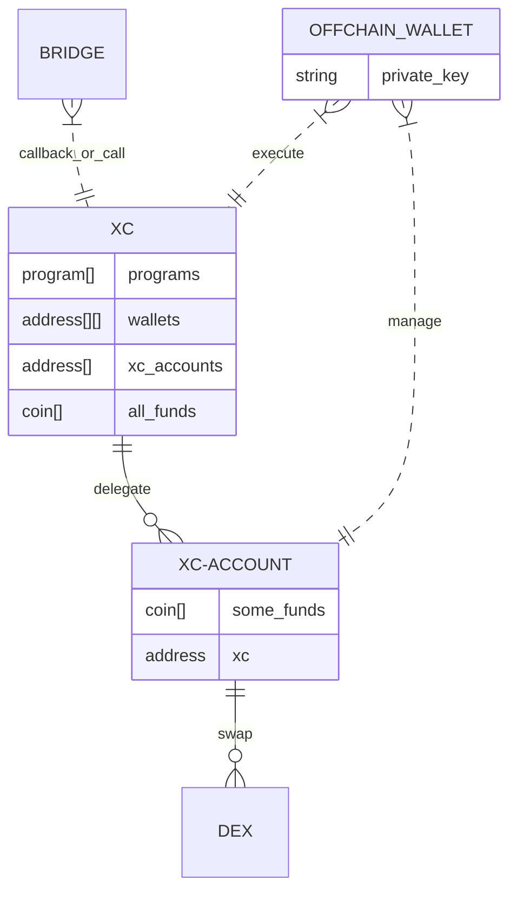
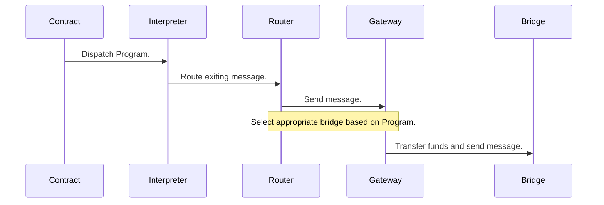

# Internals

This document documents internals of CVM on CW and EVM.

1. CVM on CW Cosmos to Cosmos uses ICS20 for value transfers. Each ICS20 channel must be upserted into CVM config.
2. CVM does not have any hardcoded requirement for bridge to be trustless or trustful. 
3. CVM uses ICS-20 assets transfers on Cosmos chains. On Polkadot and Ethereum it uses escrow/mint, path dependant semantics compatible with ICS-20.

### Asset id encoding

Each asset id is 128 bit number with 4 first bytes are network id, means that numbers never overlap.

So it will not be the case that on one chain 123213 means PEPA and on other chain 123213 means SHIB.

Prefix allows to find network to look at for asset info.

For security reasons when assets sent from chain to chain, asset id changes.

## Deployments

Can be considered as 3 layers,

1. Full deployment of contract with all capabilities. Can do anything.
2. Partial fulfillment of CVM spec using on chain features in case not deployment is possible (usually can multi hop transfer, swap). 
3. Edges which may start or terminate CVM programs, but do not execute anything except simple sings (like one hop final transfer) 

For each chain and protocol it makes pragmatics hacks to use existing liquidity and execution primitives.

## CVM Contracts state

### State

### Execution

Program execution touches the following components in this approximate manner:

For brevity, the receiving side of the chain has been omitted, although that goes through similar steps, but for the on-chain components in reverse order.