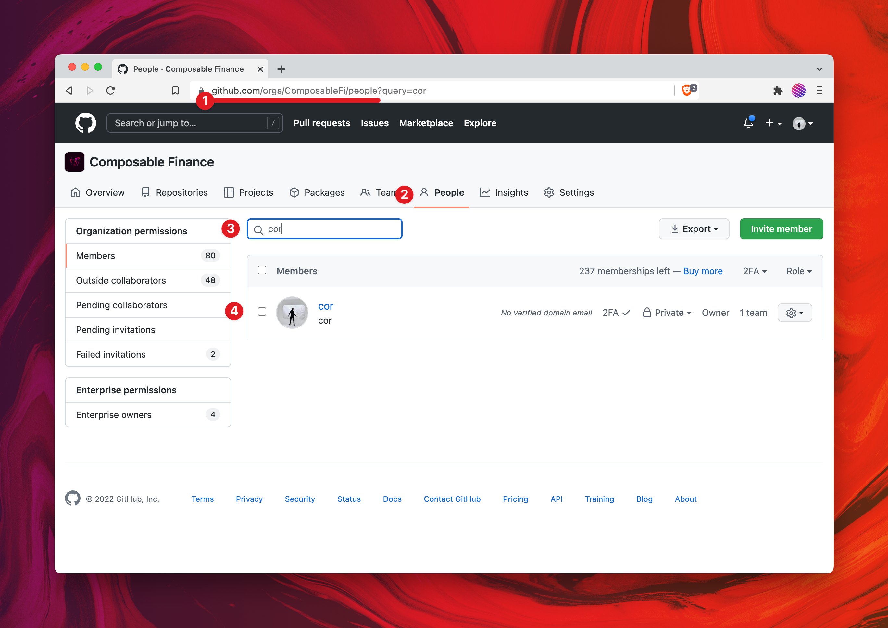
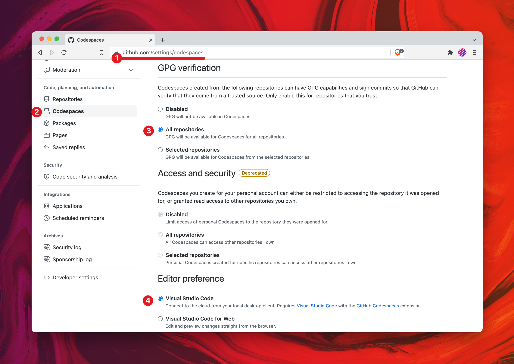
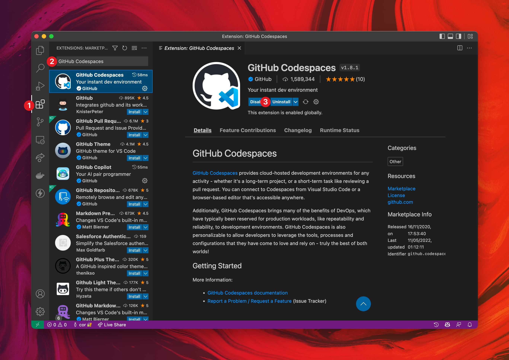

# Getting Started

*Quick and simple*

Getting started with Codespaces is super easy. 
We'll just have to configure your **GitHub account** and set up **Visual Studio Code**.

## Setting up your GitHub account

First, make an account on [GitHub](https://github.com) if you do not already have one. 
[Configure two-factor authentication](https://docs.github.com/en/authentication/securing-your-account-with-two-factor-authentication-2fa/configuring-two-factor-authentication), 
and make sure you use a strong password, *preferably by using [a password manager](https://1password.com/)*.

Then, make sure that you are part of the _Composable Finance Organization_. 
You check this by going to [github.com/orgs/ComposableFi/people](https://github.com/orgs/ComposableFi/people).

*Search for your own GitHub username*

**If you are not yet part of the ComposableFi GitHub organization, send a message to `@cor` in the composable Slack 
channel.**

When you are part of the ComposableFi organization, you need to configure GPG signing and your Code editor in GitHub 
settings. Go to [github.com/settings/codespaces](https://github.com/settings/codespaces). 
set **GPG verification to "All repositories"** and **Editor preference to "Visual Studio Code"**.

*Setting up GPG verification and Editor preference*

## Setting up Visual Studio Code

Simply install [Visual Studio Code](https://code.visualstudio.com/) on your computer, 
and add the [GitHub Codespaces plugin](https://marketplace.visualstudio.com/items?itemName=GitHub.codespaces).

*Installing the GitHub Codespaces plugin*

You are now ready to [start using Codespaces](./using-codespaces)!
