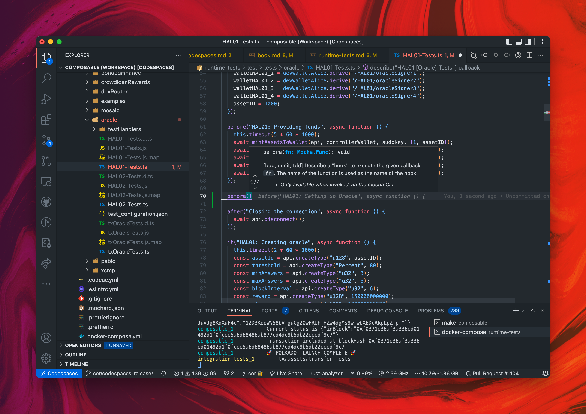

# Runtime Tests

## Editing and writing runtime tests

Editing and writing runtime tests is easy because it is already set up for you. 
Simply scroll down to `integration-tests/runtime-tests` in the sidebar, and start coding away!


*Editing runtime tests*

## Running runtime tests

In order to run runtime tests from the Codespace, simply run:

```bash
cd integration-tests/runtime-tests
docker-compose up
```

For more info, check the `README.md` in the integration-tests/runtime-tests directory.
