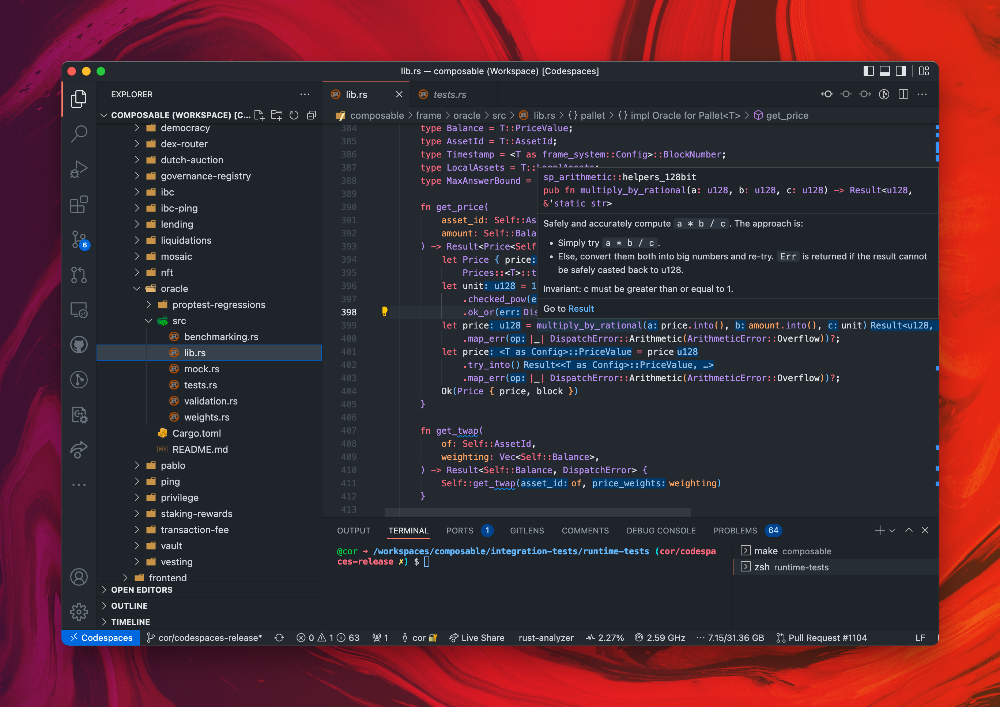

# Substrate

## Editing pallets

Simply scroll to the pallet you want to edit in the `frame/` directory, and start editing it. 
`rust-analyzer` may need a few minutes to index (progress can be seen in the bottom status bar), 
and then you should have nice code analysis.


*Substrate pallet development*

---

## Running tests

Open the integrated terminal, and run

```bash
cargo test --workspace
```

## Running the full parachain and relaychain

Codespaces come with a pre-built polkadot relaychain. You'll only have to build our own parachain, 
and then use `polkadot-launch` to run both the relaychain and the parachain.

### Building the parachain

```bash
cargo build --release
```

This will take about 17 minutes. Since it is using all of the available cores, your editor may slow down. 
If you want to continue working in the editor while you are doing a release build, 
you should reduce the amount of cores used for the build by running `cargo build --release -j 12` instead.


### Launching the parachain and relaychain with `polkadot-launch`

Once your release build is complete, you can run the full parachain and relay chain like this:

```bash
cd scripts/polkadot-launch
yarn
yarn composable
```
