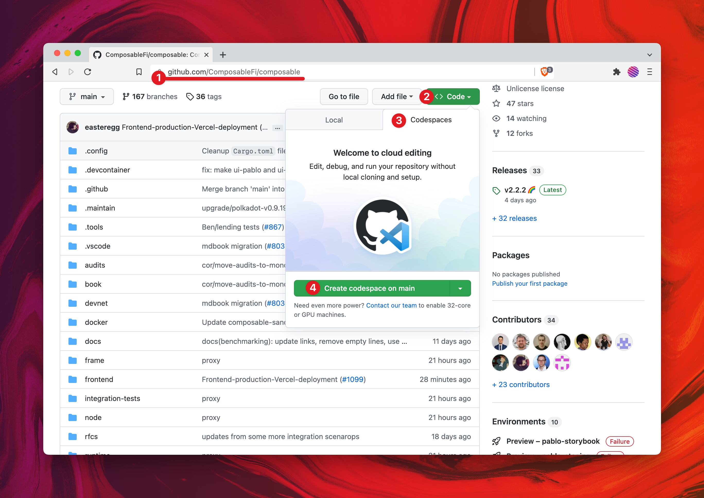
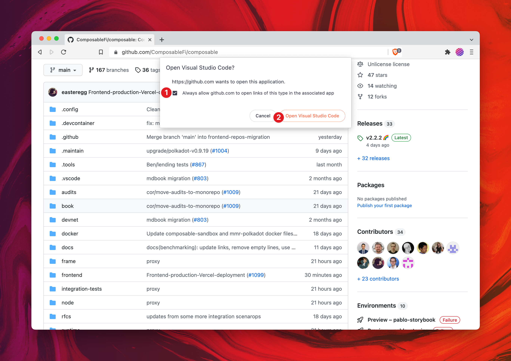
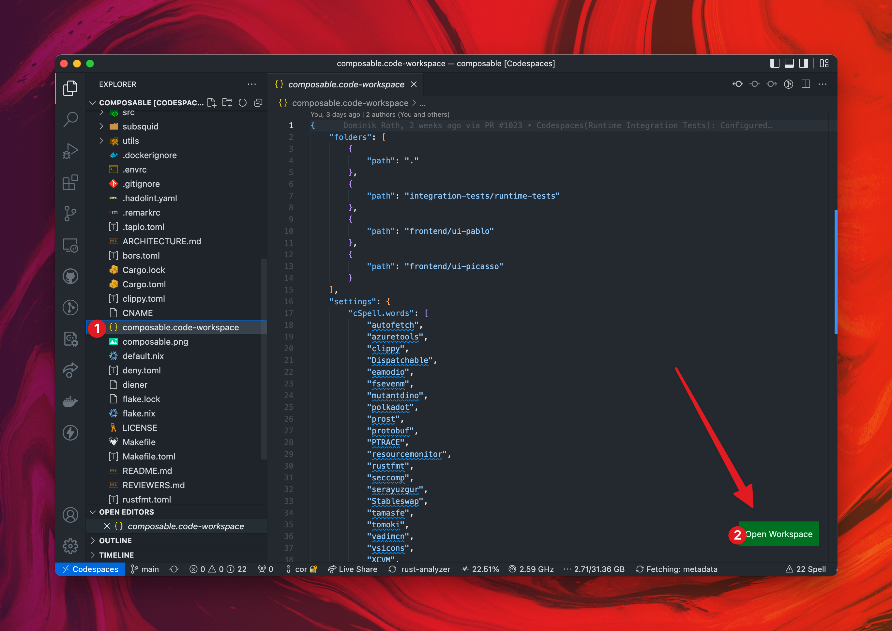
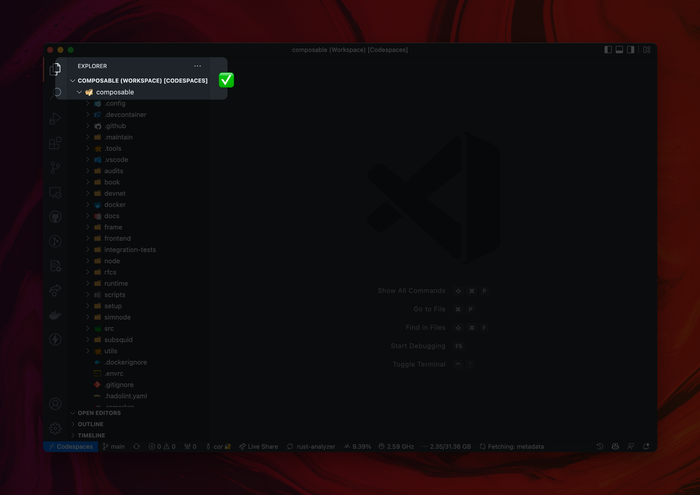
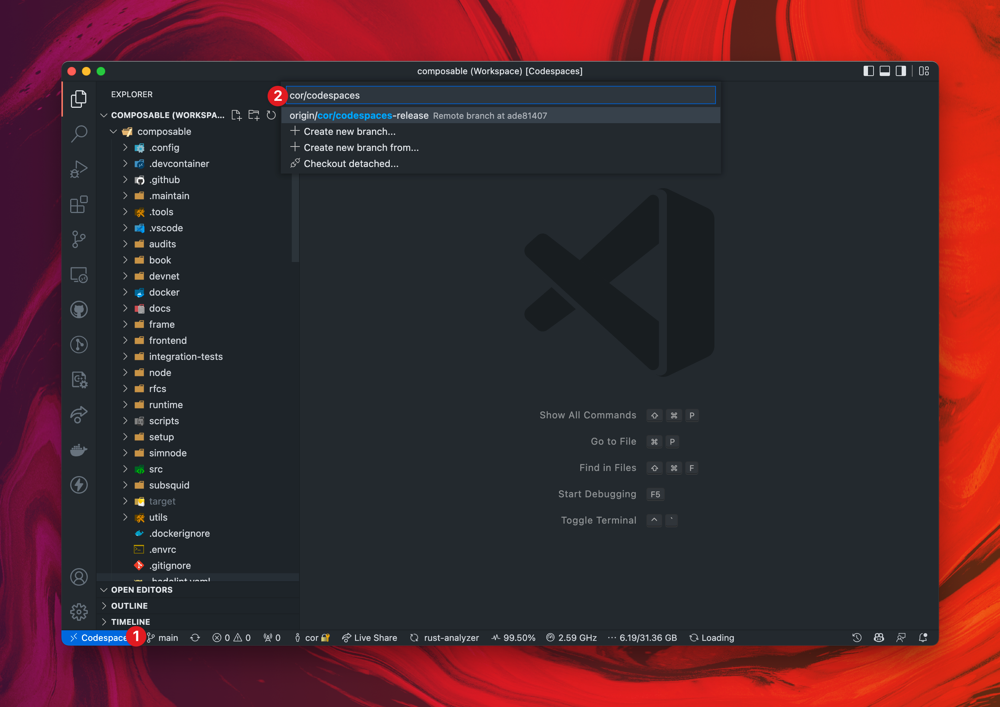
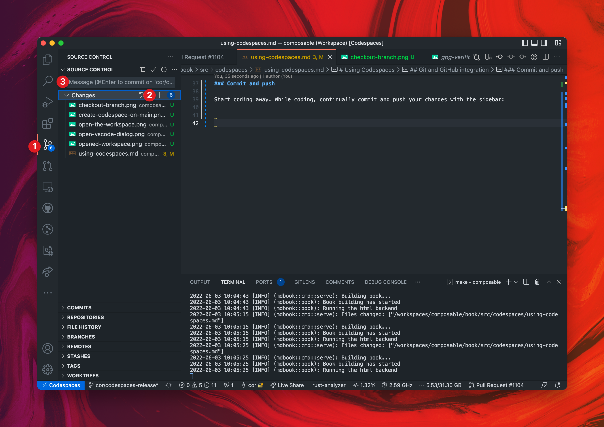
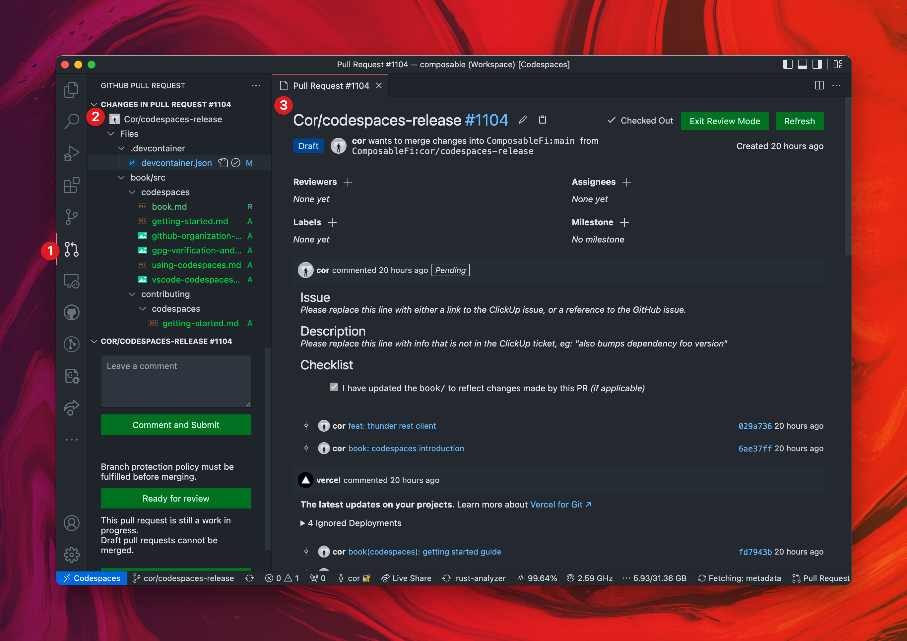
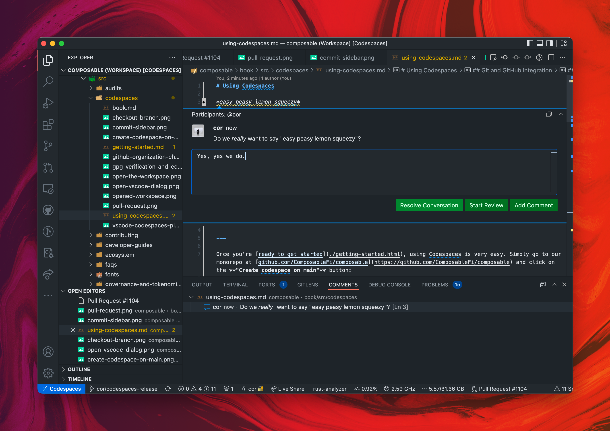

# Using Codespaces

*easy peasy lemon squeezy*

Once you're [ready to get started](./getting-started), using Codespaces is very easy. 
Simply go to our monorepo at [github.com/ComposableFi/composable](https://github.com/ComposableFi/composable) 
and click on the **"Create codespace on main"** button:

*Create codespace on main*

Then, give your browser permission to open **Visual Studio Code**:

*Open Visual Studio Code*

Once you've opened Visual Studio Code, it is very important that you **open the Workspace**. 
The bad news is that this [cannot yet be done automatically](https://github.community/t/how-to-automatically-open-a-vscode-workspace/154339), 
but the good news is that it is very easy to do. Scroll down to the file named `composable.code-workspace`, 
and click on the **"Open Workspace"** button in the lower-right corner:

*Open the Workspace*

When you see `COMPOSABLE (WORKSPACE) [CODESPACES]`, you're good to go!

*Opened Workspace*

## Git and GitHub integration

We have deep Git and GitHub integration in our Codespace. GPG Signing is done automatically, 
and interacting with pull-requests is integrated in the core of the coding workflow.

### Checkout a branch

Checkout a new or existing branch with the branch button.

### Commit and push

Start coding away. While coding, continually commit and push your changes with the sidebar:

*Commit sidebar*

### Open a draft pull-request

Once you've pushed one commit, you can open a draft pull-request with the pull-requests sidebar. 
Then, you can view your PR while you are working on it:

### PR Comments while you code

You can then continue working on your PR as usual. When someone comments on a piece of code that you are editing, 
you will see it in-place. Here you will be able to reply to the comment and optionally resolve the conversation:

*Inline PR comment*

That's all you need to know in order to effectively make changes using Codespaces!
Depending on what you want to work on, check out one of the following guides:

- [Book](./book)
- [Substrate](./substrate)
- [Frontend](./frontend)
- [Runtime Tests](./runtime-tests)
