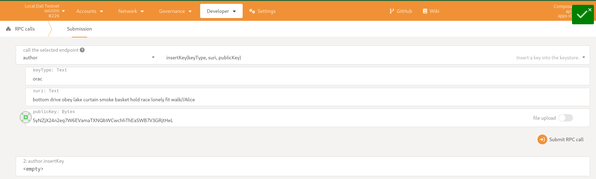
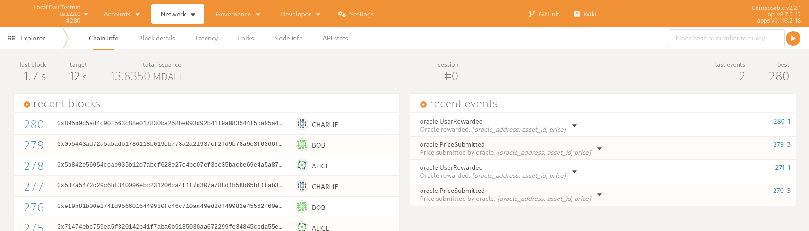
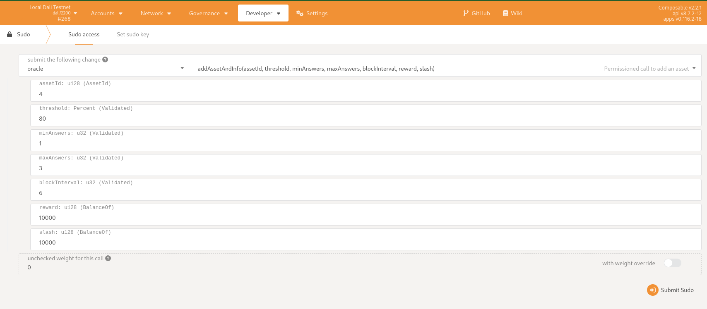

# Apollo Oracle Set-up Guide 


## Overview

Apollo is an oracle for submitting prices on-chain. 
We plan to upgrade it and allow everyone to stream arbitrary third party data in the future. 
By taking part in Apollo and becoming an oracle operator, 
you will be securing the assets prices and help the network become more resilient. 
Participants receive tokens as rewards for their work, 
but it is important to note that the on-chain algorithm also allows for slashing based on bad behavior, 
which is defined as submitting prices out of a certain threshold range from a pivot price calculated on all submitted prices.

Apollo consists of three key components. The On-chain pallet/worker that decides when a price is requested. 
An Off-Chain worker that monitors when a price has been requested and if so, submits a price for the request. 
Finally, a Price-Feed (we provide a reference implementation for this component) that fetches the prices from a CEX/DEX 
and caches them, such that the Off-Chain worker is able to query those prices and stream them by submitting a transaction. 
Below is a high level diagram that shows the interactions between the components.


## High level architecture


1. Apollo off-chain worker monitors on-chain price requests.
2. Once a price request for an asset has been detected, the off-chain worker does an http GET to the price-feed server and gets the latest price.
3. If and only if the latest cached price (on the price-feed server) is recent enough (in seconds, configurable via the price-feed CLI), the off-chain worker submits a transaction containing the asset price.


## Setting up a node

[Setup a node by following the collator guide](https://docs.composable.finance/developer-guides/collator-guide)


## Setting up the price feed 

### Requirements
- Collator node
- Docker or Rust if building your own binary

### Setup using docker

#### Standalone docker

Get price feeder docker image:
```bash
docker pull composablefi/price-feeder:latest
```

Running the price-feeder:
Run the following command:
```bash
docker run --rm -d -p 3001:3001 -e RUST_LOG=debug -ti price-feeder --composable-node ws://<your-collator-node-address> -l 0.0.0.0:3001

```

#### Using docker-compose
Create a file called docker-compose.yml, then add the following:
```yaml
services:
  price-feeder:
    image: composablefi/price-feeder:latest
    command: --composable-node ws://<your-collator-node-address>:<port> -l 0.0.0.0:3001
    environment:
      - RUST_LOG=debug
    ports:
      - 3001:3001
```
Make sure you add the right address and port to access your collator node.

To start the price-feeder make sure you cd into the directory where the `docker-compose.yml` was created, then run:
```bash
docker-compose up 
```
or 
```bash
docker-compose up -d
```
to run the service in the background.

<br>
### Building your own binary

In this step, we will set up a rust compiler, a toolchain and build a node.  \
 \
**Setup required libraries**

Run the following command:

```bash
sudo apt update && sudo apt install -y git clang curl libssl-dev llvm libudev-dev pkg-config
```

**Get the project and build the price-feed**

Run the following commands:

```bash
git clone --depth 1 --branch v2.2.1 https://github.com/ComposableFi/composable.git composable-oracle && \
cd composable-oracle/code/utils/price-feed && \
cargo build --release --package price-feed
```

Move the binary to `/usr/local/bin/`:
```bash
sudo mv ../../target/release/price-feed /usr/local/bin/price-feed
```

### Start Price-feed

You can run the server with:
```bash
RUST_LOG=debug price-feed --composable-node ws://<your-collator-node-address>:<port> -l 0.0.0.0:3001
```

To make sure the price-feed is working correctly one should go to the browser.

By default, price-feed runs on localhost, port 3001. 


[http://127.0.0.1:3001/price/4](http://127.0.0.1:3001/price/4)


price-feed output should look like this.

```markdown
[2022-06-09T19:08:25Z DEBUG price_feed::backend] notification received: Started { feed: Binance }
[2022-06-09T19:08:25Z INFO  price_feed::backend] Binance started successfully
[2022-06-09T19:08:25Z DEBUG price_feed::backend] notification received: AssetOpened { feed: Binance, asset: KSM }
[2022-06-09T19:08:25Z INFO  price_feed::backend] Binance has opened a channel for KSM
[2022-06-09T19:08:25Z DEBUG price_feed::feed::binance] connecting to binance
[2022-06-09T19:08:25Z DEBUG tungstenite::client] Trying to contact wss://stream.binance.com:9443/stream?streams=ksmusdt@aggTrade at 13.114.11.14:9443...
[2022-06-09T19:08:26Z DEBUG tungstenite::handshake::client] Client handshake done.
[2022-06-09T19:08:26Z DEBUG price_feed::feed::binance] running event loop
[2022-06-09T19:08:31Z DEBUG price_feed::backend] notification received: AssetPriceUpdated { feed: Binance, asset: KSM, price: TimeStamped { value: (Price(6659), Exponent(2)), timestamp: TimeStamp(1654801711) } }
[2022-06-09T19:08:36Z DEBUG price_feed::backend] notification received: AssetPriceUpdated { feed: Binance, asset: KSM, price: TimeStamped { value: (Price(6659), Exponent(2)), timestamp: TimeStamp(1654801716) } }
```

The default URL is:

```markdown
localhost:3001/price/${ ASSET_ID }/
```

### CLI Options

Run the following command: 

```bash
./target/release/price-feed --help
```

For a list of CLI options.


```markdown
$ price-feed --help
price-feed 1.0
Composable

USAGE:
    price-feed [OPTIONS]

OPTIONS:
    -c, --cache-duration <CACHE_DURATION>
            Duration, in seconds, before a price is evicted from the cache [default: 10]

        --composable-node <COMPOSABLE_NODE>
            Host address of the composable node [default: ws://127.0.0.1:9988]

    -e, --expected-exponent <EXPECTED_EXPONENT>
            Price will be normalized to this exponent [default: 12]

    -h, --help
            Print help information

    -l, --listening-address <LISTENING_ADDRESS>
            Listening address for the frontend [default: 127.0.0.1:3001]

    -p, --pythd-host <PYTHD_HOST>
            Host address of the pythd server [default: http://127.0.0.1:8910]

    -q, --quote-asset <QUOTE_ASSET>
            Asset to be used as quote for pricing [default: USDT]

    -V, --version
            Print version information
```

## Setting up Apollo (becoming an Oracle)

In order for a Collator to become an Apollo Oracle, you need to make sure that you deployed a price-feed server along 
your node. 

Once you have node and price-feed setup and running, the following steps will be required to bind your price-feed to the 
node.

These are the wallet details for the Alice developer wallet.

It’s required for registering the offchain worker.

```markdown
name: "Alice"
Address (public key): "5yNZjX24n2eg7W6EVamaTXNQbWCwchhThEaSWB7V3GRjtHeL"
Mnemonic(seed): "bottom drive obey lake curtain smoke basket hold race lonely fit walk//Alice"
```

### 1. Automated Setup

This describes the automated setup using our oracle initialization script.

Please scroll down to part 2. For manual setup instructions.

**Setup required libraries**

Installing application dependencies:

```bash
sudo apt update && sudo apt install -y git curl
```

Installing NodeJS:

```bash
curl -o- https://raw.githubusercontent.com/nvm-sh/nvm/v0.35.3/install.sh | bash && \
export NVM_DIR="$HOME/.nvm" && \
[ -s "$NVM_DIR/nvm.sh" ] && \. "$NVM_DIR/nvm.sh" && \
nvm install v16.15.0 && \
nvm use v16.15.0 && \
npm install --global yarn
```

**Setup oracle price feed initializer**

Getting the oracle price feed initializer:

```bash
git clone --depth 1 https://github.com/ComposableFi/composable.git composable-oracle-initializer && \
cd composable-oracle-initializer/scripts/oracle-setup
```

Setup oracle price feed initializer:

```bash
yarn
```

Starting oracle price feed initializer:

```bash
yarn start
```

**Registering offchain worker**

As soon as the script has finished, only a single step remains.

We need to register the offchain worker on our chain.

To do this go to:

_Developer menu -> RPC calls -> author -> InsertKey_

And enter the details, as seen in the screenshot below and press: “Submit RPC call”.

```markdown
keyType: orac
suri: bottom drive obey lake curtain smoke basket hold race lonely fit walk//Alice
publicKey: 5yNZjX24n2eg7W6EVamaTXNQbWCwchhThEaSWB7V3GRjtHeL
```




After successfully following these steps, you should see the blockchain successfully getting prices submitted, every few
blocks.





### 2. Manual Setup

For the manual setup we need to do the following:

1. Register price feed URL
2. Register offchain worker
3. Set signer
4. Create an oracle for the asset

**Register price feed URL**

Register your price-feed url in the local storage,` kind` must be **PERSISTENT**, the key is **ocw-url,** and the value 
is **[http://localhost:3001/price/](http://my-price-feed.com/prices/)**

JavaScript:

```JavaScript
api.rpc.offchain.localStorageSet("PERSISTENT", stringToHex("ocw-url"), stringToHex("http://localhost:3001/price/"));
```

To do this go to:

_Developer menu -> RPC calls -> offchain -> **localStorageSet**_ \


**Register offchain worker**

To do this go to:

_Developer menu -> RPC calls -> author -> **insertKey**_

And enter the details above, as seen in the screenshot and press: “Submit RPC call”.


**Setting signer**

Bond the controller account by submitting a set_signer transaction (tie the Signer to the Controller). This transaction 
**must** be sent by the controller. The controller **must have the necessary bond amount** as it will be transferred to 
the signer and put on hold (reserved).

JavaScript:

```JavaScript
api.tx.oracle.setSigner(address);
```

Setting the signer automatically adds a small amount of funds to the oracle stake of this wallet. These are required for
submitting prices.

_Developer -> extrinsics -> Oracle -> setSinger_


**Create oracle for asset**

We can create an oracle for an asset by using the extrinsic _oracle.addAssetAndInfo(...)_ and calling it using 
administrative rights. To call this extrinsic as an administrator go to:

_Developer -> Sudo -> Oracle **-> addAssetAndInfo	**_

**Parameters**:

* assetId: 4
* threshold: 80
* minAnswers: 1
* maxAnswers: 3
* blockInterval: 6
* reward: 10000
* slash: 10000




After successfully following these steps, you should see the blockchain successfully getting prices submitted, every few
blocks.


____

External Link 

[Polkadotjs API](https://polkadot.js.org/docs/)
